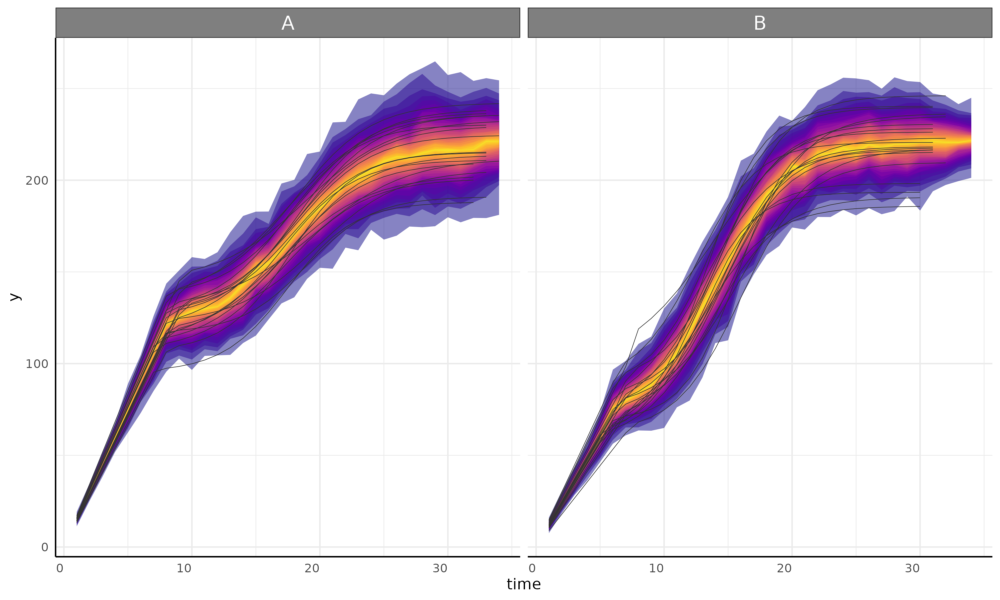
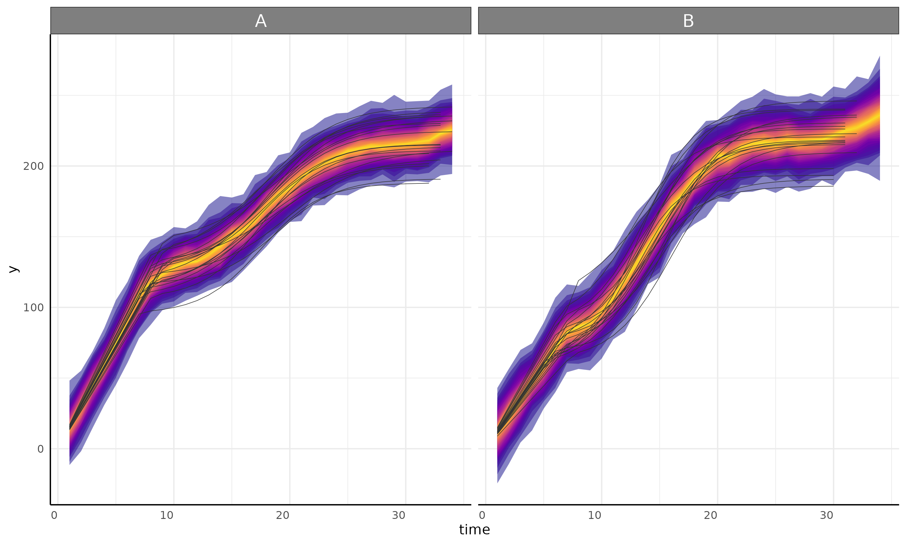
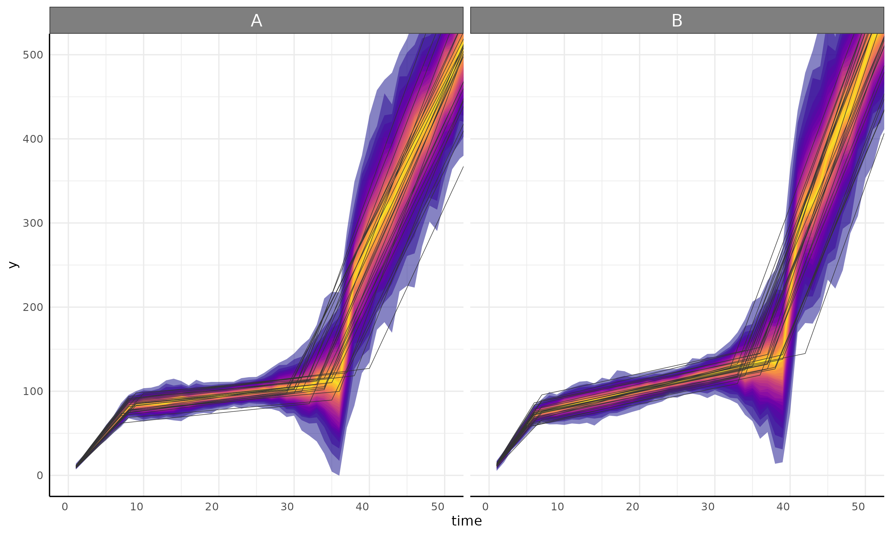
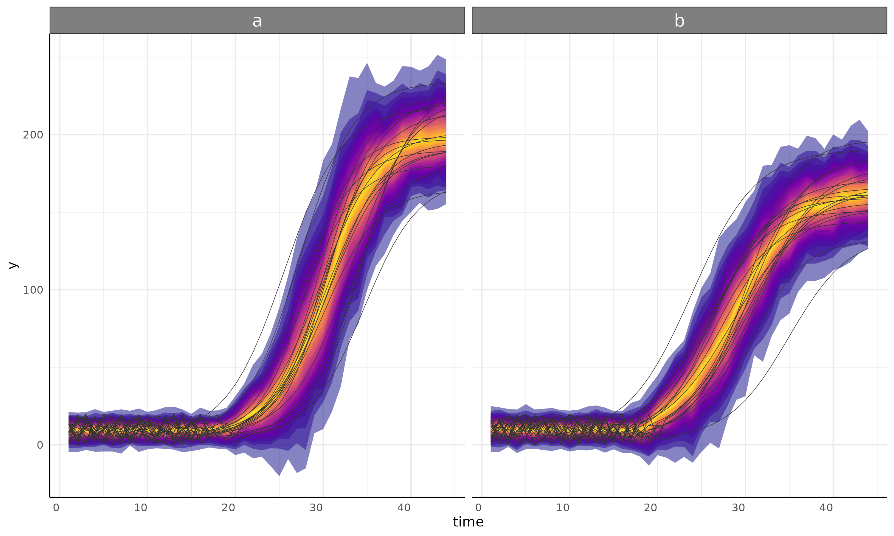
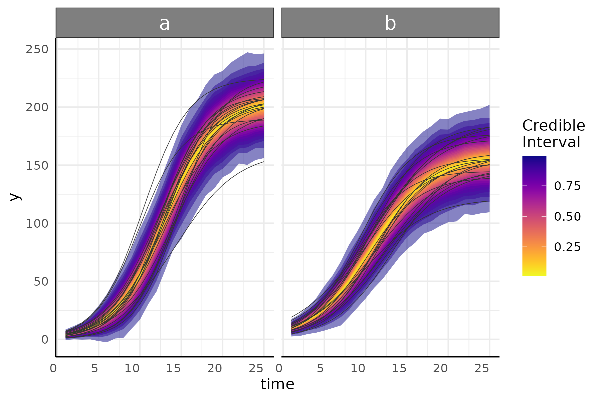

# Advanced Growth Modeling with \`pcvr\`

## Outline

- `pcvr` Goals
- Load Package
- Why Longitudinal Modeling?
- Why Bayesian Modeling?
- Supported Curves
- `growthSS`
- `fitGrowth`
- `growthPlot`/Model Visualization
- Hypothesis testing
- Threshold models
- Using `brms` directly
- Resources

## `pcvr` Goals

Currently `pcvr` aims to:

- Make common tasks easier and consistent
- Make select Bayesian statistics easier

There is room for goals to evolve based on feedback and scientific
needs.

## Load package

Pre-work was to install R, Rstudio, and `pcvr` with dependencies.

``` r
library(pcvr) # or devtools::load_all() if you are editing
library(brms) # for bayesian models
```

    ## Loading required package: Rcpp

    ## Loading 'brms' package (version 2.23.0). Useful instructions
    ## can be found by typing help('brms'). A more detailed introduction
    ## to the package is available through vignette('brms_overview').

    ## 
    ## Attaching package: 'brms'

    ## The following object is masked from 'package:stats':
    ## 
    ##     ar

``` r
library(data.table) # for fread
library(ggplot2) # for plotting
library(patchwork) # to arrange ggplots
```

## Why Longitudinal Modeling?

`plantCV` allows for user friendly high throughput image based
phenotyping.

Resulting data follows individuals over time, which changes our
statistical needs.

Longitudinal Data is:

- Autocorrelated
- Often non-linear
- Heteroskedastic


``` r
r1 <- range(simdf[simdf$time == 1, "y"])
r2 <- range(simdf[simdf$time == 5, "y"])
r3 <- range(simdf[simdf$time == 10, "y"])
r4 <- range(simdf[simdf$time == 20, "y"])

main <- ggplot(simdf, aes(time, y, group = interaction(group, id))) +
  geom_line() +
  annotate("segment", x = 1, xend = 1, y = r1[1], yend = r1[2], color = "blue", linewidth = 2) +
  annotate("segment", x = 5, xend = 5, y = r2[1], yend = r2[2], color = "blue", linewidth = 2) +
  annotate("segment", x = 10, xend = 10, y = r3[1], yend = r3[2], color = "blue", linewidth = 2) +
  annotate("segment", x = 20, xend = 20, y = r4[1], yend = r4[2], color = "blue", linewidth = 2) +
  labs(title = "Heteroskedasticity") +
  pcv_theme() +
  theme(axis.title.x = element_blank(), axis.text.x = element_blank())

sigma_df <- aggregate(y ~ group + time, data = simdf, FUN = sd)

sigmaPlot <- ggplot(sigma_df, aes(x = time, y = y, group = group)) +
  geom_line(color = "blue") +
  pcv_theme() +
  labs(y = "SD of y") +
  theme(plot.title = element_blank())


design <- c(
  area(1, 1, 4, 4),
  area(5, 1, 6, 4)
)
hetPatch <- main / sigmaPlot + plot_layout(design = design)
hetPatch
```


## Why Bayesian Modeling?

Bayesian modeling allows us to account for all these problems via a more
flexible interface than frequentist methods.

Bayesian modeling also allows for non-linear, probability driven
hypothesis testing.

In a Bayesian context we flip “random” and “fixed” elements.

|             | Fixed       | Random      | Interpretation                                                                                                        |
|-------------|-------------|-------------|-----------------------------------------------------------------------------------------------------------------------|
| Frequentist | True Effect | Data        | If the True Effect is 0 then there is an $\alpha \cdot 100$% chance of estimating an effect of this size or more.     |
| Bayesian    | Data        | True Effect | Given the estimated effect from our data there is a P probability of the True Effect being a difference of at least X |

Before moving on we should note that each group in your data will have
parameters fit to it. If you have many groups then fitting models to
only a few groups at a time is likely to make your life easier. Larger
models will fit, but they can take a very long time.

It’s generally been easier for the authors to fit 50 models each with 4
groups in them then compare across models than to fit 1 model with 200
groups in it.

## Supported Growth Models

There are 13 main growth models supported in `pcvr`.

Several are shown next, including asymptotic and non-asymptotic options.


There are an additional 3 sigmoidal models based on the Extreme Value
Distribution. Those are Weibull, Frechet, and Gumbel. The authors
generally prefer Gompertz to these options but for your data it is
possible that these could be a better fit.


There are also two double sigmoid curves intended for use with recovery
experiments.

    ## Warning: Removed 1 row containing missing values or values outside the scale range
    ## (`geom_line()`).


Generalized Additive Models
([GAMs](https://en.wikipedia.org/wiki/Generalized_additive_model)) are
supported but discouraged due to poor interpretability.


Intercept only models are supported, although they are only intended for
use in segmented models or to represent homoskedasticity as a sub-model.

``` r
set.seed(123)
ggplot(
  data.frame(
    yint = c(rnorm(20, 8, 1), rnorm(20, 9, 1)),
    group = c(rep("a", 10), rep("b", 10))
  ),
  aes(x = 1:25)
) +
  geom_hline(aes(yintercept = yint, color = group)) +
  scale_y_continuous(limits = c(0, 20)) +
  pcv_theme() +
  labs(y = "y", x = "x")
```


Segmented growth models are also supported using “model1 + model2”
syntax in both `growthSim` and `growthSS`.

For now we will focus on single models but there will be examples of
segmented models later on.

The “decay” keyword can be used to specify a decay model instead. For
now we will focus on growth models as these constitute the large
majority of models used in plant phenotyping.

Hierarchical models can be specified by adding covariates to the model
formula and specifying models for those covariates in the `hierarchy`
argument.

A hierarchical formula would then be written as
`y ~ time + covar | id / group` and we could specify to only model the
`A` parameter as being modeled by `covar` by adding
`hierarchy = list("A" = "int_linear")`.

## Survival Models

Survival models can also be specified using the “survival” keyword.
Using the brms backend these models use the weibull distribution by
default but “binomial” family can also be specified by
`model = "survival binomial"`.

For details please see the `growthSS` documentation.

## Maxima/Minima Models

bragg, lorentz, and beta Maxima/Minima models are available in
`growthSS`, but should only be used for biologically appropriate
settings. For general trends where data may increase then decrease some
consider changepoint models or splines before using these.

## `growthSS`

Any of the aforementioned models can be specified easily using
`growthSS`.

### `growthSS` - form

With a model specified a rough formula is required to parse your data to
fit the model.

The layout of that formula is:

`outcome ~ time|individual/group`

### `growthSS` - form 2

Here we would use `y~time|id/group`

``` r
simdf <- growthSim("gompertz",
  n = 20, t = 25,
  params = list(
    "A" = c(200, 160),
    "B" = c(13, 11),
    "C" = c(0.2, 0.25)
  )
)
head(simdf)
```

    ##     id group time           y
    ## 1 id_1     a    1 0.004058413
    ## 2 id_1     a    2 0.022060411
    ## 3 id_1     a    3 0.091828381
    ## 4 id_1     a    4 0.305290892
    ## 5 id_1     a    5 0.839871042
    ## 6 id_1     a    6 1.969862435

### `growthSS` - form 3

Generally it makes sense to visually check that your formula covers your
experimental design.

Note that it is fine for id to be duplicated between groups, but not
within groups

``` r
ggplot(simdf, aes(time, y,
  group = paste(group, id)
)) + # group on id
  geom_line(aes(color = group)) + # color by group
  labs(title = "Testing Formula") +
  theme_minimal()
```


### `growthSS` - sigma

Recall the heteroskedasticity problem, shown again with our simulated
data:


### `growthSS` - sigma

There are lots of ways to model a trend like that we see for sigma.

`pcvr` allows any of the model options in `growthSS` to also be applied
to model variance.

``` r
draw_gomp_sigma <- function(x) {
  return(23 * exp(-21 * exp(-0.22 * x)))
}

ggplot(sigma_df, aes(x = time, y = y)) +
  geom_line(aes(group = group), color = "gray60") +
  geom_hline(aes(yintercept = 12, color = "Homoskedastic"),
    linetype = 5, key_glyph = draw_key_path
  ) +
  geom_abline(aes(slope = 0.8, intercept = 0, color = "Linear"),
    linetype = 5, key_glyph = draw_key_path
  ) +
  geom_smooth(
    method = "gam", aes(color = "Spline"), linetype = 5,
    se = FALSE, key_glyph = draw_key_path
  ) +
  geom_function(fun = draw_gomp_sigma, aes(color = "Gompertz"), linetype = 5) +
  scale_color_viridis_d(option = "plasma", begin = 0.1, end = 0.9) +
  guides(color = guide_legend(override.aes = list(linewidth = 1, linetype = 1))) +
  pcv_theme() +
  theme(legend.position = "bottom") +
  labs(y = "SD of y", title = "Several sigma options", color = "")
```

    ## `geom_smooth()` using formula = 'y ~ s(x, bs = "cs")'


### `growthSS` - Intercept sigma

| Pros                 | Cons                                          |
|----------------------|-----------------------------------------------|
| Faster model fitting | Very inaccurate intervals at early timepoints |

``` r
ggplot(sigma_df, aes(x = time, y = y, group = group)) +
  geom_hline(aes(yintercept = 13.8, color = "Homoskedastic"), linetype = 5, key_glyph = draw_key_path) +
  geom_line(aes(color = group)) +
  scale_color_manual(values = c(scales::hue_pal()(2), "gray40")) +
  pcv_theme() +
  labs(y = "SD of y", color = "Sigma") +
  theme(plot.title = element_blank(), legend.position = "bottom")
```


### `growthSS` - Linear sigma

| Pros                           | Cons                                    |
|--------------------------------|-----------------------------------------|
| Models still fit quickly       | Variance tends to increase non-linearly |
| Easy testing on variance model |                                         |

``` r
p <- ggplot(sigma_df, aes(x = time, y = y, group = group)) +
  geom_smooth(aes(group = "linear", color = "Linear"),
    linetype = 5,
    method = "lm", se = FALSE, formula = y ~ x
  ) +
  geom_line(aes(color = group)) +
  scale_color_manual(values = c(scales::hue_pal()(2), "gray40")) +
  pcv_theme() +
  labs(y = "SD of y", color = "Sigma") +
  theme(plot.title = element_blank(), legend.position = "bottom")
```

### `growthSS` - Linear sigma

``` r
p
```


### `growthSS` - Gompertz sigma

| Pros                                | Cons                                   |
|-------------------------------------|----------------------------------------|
| Models fit much faster than splines | Slightly slower than linear sub-models |
| Variance is often asymptotic        | Requires priors on sigma model         |
| Easy testing on variance model      |                                        |

Note that these traits are broadly true of logistic and monomolecular
sub models as well.

``` r
draw_gomp_sigma <- function(x) {
  return(22 * exp(-9 * exp(-0.27 * x)))
} # guesses at parameters

p <- ggplot(sigma_df, aes(x = time, y = y, group = group)) +
  geom_function(fun = draw_gomp_sigma, aes(group = 1, color = "Gompertz"), linetype = 5) +
  geom_line(aes(color = group)) +
  scale_color_manual(values = c(scales::hue_pal()(2), "gray40")) +
  pcv_theme() +
  labs(y = "SD of y", color = "Sigma") +
  theme(plot.title = element_blank(), legend.position = "bottom")
```

### `growthSS` - Gompertz sigma

``` r
p
```


### `growthSS` - Spline sigma

| Pros                                           | Cons                                        |
|------------------------------------------------|---------------------------------------------|
| **Very** flexible and accurate model for sigma | **Significantly** slower than other options |
| Fewer priors                                   | Splines can be a black-box                  |

``` r
p <- ggplot(sigma_df, aes(x = time, y = y, group = group)) +
  geom_smooth(
    method = "gam", aes(group = "Spline", color = "Spline"),
    linetype = 5, se = FALSE, formula = y ~ s(x, bs = "cs")
  ) +
  geom_line(aes(color = group)) +
  scale_color_manual(values = c(scales::hue_pal()(2), "gray40")) +
  pcv_theme() +
  labs(y = "SD of y", color = "Sigma") +
  theme(plot.title = element_blank(), legend.position = "bottom")
```

### `growthSS` - Spline sigma

``` r
p
```


### `growthSS` - other sigma models

You can always add a new sigma formula if something else fits your needs
better.


### `growthSS` - Distributional Models

Here we have limited the examples to talk about sigma, a parameter of
the Student T distribution that our model belongs to. Written another
way we might say all the previous methods are modeling:

Y ~ T(mu ~ main growth formula, sigma ~ sigma formula, nu ~ 1)

### `growthSS` - Distributional Models 2

In `pcvr` the Student T family is the default for these models, but
other distributions are supported through `"distribution: model"`
syntax.

In general this is only for special cases where the Gaussian/T does not
capture some important quality of the data. An obvious example could be
leaf counts, which might be modeled as `"poisson: monomolecular"`, for
instance.

### `growthSS` - Distributional Models 3

You can specify sigma as a list of formulas to model different
distributional parameters separately. Most of the time this is overkill
and adds unnecessary complexity, but the option exists for certain cases
such as ZINB where modeling mean, shape, and zero inflation per group
may make sense.

For details on supported families and their parameterization try running
`growthSS(..., sigma=NULL,...)` and examining the priors, or checking
`?brmfamily`.

### `growthSS` - priors

Bayesian statistics combine prior distributions and collected data to
form a posterior distribution.

Luckily, in the growth model context it is pretty easy to set “good
priors”.

### `growthSS` - priors

“Good priors” are generally mildly informative, but not very strong.

They provide some well vetted evidence, but do not overpower the data.

### `growthSS` - priors

For our setting we know growth is positive and we should have basic
impressions of what sizes are possible.

At the “weakest” side of these priors we at least know growth is
positive and the camera only can measure some finite space.

### `growthSS` - priors 2

Default priors in `growthSS` are log-normal

$\text{log}\ N(\mu,0.25)$

This has the benefit of giving a long right tail and strictly positive
values while only requiring us to provide $\mu$.

### `growthSS` - priors 3

We can see what those log-normal distributions look like with
`plotPrior`.

``` r
priors <- list("A" = 130, "B" = 10, "C" = 0.2)
priorPlots <- plotPrior(priors)
priorPlots[[1]] / priorPlots[[2]] / priorPlots[[3]]
```


### `growthSS` - priors 4

Those distributions can still be somewhat abstract, so we can simulate
draws from the priors and see what those values yield in our growth
model.

``` r
twoPriors <- list("A" = c(100, 130), "B" = c(6, 12), "C" = c(0.5, 0.25))
plotPrior(twoPriors, "gompertz", n = 100)[[1]]
```


### `growthSS` - priors 5

Our final call to `growthSS` will look like this for our sample data.

``` r
ss <- growthSS(
  model = "gompertz", form = y ~ time | id / group,
  sigma = "gompertz", df = simdf,
  start = list(
    "A" = 130, "B" = 10, "C" = 0.5,
    "sigmaA" = 20, "sigmaB" = 10, "sigmaC" = 0.25
  )
)
```

## `fitGrowth`

Now that we have the components for our model from `growthSS` we can fit
the model with `fitGrowth`.

This will call `Stan` outside of R to run Markov Chain Monte Carlo
(MCMC) to get draws from the posterior distributions. We can control how
`Stan` runs with additional arguments to `fitGrowth`, although the only
required argument is the output from `growthSS`.

Here we specify our `ss` argument to be the output from `growthSS` and
tell the model to use 4 cores so that the chains run entirely in
parallel, but the rest of this model is using defaults.

``` r
fit <- fitGrowth(
  ss = ss, cores = 4,
  iter = 2000, chains = 4, backend = "cmdstanr"
)
```

Note that there are lots of arguments that can be passed to
[`brms::brm`](https://paulbuerkner.com/brms/reference/brm.html) via
`fitGrowth`.

One that can be very helpful for fitting complex models is the `control`
argument, where we can control the sampler’s behavior.

`adapt_delta` and `tree_depth` are both used to reduce the number of
“divergent transitions” which are times that the sampler has some
departure from the True path and which can compromise the results.

``` r
fit <- fitGrowth(ss,
  cores = 4,
  iter = 2000, chains = 4, backend = "cmdstanr",
  control = list(adapt_delta = 0.999, max_treedepth = 20)
)
```

`fitGrowth` returns a `brmsfit` object, see
[`?brmsfit`](https://paulbuerkner.com/brms/reference/brmsfit-class.html)
and `methods(class="brmsfit")` for general information.

Within `pcvr` there are several functions for visualizing these objects.

## `growthPlot`

`growthPlot` can be used to plot credible intervals of your model.

``` r
growthPlot(fit, form = ss$pcvrForm, df = ss$df)
```

These plots can show one of the benefits of an asymptotic sub model
well.

Here we check our model predictions to 35 days.

``` r
growthPlot(fit, form = ss$pcvrForm, df = ss$df, timeRange = 1:35)
```

And now we check those predictions from a spline model, where the basis
functions are not suited for data past day 25.

``` r
growthPlot(fit_spline, form = ss_spline$pcvrForm, df = ss_spline$df, timeRange = 1:35)
```

We can also plot the posterior distributions and test hypotheses with
`brmViolin`.

Here hypotheses are tested with
[`brms::hypothesis`](https://paulbuerkner.com/brms/reference/hypothesis.brmsfit.html).

``` r
brmViolin(fit, ss, hypothesis = ".../A_groupa > 1.05")
```

    ## Loading required namespace: rstan


## Hypothesis Testing

[`brms::hypothesis`](https://paulbuerkner.com/brms/reference/hypothesis.brmsfit.html)
allows for incredibly flexible hypothesis testing.

Here we test for an asymptote for group A at least 20% larger than that
of group B.

``` r
brms::hypothesis(fit, "A_groupa > 1.2 * A_groupb")$hyp
```

    ##                      Hypothesis Estimate Est.Error CI.Lower CI.Upper Evid.Ratio
    ## 1 (A_groupa)-(1.2*A_groupb) > 0 6.290106  4.925797 -1.74309 14.41414    8.90099
    ##   Post.Prob Star
    ## 1     0.899

## Threshold models

Segmented Models are specified using “model1 + model2” syntax, with “+”
representing a change point.

Currently only two phases (one changepoint) are recommended. More will
work but they will slow down the MCMC and may require more fine tuning.

These segmented models can also be used to specify sub-models of
distributional parameters.

### linear + linear

``` r
simdf <- growthSim(
  model = "linear + linear",
  n = 20, t = 25,
  params = list("linear1A" = c(15, 12), "changePoint1" = c(8, 6), "linear2A" = c(3, 5))
)

ss <- growthSS(
  model = "linear + linear", form = y ~ time | id / group, sigma = "spline",
  start = list("linear1A" = 10, "changePoint1" = 5, "linear2A" = 2),
  df = simdf, type = "brms"
)

fit <- fitGrowth(ss, backend = "cmdstanr", iter = 500, chains = 1, cores = 1)
growthPlot(fit = fit, form = ss$pcvrForm, df = ss$df)
```


Example changepoint model

### linear + logistic

``` r
simdf <- growthSim("linear + logistic",
  n = 20, t = 25,
  params = list(
    "linear1A" = c(15, 12), "changePoint1" = c(8, 6),
    "logistic2A" = c(100, 150), "logistic2B" = c(10, 8),
    "logistic2C" = c(3, 2.5)
  )
)

ss <- growthSS(
  model = "linear + logistic", form = y ~ time | id / group, sigma = "spline",
  list(
    "linear1A" = 10, "changePoint1" = 5,
    "logistic2A" = 100, "logistic2B" = 10, "logistic2C" = 3
  ),
  df = simdf, type = "brms"
)

fit <- fitGrowth(ss, backend = "cmdstanr", iter = 500, chains = 1, cores = 1)
growthPlot(fit = fit, form = ss$pcvrForm, df = ss$df)
```



Example changepoint model

### linear + gam

``` r
ss <- growthSS(
  model = "linear + gam", form = y ~ time | id / group, sigma = "int",
  list("linear1A" = 10, "changePoint1" = 5),
  df = simdf, type = "brms"
)

fit <- fitGrowth(ss, backend = "cmdstanr", iter = 500, chains = 1, cores = 1)
growthPlot(fit = fit, form = ss$pcvrForm, df = ss$df)
```



Example changepoint model

### linear + linear + linear

``` r
simdf <- growthSim("linear + linear + linear",
  n = 25, t = 50,
  params = list(
    "linear1A" = c(10, 12), "changePoint1" = c(8, 6),
    "linear2A" = c(1, 2), "changePoint2" = c(25, 30), "linear3A" = c(20, 24)
  )
)

ss <- growthSS(
  model = "linear + linear + linear", form = y ~ time | id / group, sigma = "spline",
  list(
    "linear1A" = 10, "changePoint1" = 5,
    "linear2A" = 2, "changePoint2" = 15,
    "linear3A" = 5
  ), df = simdf, type = "brms"
)

fit <- fitGrowth(ss, backend = "cmdstanr", iter = 500, chains = 1, cores = 1)

plot <- growthPlot(fit = fit, form = ss$pcvrForm, df = ss$df)
```



Example changepoint model

### int + int with segmented sigma

``` r
ss <- growthSS(
  model = "int + int", form = y ~ time | id / group, sigma = "int + int",
  list(
    "int1" = 10, "changePoint1" = 10, "int2" = 20, # main model
    "sigmaint1" = 10, "sigmachangePoint1" = 10, "sigmaint2" = 10
  ), # sub model
  df = simdf, type = "brms"
)

fit <- fitGrowth(ss, backend = "cmdstanr", iter = 500, chains = 1, cores = 1)

plot <- growthPlot(fit = fit, form = ss$pcvrForm, df = ss$df)
```


Example changepoint model

### int + linear model and submodel

``` r
ss <- growthSS(
  model = "int + linear", form = y ~ time | id / group, sigma = "int + linear",
  list(
    "int1" = 10, "changePoint1" = 10, "linear2A" = 20,
    "sigmaint1" = 10, "sigmachangePoint1" = 10, "sigmalinear2A" = 10
  ),
  df = simdf, type = "brms"
)
fit <- fitGrowth(ss, backend = "cmdstanr", iter = 500, chains = 1, cores = 1)
plot <- growthPlot(fit = fit, form = ss$pcvrForm, df = ss$df, timeRange = 1:40)
```


Example changepoint model

### int+logistic with int+gam sub model

``` r
ss <- growthSS(
  model = "int+logistic", form = y ~ time | id / group, sigma = "int + spline",
  list(
    "int1" = 5, "changePoint1" = 10,
    "logistic2A" = 130, "logistic2B" = 10, "logistic2C" = 3,
    "sigmaint1" = 5, "sigmachangePoint1" = 15
  ),
  df = simdf, type = "brms"
)
fit <- fitGrowth(ss, backend = "cmdstanr", iter = 500, chains = 1, cores = 1)
plot <- growthPlot(fit = fit, form = ss$pcvrForm, df = ss$df)
```



Example changepoint model

## Example survival model

``` r
df <- growthSim("logistic",
  n = 20, t = 25,
  params = list("A" = c(200, 160), "B" = c(13, 11), "C" = c(3, 3.5))
)
ss <- growthSS(
  model = "survival weibull", type = "brms",
  form = y > 100 ~ time | id / group,
  df = df, start = c(0, 5)
)
fit <- fitGrowth(ss, iter = 600, cores = 2, chains = 2, backend = "cmdstanr")
plot <- growthPlot(fit = fit, form = ss$pcvrForm, df = ss$df)
```

Here the input data is standard phenotype data with a cutoff to
represent the event (germination for instance) on the left hand side of
the formula.


Example survival model

## Example count model

``` r
df <- growthSim("count: logistic",
  n = 20, t = 25,
  params = list("A" = c(10, 12), "B" = c(13, 11), "C" = c(3, 3.5))
)
ss <- growthSS(
  model = "poisson: logistic", # specify poisson family
  form = y ~ time | id / group,
  sigma = NULL, # poisson only has one parameter
  df = df, start = list("A" = 8, "B" = 10, "C" = 3)
)
fit <- fitGrowth(ss, iter = 2000, cores = 4, chains = 4)
plot <- growthPlot(fit = fit, form = ss$pcvrForm, df = ss$df)
```


Example count model

## Example hierarchical model

``` r
simdf <- growthSim(
  "logistic",
  n = 20, t = 25,
  params = list("A" = c(200, 160), "B" = c(13, 11), "C" = c(3, 3.5))
)
simdf$covar <- stats::rnorm(nrow(simdf), 10, 1)
ss <- growthSS(
  model = "logistic",
  form = y ~ time + covar | id / group,
  sigma = "logistic",
  list(
    "AI" = 100, "AA" = 5,
    "B" = 10, "C" = 3,
    "sigmaA" = 10, "sigmaB" = 10, "sigmaC" = 3
  ),
  df = simdf, type = "brms",
  hierarchy = list("A" = "int_linear")
)
fit <- fitGrowth(ss, iter = 1000, cores = 4, chains = 4)
plot <- growthPlot(fit = fit, form = ss$pcvrForm, df = ss$df)
```

Note for plotting hierarchical models a `hierarchy_value` can be
specified and defaults to the mean of the `covar` in this case.



Example hierarchical model

## Evaluating your models

John Kruschke wrote a paper on the [Bayesian Analysis and Reporting
Guidelines](https://www.nature.com/articles/s41562-021-01177-7) (BARG)
to aid in transparency and reproducibility when using Bayesian methods.

In pcvr some of what Kruschke recommends can be accessed from a
model/list of models using the `barg` function, see
[`?barg`](https://danforthcenter.github.io/pcvr/reference/barg.md) for
details on what that entails.

The
[`brms::add_criterion`](https://paulbuerkner.com/brms/reference/add_criterion.html)
function can be used to add LOO IC or WAIC values to models, which can
be easily compared against each other using
[`brms::loo_compare`](https://mc-stan.org/loo/reference/loo_compare.html).
The best fitting model is displayed first, with others ranked relative
to that model. Differences in elpd of at least 5 times the standard
error are generally considered meaningful. These information criteria
are unlikely to help make decisions about small changes to a model but
may be useful in considering whether a changepoint improves the model
fit or not, as an example.

## Using `brms` directly

These functions are all to help use common growth models more easily.

The choices in `pcvr` are a small subset of what is possible with
`brms`, which itself is more limited than `Stan`.

## Using `brms` directly

Our gompertz sigma model looks like this in `brms`:

``` r
prior1 <- prior(gamma(2, 0.1), class = "nu", lb = 0.001) +
  prior(lognormal(log(130), .25), nlpar = "A", lb = 0) +
  prior(lognormal(log(12), .25), nlpar = "B", lb = 0) +
  prior(lognormal(log(1.2), .25), nlpar = "C", lb = 0) +
  prior(lognormal(log(25), .25), nlpar = "subA", lb = 0) +
  prior(lognormal(log(20), .25), nlpar = "subB", lb = 0) +
  prior(lognormal(log(1.2), .25), nlpar = "subC", lb = 0)

form_b <- bf(y ~ A * exp(-B * exp(-C * time)),
  nlf(sigma ~ subA * exp(-subB * exp(-subC * time))),
  A + B + C + subA + subB + subC ~ 0 + group,
  autocor = ~ arma(~ time | sample:group, 1, 1),
  nl = TRUE
)

fit_g2 <- brm(form_b,
  family = student, prior = prior1, data = simdf,
  iter = 1000, cores = 4, chains = 4, backend = "cmdstanr", silent = 0,
  control = list(adapt_delta = 0.999, max_treedepth = 20),
  init = 0
) # chain initialization at 0 for simplicity
```

## Using `brms` directly

It can be more work to try new options in `brms` or `Stan`, but if you
have a situation not well represented by the existing models then it may
be necessary.

## Resources

If you run into a novel situation please reach out and we will try to
come up with a solution and add it to `pcvr` if possible.

Good ways to reach out are the help-datascience slack channel and [pcvr
github repository](https://github.com/danforthcenter/pcvr).
