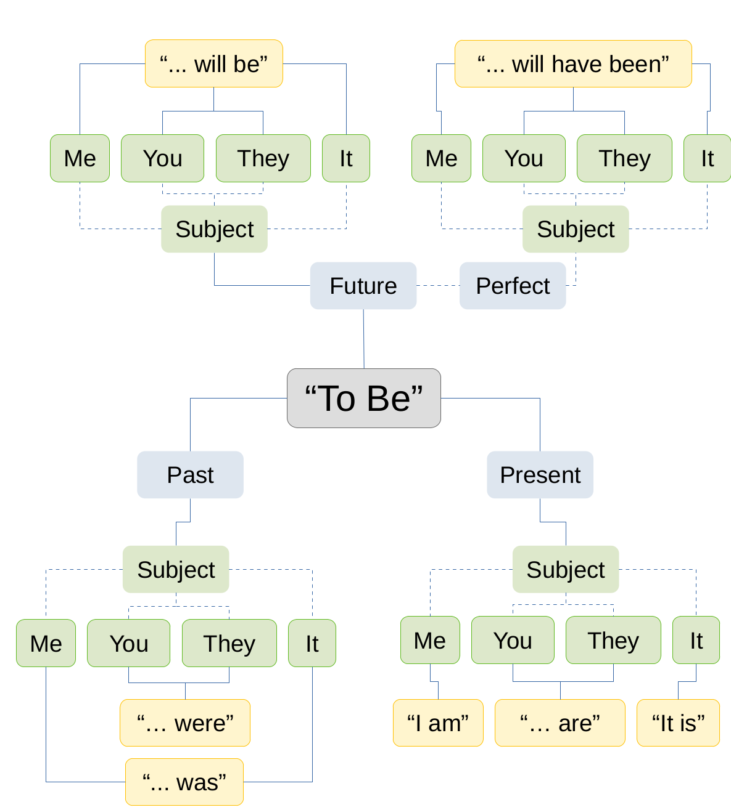

## Outline

-   `pcvr` Goals
-   Load Package
-   Bayesian Statistics Intro
-   Bayesian Conjugacy Theory
-   Bayesian Conjugacy Example
-   `pcvr::conjugate`
-   Supported Distributions
-   `pcvr::conjugate` arguments
-   Reading `conjugate` output

## `pcvr` Goals

Currently `pcvr` aims to:

-   Make common tasks easier and consistent
-   Make select Bayesian statistics easier

There is room for goals to evolve based on feedback and scientific needs.

## Load package

Pre-work was to install R, Rstudio, and `pcvr`.

```{r}
#| echo: false
#| eval: true
if (!"pcvr" %in% installed.packages()) {
  if (!"devtools" %in% installed.packages()) {
    install.packages("devtools")
  }
  devtools::install_github("danforthcenter/pcvr")
}
```

```{r}
#| echo: true
library(pcvr)
library(ggplot2)
library(patchwork)
library(extraDistr)
```

## Bayesian Statistics Intro

Talk about probability, compare to frequentist, introduce theorem.

## Bayesian Statistics Intro

||Frequentist|Bayesian|
|---|---|---|
|Fixed| [True Effect]{style="color:goldenrod;"} | [Observed Data]{style="color:purple;"} |
|Random| [Observed Data]{style="color:purple;"} | [True Effect]{style="color:goldenrod;"} |
|Interpretation| P[Data \| No Effect] | P[Hypothesis \| Observed Data] |

## Bayesian Conjugacy Theory

\begin{equation}
P(\theta|(x_1, \ldots, x_i)) = \frac{\pi(\theta) \cdot L(\theta|(x_1, \ldots, x_i))}{\int \pi(\theta) \cdot L(\theta|(x_1, \ldots, x_i))~d\theta}
\end{equation}

## Bayesian Conjugacy Theory

\begin{equation}
P(\theta|(x_1, \ldots, x_i)) = \frac{\pi(\theta) \cdot L(\theta|(x_1, \ldots, x_i))}{\int \pi(\theta) \cdot L(\theta|(x_1, \ldots, x_i))~d\theta}
\end{equation}

[$P(\theta|(x_1, \ldots, x_i))$]{style="color:purple;"} = Posterior Distribution (Conclusion as a PDf)

[$\pi(\theta)$]{style="color:goldenrod;"} = Prior Distribution (Knowledge as a PDF)

[$L(\theta|(x_1, \ldots, x_i))$]{style="color:DodgerBlue;"} = Likelihood (Data that we collected)

[$\int \pi(\theta) \cdot L(\theta|(x_1, \ldots, x_i))~d\theta$]{style="color:DarkRed;"} = Marginal Distribution (this is the problem area)


## [$\int \pi(\theta) \cdot L(\theta|(x_1, \ldots, x_i))~d\theta$]{style="color:DarkRed;"}

Solving this integral is potentially a very difficult problem.

Historically there have been two answers:

- Find pairs of likelihood functions and Priors that integrate easily
- Numerical Methods

## [$\int \pi(\theta) \cdot L(\theta|(x_1, \ldots, x_i))~d\theta$]{style="color:DarkRed;"}

Solving this integral is potentially a very difficult problem.

Historically there have been two answers:

- Find pairs of likelihood functions and Priors that integrate easily ([these are the conjugate priors]{style="color:goldenrod;"})
- Numerical Methods (Powerful computers making numeric approximations via MCMC, see advanced growth modeling tutorial)

## Verb Conjugation

This may all still seem abstract, so we'll try to clear it up with two examples.


## Verb Conjugation


## Verb Conjugation



## Bayesian Beta-Binomial Conjugacy

In the previous example we updated a fundamental verb with context.

Here we'll update a probability distribution with data.

The P parameter of a Binomial distribution has a Beta conjugate prior.

\begin{equation}
x_1, \ldots, x_n \sim Binomial(N, P) \\
P \sim Beta(\alpha, \beta)  \\
Beta(\alpha', \beta' |(x_1, \ldots, x_n)) = Beta(\alpha, \beta) \cdot L(\alpha, \beta|(x_1, \ldots, x_n)) \\
\alpha` = \alpha + \Sigma(\text{Successes} \in x) \\
\beta` = \beta + \Sigma(\text{Failures} \in x)
\end{equation}

## Bayesian Beta-Binomial Conjugacy

```{r}
#| echo: false
#| eval: true
bdf <- data.frame(
  value = c(
    rbeta(5000, 2, 2), rbeta(5000, 20, 20), rbeta(5000, 40, 10),
    rbeta(5000, 20, 80), rbeta(5000, 2, 8), rbeta(5000, 100, 10)
  ),
  Beta = factor(
    c(rep(
      c("B(2,2)", "B(20,20)", "B(40,10)", "B(20,80)", "B(2,8)", "B(100,10)"),
      each = 5000
    )),
    levels = c("B(2,2)", "B(20,20)", "B(40,10)", "B(20,80)", "B(2,8)", "B(100,10)")
  )
)

pal <- viridis::viridis(6) # should be imported by pcvr and ggplot2

beta_dist_plot <- ggplot(bdf, aes(x = value, fill = Beta)) +
  geom_density(alpha = 0, color = NA) +
  scale_fill_viridis_d() +
  guides(fill = guide_legend(override.aes = list(alpha = 1))) +
  labs(
    x = "Percentage", y = "Density",
    fill = expression("Beta(" * alpha * ", " * beta * ")")
  ) +
  stat_function(
    fun = dbeta, geom = "polygon", colour = pal[1],
    fill = pal[1], alpha = 0.75,
    args = list(shape1 = 2, shape2 = 2), show.legend = FALSE
  ) +
  stat_function(
    fun = dbeta, geom = "polygon", colour = pal[2],
    fill = pal[2], alpha = 0.75,
    args = list(shape1 = 20, shape2 = 20), show.legend = FALSE
  ) +
  stat_function(
    fun = dbeta, geom = "polygon", colour = pal[3],
    fill = pal[3], alpha = 0.75,
    args = list(shape1 = 40, shape2 = 10), show.legend = FALSE
  ) +
  stat_function(
    fun = dbeta, geom = "polygon", colour = pal[4],
    fill = pal[4], alpha = 0.75,
    args = list(shape1 = 20, shape2 = 80), show.legend = FALSE
  ) +
  stat_function(
    fun = dbeta, geom = "polygon", colour = pal[5],
    fill = pal[5], alpha = 0.75,
    args = list(shape1 = 2, shape2 = 8), show.legend = FALSE
  ) +
  stat_function(
    fun = dbeta, geom = "polygon", colour = pal[6],
    fill = pal[6], alpha = 0.75,
    args = list(shape1 = 100, shape2 = 10), show.legend = FALSE
  ) +
  scale_x_continuous(limits = c(-0.01, 1.01)) +
  pcv_theme()

beta_dist_plot
#* ***** `Beta Binomial` *****

values <- c(
  unlist(lapply(1:100, function(i) {
    return(rbinom(10, 100, prob = rbeta(1, 2, 2)))
  })),
  unlist(lapply(1:100, function(i) {
    return(rbinom(10, 100, prob = rbeta(1, 20, 20)))
  })),
  unlist(lapply(1:100, function(i) {
    return(rbinom(10, 100, prob = rbeta(1, 40, 10)))
  })),
  unlist(lapply(1:100, function(i) {
    return(rbinom(10, 100, prob = rbeta(1, 20, 80)))
  })),
  unlist(lapply(1:100, function(i) {
    set.seed(i)
    return(rbinom(10, 100, prob = rbeta(1, 2, 8)))
  })),
  unlist(lapply(1:100, function(i) {
    return(rbinom(10, 100, prob = rbeta(1, 100, 10)))
  }))
)
betas <- factor(
  c(rep(c(
    "B(2,2)", "B(20,20)", "B(40,10)", "B(20,80)", "B(2,8)", "B(100,10)"
  ), each = 1000)),
  levels = c("B(2,2)", "B(20,20)", "B(40,10)", "B(20,80)", "B(2,8)", "B(100,10)")
)
bndf <- data.frame(values, betas)

beta_binom_dist_plot <- ggplot(bndf, aes(x = values, fill = betas)) +
  geom_histogram(alpha = 0.7, position = "identity", binwidth = 1) +
  scale_fill_viridis_d() +
  guides(fill = guide_legend(override.aes = list(alpha = 1))) +
  labs(
    x = "Successes from 100 Trials", y = "Count",
    fill = expression("Beta(" * alpha * ", " * beta * ")"),
    title = "Beta Binomial Conjugacy"
  ) +
  pcv_theme()
layout <- c(area(1, 1, 3, 4), area(4, 1, 4, 4))

conjugacy_ex_beta_binom <- beta_binom_dist_plot / beta_dist_plot +
  plot_layout(design = layout, guides = "collect")
```

## Bayesian Beta-Binomial Conjugacy

```{r}
#| echo: false
#| eval: true
conjugacy_ex_beta_binom
```

## Bayesian Beta-Binomial Conjugacy

Generally we can think of conjugacy as when we know the distribution of a parameter in another distribution.

```{r}
#| echo: false
#| eval: true
conjugacy_ex_beta_binom
```


## `pcvr::conjugate`

In `pcvr` 11 distributions are supported in the `conjugate` function.

We'll go over those distributions, what they tend to represent, how they are updated, and what the common alternative tests would be for that kind of data.

## `pcvr::conjugate`

| Distribution | Data | Updating | Common Option |
|-----------------|-----------------|-----------------|----------------------|
| Gaussian | Normal | $\mu', \sigma' \sim N(\mu, \sigma)$ | Z-test |
| T | Normal Means | $\mu', \sigma_\mu, \nu_\mu' \sim T(\mu, \sigma, \nu)$ | T-test |
| Lognormal | Positive Right Skewed | $\mu' \sim N(\mu, \sigma)$ | Wilcox |
| Lognormal2 | Positive Right Skewed | $\rho' \sim \Gamma(A, B)$ | Wilcox |
| Beta | Percentages | $\alpha', \beta' \sim \alpha, \beta + Counts$ | Wilcox|
|Binomial | Success/Failure Counts | $P \sim Beta(\alpha, \beta)$ | Wilcox/logistic regression |
| Poisson | Counts | $\lambda \sim Gamma(A, B)$ | Wilcox/glm |
| Neg-Binom. | Overdispersed Counts | $P \sim Beta(\alpha, \beta)|r$) | Wilcox/glm |
| Von Mises | Circular | $\mu', \kappa'^* \sim VMf(\mu, \kappa)$ | Watsons |
|Uniform| Positive Flat | $Upper \sim Pareto(A, B)$ | Wilcox |
| Pareto | Heavy Tail | $Shape \sim \Gamma(A, B)| Loc.$ | Wilcox|
| Gamma | Right Skew | $Rate \sim \Gamma(A, B)| Shape$ | Wilcox|
| Bernoulli | Logical | $Rate \sim Beta(\alpha, \beta)$ | Logistic Regression|
| Exponential | Right Skew | $Rate \sim \Gamma(A, B)$ | Wilcox/glm |


## `pcvr::conjugate`

```{r}
#| echo: false
methods <- c(
  "gaussian", "t", "lognormal",
  "beta", "binomial", "poisson",
  "negbin", "von mises", "uniform",
  "pareto", "gamma", "bernoulli", "exponential"
)

virPal <- viridis::viridis(length(methods), 1, 0.1, 0.9)
p1 <- ggplot(
  data.frame(
    x = seq(0, 20, 0.001),
    fill = factor("gaussian", levels = methods)
  ),
  aes(x = x, fill = fill)
) +
  stat_function(geom = "polygon", fun = dnorm, args = list(mean = 10, sd = 2)) +
  scale_fill_manual(values = virPal, drop = FALSE) +
  pcv_theme() +
  labs(title = "gaussian")

p2 <- ggplot(
  data.frame(
    x = seq(0, 20, 0.01),
    fill = factor("t", levels = methods)
  ),
  aes(x = x, fill = fill)
) +
  stat_function(
    geom = "polygon", fun = dlst,
    args = list(df = 3, mu = 10, sigma = 2)
  ) +
  scale_fill_manual(values = virPal, drop = FALSE) +
  pcv_theme() +
  labs(title = "T")

p3 <- ggplot(
  data.frame(
    x = seq(0, 250, 0.1),
    fill = factor("lognormal", levels = methods)
  ),
  aes(x = x, fill = fill)
) +
  stat_function(
    geom = "polygon", fun = dlnorm,
    args = list(meanlog = log(70), sdlog = log(1.5))
  ) +
  scale_fill_manual(values = virPal, drop = FALSE) +
  pcv_theme() +
  labs(title = "lognormal")

p4 <- ggplot(
  data.frame(
    x = seq(0, 1, 0.0001),
    fill = factor("beta", levels = methods)
  ),
  aes(x = x, fill = fill)
) +
  stat_function(
    geom = "polygon", fun = dbeta,
    args = list(shape1 = 10, shape2 = 5)
  ) +
  scale_fill_manual(values = virPal, drop = FALSE) +
  pcv_theme() +
  labs(title = "beta")

set.seed(123)
binomial <- hist(rbinom(100000, 20, 0.75), breaks = seq(0, 20, 1), plot = FALSE)
p5 <- ggplot(
  data.frame(
    x = binomial$breaks[-21], y = binomial$counts,
    fill = factor("binomial", levels = methods)
  ),
  aes(x = x, y = y, fill = fill)
) +
  geom_col() +
  scale_fill_manual(values = virPal, drop = FALSE) +
  pcv_theme() +
  labs(title = "binomial")

set.seed(123)
pois <- hist(rpois(100000, 12), breaks = seq(0, 30, 1), plot = FALSE)
p6 <- ggplot(
  data.frame(
    x = pois$breaks[-31], y = pois$counts,
    fill = factor("poisson", levels = methods)
  ),
  aes(x = x, y = y, fill = fill)
) +
  geom_col() +
  scale_fill_manual(values = virPal, drop = FALSE) +
  pcv_theme() +
  labs(title = "poisson")

set.seed(123)
nb <- hist(rnbinom(100000, 5, 0.2), breaks = seq(0, 100, 1), plot = FALSE)
p7 <- ggplot(
  data.frame(
    x = nb$breaks[-101], y = nb$counts,
    fill = factor("negbin", levels = methods)
  ),
  aes(x = x, y = y, fill = fill)
) +
  geom_col() +
  scale_fill_manual(values = virPal, drop = FALSE) +
  pcv_theme() +
  labs(title = "negbin")

p8 <- ggplot(
  data.frame(
    x = round(brms::rvon_mises(10000, 3, 2), 2),
    fill = factor("von mises", levels = methods)
  ),
  aes(x = x, fill = fill)
) +
  geom_bar() +
  coord_polar() +
  scale_x_continuous(
    limits = c(-pi, pi), breaks = seq(-pi, pi, pi / 2),
    labels = ~ round(., 1)
  ) +
  scale_fill_manual(values = virPal, drop = FALSE) +
  pcv_theme() +
  theme(
    axis.text.y = element_blank(),
    axis.title.y = element_blank(),
    aspect.ratio = 0.4
  ) +
  labs(title = "von mises")

p9 <- ggplot(
  data.frame(
    x = seq(0, 11, 0.01),
    fill = factor("uniform", levels = methods)
  ),
  aes(x = x, fill = fill)
) +
  stat_function(geom = "polygon", fun = dunif, args = list(min = 0.5, max = 10.5)) +
  scale_fill_manual(values = virPal, drop = FALSE) +
  coord_cartesian(xlim = c(1, 10), ylim = c(0, 0.15)) +
  pcv_theme() +
  labs(title = "uniform")

p10 <- ggplot(
  data.frame(
    x = seq(0, 20, 0.1),
    fill = factor("pareto", levels = methods)
  ),
  aes(x = x, fill = fill)
) +
  stat_function(geom = "polygon", fun = dpareto, args = list(a = 1, b = 1)) +
  scale_fill_manual(values = virPal, drop = FALSE) +
  pcv_theme() +
  labs(title = "pareto")

p11 <- ggplot(
  data.frame(
    x = seq(-1, 10, 0.1),
    fill = factor("gamma", levels = methods)
  ),
  aes(x = x, fill = fill)
) +
  stat_function(geom = "polygon", fun = dgamma, args = list(shape = 3, rate = 1)) +
  scale_fill_manual(values = virPal, drop = FALSE) +
  pcv_theme() +
  labs(title = "gamma")

p12 <- ggplot(
  data.frame(
    x = rep(c(TRUE, FALSE), times = c(4, 8)),
    fill = factor("bernoulli", levels = methods)
  ),
  aes(x = x, fill = fill)
) +
  geom_bar() +
  scale_fill_manual(values = virPal, drop = FALSE) +
  pcv_theme() +
  labs(title = "bernoulli")

p13 <- ggplot(
  data.frame(
    x = seq(-1, 10, 0.1),
    fill = factor("exponential", levels = methods)
  ),
  aes(x = x, fill = fill)
) +
  stat_function(geom = "polygon", fun = dexp, args = list(rate = 0.5)) +
  scale_fill_manual(values = virPal, drop = FALSE) +
  pcv_theme() +
  labs(title = "exponential")

design <- c(
  area(1, 1, 1, 1), area(1, 2, 1, 2), area(1, 3, 1, 3),
  area(2, 1, 2, 1), area(2, 2, 2, 2), area(2, 3, 2, 3),
  area(3, 1, 3, 1), area(3, 2, 4, 2), area(3, 3, 3, 3),
  area(4, 1, 4, 1), area(4, 3, 4, 3),
  area(5, 1, 5, 1), area(5, 2, 5, 2)
)

conjugate_patch <- (p1 + p2 + p3 + p4 + p5 + p6 + p7 + p8 + p9 + p10 + p11 + p12 + p13) +
  plot_layout(guides = "collect", design = design, widths = 1) &
  labs(fill = "Distribution") & theme(legend.position = "none")
conjugate_patch
```

## `pcvr::conjugate` arguments

`conjugate` takes one or two sets of SV (numeric) or MV (matrix/df) data. Alternatively this can be a formula and a dataframe, similar to `stats::t.test`.

```{r}
#| eval: false
#| echo: true
#| code-line-numbers: "2"
pcvr::conjugate(
  s1 = NULL, s2 = NULL,
  method = c(
    "t", "gaussian", "beta",
    "binomial", "lognormal", "lognormal2",
    "poisson", "negbin",
    "uniform", "pareto",
    "vonmises", "vonmises2"
  ),
  priors = NULL,
  plot = FALSE,
  rope_range = NULL, rope_ci = 0.89,
  cred.int.level = 0.89,
  hypothesis = "equal",
  support = NULL
)
```

## `pcvr::conjugate` arguments

The `method` argument specifies the distribution to be used. See `?conjugate` for further details.

```{r}
#| eval: false
#| echo: true
#| code-line-numbers: "3-7"
pcvr::conjugate(
  s1 = NULL, s2 = NULL,
  method = c(
    "t", "gaussian", "beta",
    "binomial", "lognormal", "lognormal2",
    "poisson", "negbin",
    "uniform", "pareto",
    "vonmises", "vonmises2"
  ),
  priors = NULL,
  plot = FALSE,
  rope_range = NULL, rope_ci = 0.89,
  cred.int.level = 0.89,
  hypothesis = "equal",
  support = NULL
)
```

## `pcvr::conjugate` arguments

The `priors` argument allows you to specify the prior distribution. If left NULL then default priors will be used

```{r}
#| eval: false
#| echo: true
#| code-line-numbers: "8"
pcvr::conjugate(
  s1 = NULL, s2 = NULL,
  method = c(
    "t", "gaussian", "beta",
    "binomial", "lognormal", "lognormal2",
    "poisson", "negbin",
    "uniform", "pareto",
    "vonmises", "vonmises2"
  ),
  priors = NULL,
  plot = FALSE,
  rope_range = NULL, rope_ci = 0.89,
  cred.int.level = 0.89,
  hypothesis = "equal",
  support = NULL
)
```

## `pcvr::conjugate` default priors

```{r}
#| echo: false
methods <- c(
  "gaussian", "t", "lognormal",
  "beta", "binomial", "poisson",
  "negbin", "von mises", "uniform",
  "pareto", "gamma", "bernoulli", "exponential"
)

p1 <- ggplot(
  data.frame(
    x = seq(-20, 20, 0.001),
    fill = factor("gaussian", levels = methods)
  ),
  aes(x = x, fill = fill)
) +
  stat_function(geom = "polygon", fun = dnorm, args = list(mean = 0, sd = sqrt(20))) +
  scale_fill_manual(values = virPal, drop = FALSE) +
  pcv_theme() +
  labs(x = "mu = 0, n = 1, s2 = 20", title = "gaussian")

p2 <- ggplot(
  data.frame(
    x = seq(-20, 20, 0.01),
    fill = factor("t", levels = methods)
  ),
  aes(x = x, fill = fill)
) +
  stat_function(geom = "polygon", fun = dnorm, args = list(mean = 0, sd = sqrt(20))) +
  scale_fill_manual(values = virPal, drop = FALSE) +
  pcv_theme() +
  labs(x = "mu = 0, n = 1, s2 = 20", title = "t")

p3 <- ggplot(
  data.frame(
    x = seq(0, 150, 0.1),
    fill = factor("lognormal", levels = methods)
  ),
  aes(x = x, fill = fill)
) +
  stat_function(geom = "polygon", fun = dnorm, args = list(mean = 0, sd = 3)) +
  scale_fill_manual(values = virPal, drop = FALSE) +
  pcv_theme() +
  labs(x = "mu = 0, sd = 3", title = "lognormal")

p4 <- ggplot(
  data.frame(
    x = seq(0, 1, 0.0001),
    fill = factor("beta", levels = methods)
  ),
  aes(x = x, fill = fill)
) +
  stat_function(geom = "polygon", fun = dbeta, args = list(shape1 = 0.5, shape2 = 0.5)) +
  scale_fill_manual(values = virPal, drop = FALSE) +
  pcv_theme() +
  labs(x = "a = 0.5, b = 0.5", title = "beta")

p5 <- ggplot(
  data.frame(
    x = seq(0, 1, 0.0001),
    fill = factor("binomial", levels = methods)
  ),
  aes(x = x, fill = fill)
) +
  stat_function(geom = "polygon", fun = dbeta, args = list(shape1 = 0.5, shape2 = 0.5)) +
  scale_fill_manual(values = virPal, drop = FALSE) +
  pcv_theme() +
  labs(x = "a = 0.5, b = 0.5", title = "binomial")

p6 <- ggplot(
  data.frame(
    x = seq(0, 1, 0.0001),
    fill = factor("poisson", levels = methods)
  ),
  aes(x = x, fill = fill)
) +
  stat_function(geom = "polygon", fun = dbeta, args = list(shape1 = 0.5, shape2 = 0.5)) +
  scale_fill_manual(values = virPal, drop = FALSE) +
  pcv_theme() +
  labs(x = "a = 0.5, b = 0.5", title = "poisson")

p7 <- ggplot(
  data.frame(
    x = seq(0, 1, 0.0001),
    fill = factor("negbin", levels = methods)
  ),
  aes(x = x, fill = fill)
) +
  stat_function(geom = "polygon", fun = dbeta, args = list(shape1 = 0.5, shape2 = 0.5)) +
  scale_fill_manual(values = virPal, drop = FALSE) +
  pcv_theme() +
  labs(x = "a = 0.5, b = 0.5, r = 10", title = "negbin")

p8 <- ggplot(
  data.frame(
    x = round(brms::rvon_mises(10000, 0, 0.5), 2),
    fill = factor("von mises", levels = methods)
  ),
  aes(x = x, fill = fill)
) +
  geom_bar() +
  coord_polar() +
  scale_x_continuous(limits = c(-pi, pi), breaks = seq(-pi, pi, pi / 2), labels = ~ round(., 1)) +
  scale_fill_manual(values = virPal, drop = FALSE) +
  pcv_theme() +
  theme(
    axis.text.y = element_blank(),
    axis.title.y = element_blank(),
    aspect.ratio = 0.4
  ) +
  labs(x = "mu = 0, kappa = 0.5", title = "von mises")

p9 <- ggplot(
  data.frame(
    x = seq(0, 20, 0.1),
    fill = factor("uniform", levels = methods)
  ),
  aes(x = x, fill = fill)
) +
  stat_function(geom = "polygon", fun = dpareto, args = list(a = 0.5, b = 0.5)) +
  scale_fill_manual(values = virPal, drop = FALSE) +
  pcv_theme() +
  labs(x = "a = 0.5, b = 0.5", title = "uniform")

p10 <- ggplot(
  data.frame(
    x = seq(0, 20, 0.1),
    fill = factor("pareto", levels = methods)
  ),
  aes(x = x, fill = fill)
) +
  stat_function(geom = "polygon", fun = dpareto, args = list(a = 1, b = 1)) +
  scale_fill_manual(values = virPal, drop = FALSE) +
  pcv_theme() +
  labs(x = "a = 1, b = 1,\nknown_location = min(x)", title = "pareto")

p11 <- ggplot(
  data.frame(
    x = seq(-0.1, 10, 0.1),
    fill = factor("gamma", levels = methods)
  ),
  aes(x = x, fill = fill)
) +
  stat_function(geom = "polygon", fun = dgamma, args = list(shape = 0.5, rate = 0.5)) +
  scale_fill_manual(values = virPal, drop = FALSE) +
  pcv_theme() +
  labs(x = "a = 0.5, b = 0.5,\nknown_location = 1", title = "gamma")

p12 <- ggplot(
  data.frame(
    x = seq(0, 1, 0.0001),
    fill = factor("bernoulli", levels = methods)
  ),
  aes(x = x, fill = fill)
) +
  stat_function(geom = "polygon", fun = dbeta, args = list(shape1 = 0.5, shape2 = 0.5)) +
  scale_fill_manual(values = virPal, drop = FALSE) +
  pcv_theme() +
  labs(x = "a = 0.5, b = 0.5", title = "bernoulli")

p13 <- ggplot(
  data.frame(
    x = seq(-0.1, 10, 0.1),
    fill = factor("exponential", levels = methods)
  ),
  aes(x = x, fill = fill)
) +
  stat_function(geom = "polygon", fun = dgamma, args = list(shape = 0.5, rate = 0.5)) +
  scale_fill_manual(values = virPal, drop = FALSE) +
  pcv_theme() +
  labs(x = "a = 0.5, b = 0.5", title = "exponential")

design <- c(
  area(1, 1, 1, 1), area(1, 2, 1, 2), area(1, 3, 1, 3),
  area(2, 1, 2, 1), area(2, 2, 2, 2), area(2, 3, 2, 3),
  area(3, 1, 3, 1), area(3, 2, 3, 2), area(3, 3, 3, 3),
  area(4, 1, 4, 1), area(4, 2, 4, 2), area(4, 3, 4, 3),
  area(5, 1, 5, 1)
)

default_priors_patch <- (p1 + p2 + p3 + p4 + p5 + p6 + p7 + p8 + p9 + p10 + p11 + p12 + p13) +
  plot_layout(guides = "collect", design = design, widths = 1) &
  labs(fill = "Distribution") & theme(
  legend.position = "right",
  plot.title = element_text(size = 10),
  axis.title.x = element_text(size = 8)
)
default_priors_patch
```

## `pcvr::conjugate` arguments

The `plot` argument controls whether or not a ggplot is made of the results. See later examples.

```{r}
#| eval: false
#| echo: true
#| code-line-numbers: "9"
pcvr::conjugate(
  s1 = NULL, s2 = NULL,
  method = c(
    "t", "gaussian", "beta",
    "binomial", "lognormal", "lognormal2",
    "poisson", "negbin",
    "uniform", "pareto",
    "vonmises", "vonmises2"
  ),
  priors = NULL,
  plot = FALSE,
  rope_range = NULL, rope_ci = 0.89,
  cred.int.level = 0.89,
  hypothesis = "equal",
  support = NULL
)
```

## `pcvr::conjugate` arguments

The `rope_range` and `rope_ci` arguments allow region-of-practical-equivalence (ROPE) testing using the difference in the posterior distributions if two samples are given.

```{r}
#| eval: false
#| echo: true
#| code-line-numbers: "10"
pcvr::conjugate(
  s1 = NULL, s2 = NULL,
  method = c(
    "t", "gaussian", "beta",
    "binomial", "lognormal", "lognormal2",
    "poisson", "negbin",
    "uniform", "pareto",
    "vonmises", "vonmises2"
  ),
  priors = NULL,
  plot = FALSE,
  rope_range = NULL, rope_ci = 0.89,
  cred.int.level = 0.89,
  hypothesis = "equal",
  support = NULL
)
```


## `pcvr::conjugate` arguments

`cred.int.level` controls the credible intervals that are calculated on the posterior distributions. The default of 89\% is arbitrary.

```{r}
#| eval: false
#| echo: true
#| code-line-numbers: "11"
pcvr::conjugate(
  s1 = NULL, s2 = NULL,
  method = c(
    "t", "gaussian", "beta",
    "binomial", "lognormal", "lognormal2",
    "poisson", "negbin",
    "uniform", "pareto",
    "vonmises", "vonmises2"
  ),
  priors = NULL,
  plot = FALSE,
  rope_range = NULL, rope_ci = 0.89,
  cred.int.level = 0.89,
  hypothesis = "equal",
  support = NULL
)
```

## `pcvr::conjugate` arguments

The `hypothesis` argument sets which hypothesis is tested out of "greater", "lesser", "equal" and "unequal". These are read as "s1 equal to s2", etc.

```{r}
#| eval: false
#| echo: true
#| code-line-numbers: "12"
pcvr::conjugate(
  s1 = NULL, s2 = NULL,
  method = c(
    "t", "gaussian", "beta",
    "binomial", "lognormal", "lognormal2",
    "poisson", "negbin",
    "uniform", "pareto",
    "vonmises", "vonmises2"
  ),
  priors = NULL,
  plot = FALSE,
  rope_range = NULL, rope_ci = 0.89,
  cred.int.level = 0.89,
  hypothesis = "equal",
  support = NULL
)
```

## `pcvr::conjugate` arguments

The `support` argument optionally lets you set the support range for the distribution. In practice this exists for internal use and is not something you would generally want to set.

```{r}
#| eval: false
#| echo: true
#| code-line-numbers: "13"
pcvr::conjugate(
  s1 = NULL, s2 = NULL,
  method = c(
    "t", "gaussian", "beta",
    "binomial", "lognormal", "lognormal2",
    "poisson", "negbin",
    "uniform", "pareto",
    "vonmises", "vonmises2"
  ),
  priors = NULL,
  plot = FALSE,
  rope_range = NULL, rope_ci = 0.89,
  cred.int.level = 0.89,
  hypothesis = "equal",
  support = NULL
)
```

## Reading `conjugate` output

Lastly we'll show a few interpretations of `conjugate` output in the plant phenotyping context.

- Germination Rates
- Area
- Leaf Counts
- Hue

## Germination Rates

Germination Rates (or other binary outocmes like flowering or death) can make good sense as Beta-Binomial data.

```{r}
#| echo: false
#| eval: true
set.seed(345)
df <- data.frame(
  y = c(rbinom(10, 10, 0.5), rbinom(10, 10, 0.7)),
  geno = rep(c("A", "B"), each = 10)
)
ggplot(df, aes(x = y, fill = geno)) +
  facet_wrap(~geno) +
  geom_bar(width = 0.9, position = "identity") +
  labs(x = "N Germinated after 1 week (out of 10 seeds per each of 10 trials)") +
  scale_x_continuous(breaks = seq(min(df$y), max(df$y), 1)) +
  pcv_theme() +
  theme(legend.position = "none")
```

## Germination Rates

```{r}
#| echo: true
res <- conjugate(
  s1 = list(successes = df[df$geno == "A", "y"], trials = 10),
  s2 = list(successes = df[df$geno == "B", "y"], trials = 10),
  method = "binomial",
  plot = TRUE
)
```

```{r}
#| echo: false
res$plot
```

## Germination Rates

Here we'd simply conclude that there is about a 19\% chance that the germination rate is the same between these two genotypes after 1 week. We could do more with ROPE testing, but we'll do that in the next example.

```{r}
#| echo: false
res$plot
```

## Area

Lots of phenotypes are gaussian and `conjugate` can be used similarly to a T-test with the "t" method. Consider area data that looks like this example.

```{r}
#| echo: false
#| eval: true
set.seed(345)
df <- data.frame(
  y = c(rnorm(10, 15, 2.5), rnorm(10, 12, 3.7)),
  geno = rep(c("A", "B"), each = 10)
)
ggplot(df, aes(x = geno, y = y, fill = geno)) +
  geom_boxplot(outlier.shape = NA) +
  geom_point() +
  pcv_theme() +
  labs(y = expression("Area (cm"^2 ~ ")")) +
  theme(legend.position = "none")
```

## Area

Here we include a ROPE test corresponding to our belief that any difference in Area of $\pm2 cm^2$ is biologically insignificant. We also show the formula syntax and use non-default priors here (since default priors include negative values which can't happen with area).

```{r}
#| echo: true
res <- conjugate(
  s1 = y ~ geno, s2 = df,
  method = "t",
  plot = TRUE,
  rope_range = c(-2, 2),
  priors = list(mu = 10, n = 1, s2 = 3),
  hypothesis = "unequal"
)
```

```{r}
#| echo: false
res$plot
```

## Area

Our plot shows about a 83\% chance that these distributions are unequal and a 24\% chance that the difference in means is within $\pm2 cm^2$.

```{r}
#| echo: false
res$plot
```

## Area

The other aspects of the output are a summary and the posterior parameters.

```{r}
#| echo: true
lapply(res, class)
```

. . .

The summary is a data.frame with a summary of the information in the plot.

```{r}
#| echo: true
res$summary
```

## Area

The other aspects of the output are a summary and the posterior parameters.

```{r}
#| echo: true
lapply(res, class)
```

The posterior is the prior list updated with the given data, this allows for Bayesian updating hypothetically.

```{r}
#| echo: true
do.call(rbind, res$posterior)
```

## Leaf Counts

There are also several phenotypes that are counts. Numbers of vertices, leaves, flowers, etc could all be used with one of the count distributions. Here we consider Poisson distributed leaf counts between two genotypes.

```{r}
#| echo: false
#| eval: true
set.seed(345)
df <- data.frame(
  y = c(rpois(10, 7), rpois(10, 10)),
  geno = rep(c("A", "B"), each = 10)
)
ggplot(df, aes(x = geno, y = y, fill = geno)) +
  geom_boxplot(outlier.shape = NA) +
  geom_jitter(height = 0, width = 0.05) +
  pcv_theme() +
  labs(y = expression("Leaf Count")) +
  theme(legend.position = "none")
```

## Leaf Counts

Here we model $X \sim Poisson(\lambda)\\ \lambda \sim \Gamma(A, B)$

```{r}
#| echo: true
res <- conjugate(
  s1 = y ~ geno, s2 = df,
  method = "poisson",
  plot = TRUE,
  rope_range = c(-1, 1),
  priors = list(a = 1, b = 1),
  hypothesis = "unequal"
)
```

```{r}
#| echo: false
res$plot
```

## Leaf Counts

We can comfortably say that the difference in the posteriors is not in [-1, 1] and there is a 91\% chance that the Gamma distributions for $\lambda$ are different.

```{r}
#| echo: false
res$plot
```

## Hue

Finally, we'll show an example using what is likely the least-familiar distribution in `conjugate`, the Von-Mises distribution.

The Von-Mises distribution is a symmetric circular distribution defined on $[-\pi, \pi]$.

To use Von-Mises with data on other intervals there is a `boundary` element in the prior that is used to rescale data to radians for the updating before rescaling back to the parameter space. See `?conjugate` for more examples of the `boundary`.

```{r}
#| echo: false
#| eval: true
set.seed(345)
df <- data.frame(
  y = c(brms::rvon_mises(10, 3, 3), brms::rvon_mises(10, -3, 2)),
  geno = rep(c("A", "B"), each = 10)
)
ggplot(df, aes(x = y, fill = geno)) +
  geom_histogram(position = "identity", alpha = 0.5) +
  coord_polar() +
  scale_x_continuous(limits = c(-pi, pi), breaks = round(c(-pi / 2, 0, pi / 2, pi), 2)) +
  pcv_theme() +
  labs(y = "Count", x = "Hue (radians)") +
  theme(legend.position = "none")
```

## Hue

Note this is a very exaggerated example for the plant phenotyping setting since green happens to be in the middle of the hue circle, which wraps in the red colors.

If you do have wrapped circular data then looking at it in a non-circular space like this would be a problem. For values we normally get from plants other continuous methods can generally be a decent approximation.

```{r}
ggplot(df, aes(x = geno, y = y, fill = geno)) +
  geom_boxplot(outlier.shape = NA) +
  geom_jitter(height = 0, width = 0.05) +
  pcv_theme() +
  labs(y = "Hue (radians)") +
  scale_y_continuous(limits = c(-pi, pi), breaks = round(c(-pi, -pi / 2, 0, pi / 2, pi), 2)) +
  theme(legend.position = "none")
```

## Hue

```{r}
#| echo: true
res <- conjugate(
  s1 = y ~ geno, s2 = df,
  method = "vonmises2",
  priors = list(mu = 0, kappa = 0.5, boundary = c(-pi, pi), n = 1),
  plot = TRUE
)
```

```{r}
res$plot
```

## Hue

Here our distributions are very similar and there is about a 79\% chance that their parameters are the same given this data and our (very wide) priors.

Note that if you use data in a different `boundary` space than radians the `rope_range` would be given in the observed parameter space, not in radians.

```{r}
res$plot
```

## Conclusion

Hopefully this has been a useful introduction to Bayesian conjugacy.

Please direct questions/issues with `pcvr::conjugate` to the pcvr github issues or help-datascience slack channel for DDPSC users.
