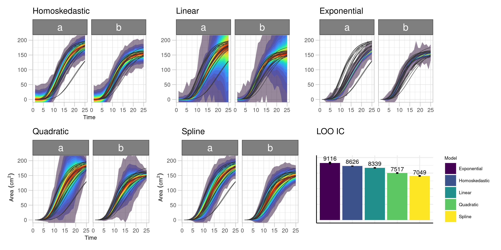
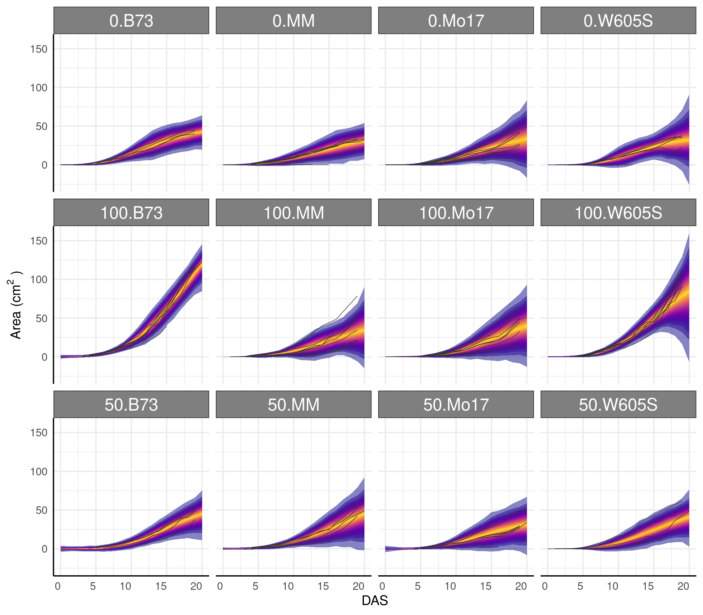
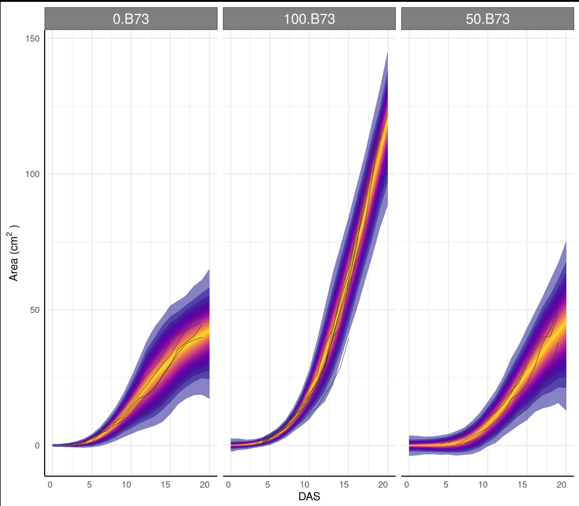
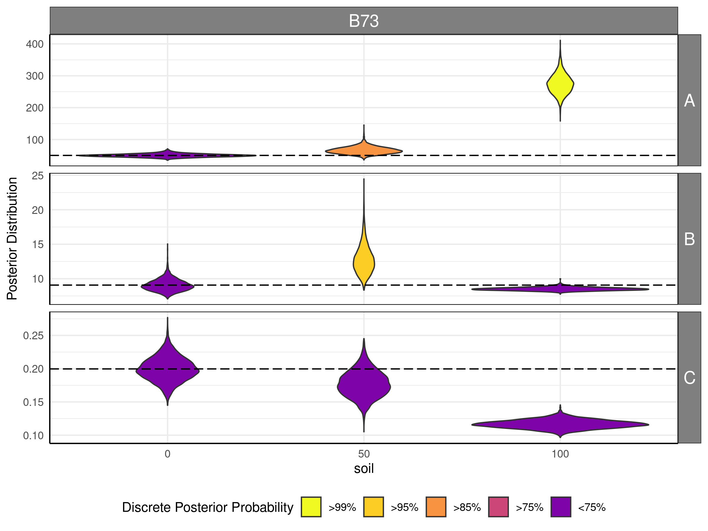
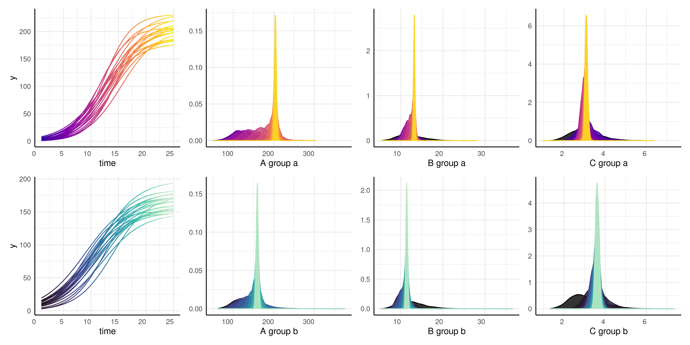

```{r setup, include=FALSE}
knitr::opts_chunk$set(echo = TRUE)
```

```{css}
.static-code {
  background-color: white;
  border: 1px solid lightgray;
}
.simulated {
  background-color: #EEF8FB;
  border: 1px solid #287C94;
}
```

```{r}
library(pcvr) #devtools::load_all()
library(data.table) # for fread
library(ggplot2)
library(patchwork) # for easy ggplot manipulation/combination
```


# Example Bellwether (Lemnatech) Workflow

The Bellwether phenotyping facility at the Donald Danforth Plant Science Center allows for high throughput image based phenotyping of up to 1140 plants over the course of several weeks. This generates a massive amount of image data which is typically analysed using plantCV, a python based image analysis tool developed and maintained by the Data Science Core Facility at DDPSC. The plantCV output from a Bellwether experiment consists of numeric phenotypes commonly broken into two categories, single value traits and multi value traits. Single value traits are phenotypes where one image yields one value, things like plant height or plant area. Multi value traits require multiple numbers to describe a single image and currently are limited to color histograms in various color spaces. Here we will focus only on the hue channel of HSV color, but there are lots of options with your data. This package is being developed to help with common analysis tasks that arise in using plantCV output. If your goal or experiment seems to be unsupported then please consider raising an [issue on github](https://github.com/joshqsumner/pcvr/issues/new/choose) so we can know what directions to take development in for the future.


Installation of `pcvr` from github is possible with the `remotes` or `devtools` packages. You may need to restart R after installing or reinstalling packages.

```{r, class.source="static-code", eval=F}
devtools::install_github("joshqsumner/pcvr", build_vignettes = TRUE)
library(pcvr)
```

If you clone that repository and are making edits then you can easily use your local version with:  `devtools::load_all("file/path/to/local/pcvr")`


Functions in `pcvr` use colorblind friendly palettes from the `viridis` package if they specify color/fill scales. Some functions do not specify a color/fill scale and use `ggplot2` defaults. If you use these functions or base work off of them please be mindful of your choices regarding color. 

As a final note before starting into `pcvr`, this vignette is laid out to help guide analyses from Bellwether experiments these functions tend to be generalizable and can be used for other plantCV data as well. There are some code chunks in this vignette that you are only presented to demonstrate syntax and that you are not meant to run locally if following along. Those are identified by style:

```{r, class.source="static-code", eval=F}
complicatedFunction("syntax") # do not run this style
```

```{r}
1+1 # run this style
```

```{r, class.source="simulated", eval=T}
support<-seq(0,1,0.0001) # this style is simulated data
plot(support, dbeta(support, 5,5), type="l", main="simulated example")
```


## Read In Data

### `read.pcv`

Bellwether data can be very large so this vignette will use a small bellwether dataset that is already subset to remove most multi-value traits (most color histograms). Both the [single value data](https://github.com/joshqsumner/pcvrTestData/blob/main/) and [multi value data](https://github.com/joshqsumner/pcvrTestData/blob/main/) are available on github. For single value traits being read into wide format there is not a compelling reason to use `read.pcv` in place directly calling `fread` or `read.csv`. The benefits of `read.pcv` are only shown if you need to filter data outside of R or if you want to use your data in a different format than it is stored in (wide going to long and vice versa).

The single value traits can be read in with `read.pcv`, here using `data.table::fread` for speed.

```{r}
sv<-read.pcv("https://raw.githubusercontent.com/joshqsumner/pcvrTestData/main/pcv4-single-value-traits.csv",
             reader="fread")
```

You will generally want to join some metadata to your phenotypes or parse metadata from your barcodes. Metadata key files will generally look and be used like this:

```{r}
key<-read.csv("https://raw.githubusercontent.com/joshqsumner/pcvrTestData/main/smallPhenotyperRun_key.csv")
head(key)
sv<-merge(sv, key, by="barcode")
table(sv$genotype, sv$fertilizer)

```

If we did not have a key file then we would parse our barcodes doing something like this:

```{r}
  genotype = substr(sv$barcode, 3,5)
  genotype = ifelse(genotype == "002", "B73",
                       ifelse(genotype == "003", "W605S",
                              ifelse(genotype == "004", "MM", "Mo17")))
  fertilizer = substr(sv$barcode, 8, 8)
  fertilizer = ifelse(fertilizer == "A", 100,
                       ifelse(fertilizer == "B", 50, 0))
  table(genotype, fertilizer)
```

Here we'll also convert some of the phenotypes from pixel units to meaningful units. Here we know that the chips on our color card are 1.2cm on each side, so we can use the following conversion. You can convert these phenotypes to whatever units you like, but you need to know the size of the color card chips in some real unit and color correct in plantCV so that the color chip measurements are returned.

```{r}
chipSize_px <- mean(c(sv$median_color_chip_height_median, sv$median_color_chip_width_median)) # ~52

px_per_cm <- chipSize_px/1.2 # ~ 43.5
pixels_per_cmsq <- px_per_cm^2 # ~ 1890

sv$area_cm2<-sv$area_pixels / pixels_per_cmsq
sv$height_cm <- sv$height_pixels/px_per_cm
```


### Very large datasets

Sometimes large plantCV output may be too large to be read into memory for R. In that case `read.pcv` has a `filter` argument which will filter rows using awk through linux/unix outside of R. That feature would work as shown below to read only single value traits into memory. This can take a few minutes but allows the entirely workflow to be documented in one R file. 


```{r, class.source="static-code", eval=F}
example<-read.pcv("prohibitivelyLargeFile.csv",
   filters = list("trait in area_pixels, area_above_reference_pixels, area_below_reference_pixels, color_chip_size_median, convex_hull_area_pixels, convex_hull_vertices_none, ellipse_angle_degrees", "sample in default"))
```

### `read.pcv.4.x`

Before the release of PlantCV version 4 there were several widely used branches of PlantCV that output results as a single long format csv file. The original goal of `read.pcv` was to make it easier to work with those files. Now that the default output has changed the `read.pcv` function has been somewhat simplified but it can still be used for these "PlantCV 4.x" legacy style data.

```{r, class.source="static-code", eval=F}
sv<-read.pcv("https://media.githubusercontent.com/media/joshqsumner/pcvrTestData/main/smallPhenotyperRun.csv", mode="wide",
             reader="fread")

if(T){ # we can parse barcodes for the metadata that we need
  sv$genotype = substr(sv$barcode, 3,5)
  sv$genotype = ifelse(sv$genotype == "002", "B73",
                       ifelse(sv$genotype == "003", "W605S",
                              ifelse(sv$genotype == "004", "MM", "Mo17")))
  sv$fertilizer = substr(sv$barcode, 8, 8)
  sv$fertilizer = ifelse(sv$fertilizer == "A", "100",
                       ifelse(sv$fertilizer == "B", "50", "0"))
} else { # or we might use a key file and join it to our data
  key<-read.csv("https://raw.githubusercontent.com/joshqsumner/pcvrTestData/main/smallPhenotyperRun_key.csv")
  sv<-merge(sv, key, by="barcode")
}
```


### `read.pcv.3`

Legacy Bellwether data (plantCV version 3 output) can also be read in with `read.pcv.3` which is a wrapper around `read.pcv` which attempts to do several common tasks related bellwether data joining internally. This should be considered experimental as it is based on plantCV version 3 and earlier outputs/bellwether experiments can take many formats and this has only been considered with a few datasets. With the older plantCV output the data is already in a wider format so here the default mode is "long". Note that while `read.pcv` works fine with this older data and still has some added benefits the reasons to use it in place of `data.table::fread` or `base::read.csv` are less compelling.

Here we have examples of reading in various amounts of plantCV 3 bellwether data. In the final example we also list a conversion to take area from pixels to $\text{cm}^2$ for the 5MP camera that was used prior to 2023. Note that the conversion would change for a different camera such as the current 18MP camera. It is a good idea to check your color chip sizes if you are not sure about the appropriate conversion.

```{r, eval=F}
bw_onlyPhenos<-read.pcv.3( file="https://raw.githubusercontent.com/joshqsumner/pcvrTestData/main/pcv3Phenos.csv",metaCol=NULL)
colnames(bw_onlyPhenos)

bw_phenosAndMeta<-read.pcv.3( file="https://raw.githubusercontent.com/joshqsumner/pcvrTestData/main/pcv3Phenos.csv",metaCol="meta", metaForm="vis_view_angle_zoom_horizontal_gain_exposure_v_new_n_rep", joinSnapshot = "id")
colnames(bw_phenosAndMeta)

bw_all<-read.pcv.3( file="https://raw.githubusercontent.com/joshqsumner/pcvrTestData/main/pcv3Phenos.csv",
   snapshotFile="https://raw.githubusercontent.com/joshqsumner/pcvrTestData/main/pcv3Snapshot.csv",
   designFile="https://raw.githubusercontent.com/joshqsumner/pcvrTestData/main/pcv3Design.csv",
   metaCol="meta",metaForm="vis_view_angle_zoom_horizontal_gain_exposure_v_new_n_rep",
   joinSnapshot="id", conversions = list(area=13.2*3.7/46856))
colnames(bw_all)
```


### Other metadata

Often we want to convert our timestamp data from the lemnatech into either days after start (DAS), days after planting (DAP), or days after emergence (DAE). By default the `bw.time` function will add columns called DAS, DAP, and DAE to your data. Days after emergence requires using a phenotype and a value to classify emergence. Here an area greater than 10 pixels is considered an emerged plant. In this example with a planting delay of 0 DAP and DAE will be the same, but both are still created for the purpose of the example.

```{r}
sv<-bw.time(sv, plantingDelay = 0, phenotype="area_pixels", cutoff=10, timeCol="timestamp", group=c("barcode", "rotation"), plot=TRUE)
dim(sv)
```

Note that in these plots, and particularly clearly in the DAE plot, there are lots of plants which show a vertical line on their last day, indicating that our grouping might be incorrect. For this data that is due to the imaging schedule changing and getting 2 separate images at each rotation on the last day.

Before moving on we'll also check the grouping in our data. Here we see that we have lots of plants with more than one image per day.

```{r}
checkGroups(sv, c("DAS", "barcode", "rotation", "genotype", "fertilizer"))
```


We can combine images taken at different angles of the same plant on a given day with `aggregate`, where we will also remove some columns we aren't using. In this case we use the mean of observations, but some people prefer a sum. Either way is fine. Here we also remove the DAE and DAP columns since we will not be using them. 

```{r}
phenotypes <- colnames(sv)[c(19:35, 43:45, 48:49)]
phenoForm<-paste0("cbind(", paste0(phenotypes, collapse=", "), ")")
groupForm<-"DAS+timestamp+barcode+genotype+fertilizer"
form<-as.formula(paste0(phenoForm, "~", groupForm))
sv_ag_withOutliers<-aggregate(form, data=sv, mean, na.rm=TRUE)
dim(sv_ag_withOutliers)
```


The `bw.outliers` function can be used to remove outliers relative to a phenotype using cook's distance. Here due to the experimental design having these plants germinate on the machine around 1 percent of data are removed as outliers. The plot shows removed data points in red, although here that is hard to see.

```{r}
sv_ag<-bw.outliers(df = sv_ag_withOutliers, phenotype="area_pixels", group = c("DAS", "genotype", "fertilizer"), plotgroup = c("barcode"))
dim(sv_ag)
```

It is also useful to check our grouping assumptions again, here we see that there are some plants with multiple images from a single day.

```{r}
checkGroups(sv_ag, c("DAS", "barcode", "genotype", "fertilizer"))
```


#### Watering Data

We might also want to check the watering data, which can be read easily from json with `bw.water`.

```{r}
water<-bw.water("https://raw.githubusercontent.com/joshqsumner/pcvrTestData/main/metadata.json")

water$genotype = substr(water$barcode, 3,5)
water$genotype = ifelse(water$genotype == "002", "B73",
                     ifelse(water$genotype == "003", "W605S",
                            ifelse(water$genotype == "004", "MM", "Mo17")))
water$fertilizer = substr(water$barcode, 8, 8)
water$fertilizer = ifelse(water$fertilizer == "A", "100",
                     ifelse(water$fertilizer == "B", "50", "0"))

ggplot(water[water$weight_after!=-1,], aes(x=DAS, y=water_amount, group=barcode,color=genotype))+
  facet_wrap(~factor(fertilizer, levels = c("0", "50", "100")))+
  geom_line()+
  pcv_theme()+
  guides(color=guide_legend(title="Condition", override.aes = list(linewidth=5)))+
  labs(y="Watering Amount (g)")+
  theme(legend.position="bottom")
```

A common use for watering data is to look at water use efficiency (WUE). Here we can calculate an approximation of WUE based on the change in some phenotype (area) over the change in weight between waterings. Note that the plants in this example are very young and as such the data in this example is dominated by noise.


```{r}
test<-pwue(df = sv_ag, w=water, pheno="area_pixels", time="timestamp", id="barcode")

ggplot(test, aes(x=DAS, y=pWUE, color=genotype, group=barcode))+
  geom_line()+
  guides(color=guide_legend(override.aes = list(linewidth=5)))+
  labs(y=expression("Pseudo WUE ("~frac(Delta~textstyle("Area")[" pixels"],
                                        Delta~textstyle("Weight")[" g"] )~")" ))+
  pcv_theme()
```


## FREM

Now that our data is read in and has undergone some basic quality control we want to know which phenotypes are best explained by our design variables. The `frem` function partitions variance using a fully random effects model (frem). Here we provide our dataframe, the design variables, the phenotypes, and the column representing time. By default `frem` will use the last timepoint, but this is controlled with the `time` argument. For this first example we mark the singular model fits (`markSingular=TRUE`) to indicate places where `lme4::lmer` had some convergence issues. Generally these issues are minor and do not cause problems for interpreting these models, but you can pass additional arguments to `lme4::lmer` through additional arguments if desired.

```{r}
frem(sv_ag, des=c("genotype", "fertilizer"),
     phenotypes=c("area_pixels", "area_above_reference_pixels", "area_below_reference_pixels", 
                  "convex_hull_area_pixels", "convex_hull_vertices_none", "ellipse_angle_degrees", 
                  "ellipse_eccentricity_none", "ellipse_major_axis_pixels", "ellipse_minor_axis_pixels", 
                  "height_pixels", "height_above_reference_pixels", "height_below_reference_pixels", 
                  "horizontal_reference_position_none", "hue_circular_mean_degrees", "hue_circular_std_degrees", 
                  "hue_median_degrees", "perimeter_pixels", "solidity_none", "width_pixels"),
     timeCol="DAS", cor=TRUE, returnData=F, combine=F, markSingular=TRUE, time=NULL)
```

Here we look at how much variance in each phenotype was explained over the course of the experiment. We could also specify a set of times (`time = c(10:14)` for example) if we are most interested in a particular timeframe.

```{r}
frem(sv_ag, des=c("genotype", "fertilizer"),
     phenotypes=c("area_pixels", "area_above_reference_pixels", "area_below_reference_pixels", 
                  "convex_hull_area_pixels", "convex_hull_vertices_none", "ellipse_angle_degrees", 
                  "ellipse_eccentricity_none", "ellipse_major_axis_pixels",
                  "ellipse_minor_axis_pixels", 
                  "height_pixels", "height_above_reference_pixels", "height_below_reference_pixels", 
                  "horizontal_reference_position_none", "hue_circular_mean_degrees", "hue_circular_std_degrees", 
                  "hue_median_degrees", "perimeter_pixels", "solidity_none", "width_pixels"),
     timeCol="DAS", cor=F, returnData=F, combine=F, markSingular=F, time="all")
```

This informs our next steps. Hue and size based phenotypes are well explained by our design variables so we might decide to focus more complex analyses on those. In this experiment mini maize is one of the genotypes and the fertilizer treatment has an option with no nitrogen, so this intuitively makes sense and passes an eye check.

## Single Value Traits

Most analysis focus on single value traits, that is phenotypes where one image returns on numeric value such as area or height. These can be compared longitudinally or with respect to individual days. Note that we do not recommend using a PCA of the single value traits to look for differences in your treatment groups, these traits are interpretable on their own and are interdependent enough that a PCA is not appropriate.


### Growth Trendlines

Trendlines help us decide what next steps make the most sense and give a general impression of which conditions yielded healthier plants.

```{r}
ggplot(sv_ag, aes(x=DAS, y=area_cm2, group=interaction(genotype, fertilizer, lex.order=TRUE),
                                color = genotype))+
  facet_wrap(~factor(fertilizer, levels = c("0", "50", "100")))+
  geom_smooth(method="loess", se=TRUE, fill = "gray90")+
  geom_line(aes(group=barcode), linewidth=0.15)+
  labs(y=expression("Area"~"(cm"^2~")"),
       color="Genotype")+
  guides(color=guide_legend(override.aes = list(linewidth=5)))+
  pcv_theme()+
  theme(axis.text.x.bottom=element_text(angle=0))
```


### Single day comparisons

Non-longitudinal data (or single day data from larger longitudinal data) can be compared with frequentist or Bayesian options.

The `pcvBox` function is a simple wrapper around ggplot and ggpubr functions that compares data with either T tests (the default) or Wilcox tests.

```{r}
pcvBox(sv_ag[sv_ag$genotype=='MM' & sv_ag$DAS==15, ], x="fertilizer", y="area_cm2", compare="0", showPoints = T)+
  labs(y=expression("Area"~"(cm"^2~")"),
       fill="Soil Fertilizer")+
  scale_x_discrete(limits = c("0", "50", "100"))
```

Alternatively the `conjugate` function compares several types of distributions using a Bayesian test and optionally evaluates a region of practical equivalence (ROPE). This function can be used with either wide or long single value data or wide multi-value data. See `?pcvr::conjugate` for details on usage and available options.

```{r}
mo17_area <- sv_ag[sv_ag$genotype=="Mo17" & sv_ag$DAS > 18 & sv_ag$fertilizer == 100, "area_cm2"]
B73_area <- sv_ag[sv_ag$genotype=="B73" & sv_ag$DAS > 18 & sv_ag$fertilizer == 100, "area_cm2"]

area_res_t <- conjugate(s1 = mo17_area, s2= B73_area, method="t", plot=TRUE, rope_range = c(-5,5))
```

Here we can see a dramatic difference in our posterior distributions between genotypes and the distribution of differences between these samples is entirely outside of our ROPE which.

### Relative Tolerance

Often bellwether experiments involve comparing stress tolerance between groups. For example in this dataset we might want to know which genotype shows the most resilience to reduced fertilizer. To easily check this we can change out data with `relativeTolerance`. Details on this function can be read with `?pcvr::relativeTolerance`.

```{r}
rt<-relativeTolerance(sv_ag, phenotypes = c("area_cm2", "height_cm"), 
                      grouping = c("fertilizer", "genotype", "DAS"), control = "fertilizer", controlGroup="100")


ggplot(rt[rt$phenotype == "area_cm2" & rt$DAS %in% c(10:12), ],
       aes(x=DAS, y=mu_rel, fill = interaction(fertilizer, genotype)) )+
  geom_col(position="dodge")+
  geom_errorbar(aes(ymin = mu_rel-1.96*se_rel, ymax = mu_rel+1.96*se_rel),
                position=position_dodge(width=0.9), width=0.3)+
  pcv_theme()+
  labs(y="Relative Tolerance", fill="Fertilizer\nand Genotype")
```

Looking at the entire data for the area phenotype is very busy so we might subset to look at something more specific, where we see some odd products of the plants germinating on the bellwether system.

```{r}
pd<-rt[rt$phenotype == "area_cm2" & rt$DAS %in% c(5:19) & rt$fertilizer=="0", ]
pd$upper_2se <- pd$mu_rel + 2* pd$se_rel
pd$lower_2se <- pd$mu_rel - 2* pd$se_rel

ggplot(pd, aes(x=DAS, y=mu_rel, fill = genotype) )+
  geom_col(position="dodge")+
  geom_errorbar( aes(ymin = lower_2se, ymax = upper_2se,
                     group = genotype), position="dodge" )+
  pcv_theme()+
  labs(y="Relative Tolerance")
```


### Cumulative Phenotypes

Sometimes we might want to use the cumulative difference over time

```{r}
cp<-cumulativePheno(sv_ag, phenotypes = c("area_cm2", "height_cm"), group="barcode", timeCol="DAS")
```


We can check that this worked correctly with trendlines:

```{r}
ggplot(cp, aes(x=DAS, y=area_cm2_csum, color = genotype, group= barcode))+
  facet_wrap(~factor(fertilizer, levels = c("0", "50", "100")))+
  geom_line()+
  pcv_theme()+
  labs(y=expression("Cumulative Sum of Area"~"(cm"^2~")"),
       color="Genotype")
```

And we can use this new phenotype data to analyse data from the entire experiment using just the last day. Here we don't specify a comparison group so `pcvBox` does not make any statistical comparisons.

```{r}
pcvBox(cp[cp$DAS==19, ], x="fertilizer", y="area_cm2_csum", showPoints = T)+
  labs(y=expression("Cumulative Area"))+
  facet_wrap(~genotype)+theme(legend.position="none")+
  scale_x_discrete(limits = c("0", "50", "100"))
```


### Longitudinal Modeling

Longitudinal modeling is the most comprehensive way to use the single value traits from a bellwether experiment. Longitudinal modeling can also be complicated compared to single timepoint analyses. Statistical complications including changes in variance, non-linearity, and autocorrelation present potential problems in analyses. To address these we recommend using hierarchical models. `pcvr` attempts to lower the barrier to entry for these models with helper functions for use with `brms`, `nlme`, `nlrq`, and `nls`. Here we focus only on `brms` models, but there are [tutorials](https://github.com/danforthcenter/pcvr/tree/main/tutorials) that cover more options.

#### Growth Model Forms

Based on literature and observed trends there are 6 common growth models that `pcvr` supports. Those are shown here using the `growthSim` function.

```{r,  class.source="simulated", class.output="simulated"}
simdf<-growthSim("logistic", n=20, t=25, params = list("A"=c(200,160), "B"=c(13, 11), "C"=c(3, 3.5)))
l<-ggplot(simdf,aes(time, y, group=interaction(group,id)))+
  geom_line(aes(color=group))+labs(title="Logistic")+theme_minimal()+theme(legend.position="none")

simdf<-growthSim("gompertz", n=20, t=25, params = list("A"=c(200,160), "B"=c(13, 11), "C"=c(0.2, 0.25)))
g<-ggplot(simdf,aes(time, y, group=interaction(group,id)))+
  geom_line(aes(color=group))+labs(title="Gompertz")+theme_minimal()+theme(legend.position="none")

simdf<-growthSim("monomolecular", n=20, t=25, params = list("A"=c(200,160), "B"=c(0.08, 0.1)))
m<-ggplot(simdf,aes(time, y, group=interaction(group,id)))+
  geom_line(aes(color=group))+labs(title="Monomolecular")+theme_minimal()+theme(legend.position="none")

simdf<-growthSim("exponential", n=20, t=25, params = list("A"=c(15, 20), "B"=c(0.095, 0.095)))
e<-ggplot(simdf,aes(time, y, group=interaction(group,id)))+
  geom_line(aes(color=group))+labs(title="Exponential")+theme_minimal()+theme(legend.position="none")

simdf<-growthSim("linear", n=20, t=25, params = list("A"=c(1.1, 0.95)))
ln<-ggplot(simdf,aes(time, y, group=interaction(group,id)))+
  geom_line(aes(color=group))+labs(title="Linear")+theme_minimal()+theme(legend.position="none")

simdf<-growthSim("power law", n=20, t=25, params = list("A"=c(16, 11), "B"=c(0.75, 0.7)))
pl<-ggplot(simdf,aes(time, y, group=interaction(group,id)))+ geom_line(aes(color=group))+
  labs(title="Power Law")+theme_minimal()+theme(legend.position="none")

(l+g+m)/(e+ln+pl)

```

Typically at least one of these models will be a good fit to your bellwether data, with gompertz models being the most broadly useful so far. In this experiment the plants were not germinated before being added to the machine, so we might not see asymptotic size. Still, conceptually we know that these plants will stop growing in the near future so we might use a gompertz model in place of the exponential model that looks most like our loess trendlines.


#### Model setup 

Coding a multilevel bayesian model can be a difficult and time consuming process. Even with the greatly simplified syntax used by `brms` this can present a barrier to entry for some people who could benefit from using very robust models. To help get around this potential issue for the specific case of measuring growth over time `pcvr` includes several functions to work with `brms`, the first of which is `growthSS`, a self-starter helper function for use with `brms::brm`.

##### submodel options

There are several ways to consider variance over time. By default almost all modeling assumes homoscedasticity, that is constant variance across predictor variables (time here). That assumption is very unrealistic in biological settings since all seeds/seedlings will start from a very low area but will grow differently through the experiment. The `growthSS` function has three options for modeling variance: homo, linear, spline. There are many ways that we could model variance, but these three are implemented for general use. Splines will almost always yield the best fit to your data.



##### Prior Distributions

An important part of bayesian statistics is setting an appropriate prior. These represent your knowledge about the field and are used along with your collected data to yield results. Priors should generally be weak relative to your data, meaning that if your prior belief is wrong then your experiment can move the posterior distribution away from the prior in a meaningful way.

In `growthSS` priors can be specified as a brmsprior object (in which case it is used as is), a named list (names representing parameters), or a numeric vector, where values will be used to generate lognormal priors with a long right tail. Lognormal priors with long right tails are used because the values for our growth curves are strictly positive and the lognormal distribution is easily interpreted. The tail is a product of the variance, which is assumed to be 0.25 for simplicity and to ensure priors are wide. This means that only a location parameter needs to be provided. If a list is used then each element of the list can be length 1 in which case each group will use the same prior or it can be a vector of the same length as `unique(data$group)` where `group` is your grouping variable from the form argument to `growthSS`. If a vector is used then a warning will be printed to check that the assumed order of groups is correct. The `growthSim` function can be useful in thinking about what a reasonable prior distribution might be, although priors should not be picked by trying to get a great fit by eye to your collected data.

We can check the priors made by `growthSS` with the `plotPrior` function.

```{r}
priors = list("A" = 130, "B" = 10, "C" = 0.2)
priorPlots<-plotPrior(priors)
priorPlots[[1]]/priorPlots[[2]]/priorPlots[[3]]
```

Looking at the prior distributions this way is useful, but for those still familiarizing with a given growth model the parameter values may not be very intuitive. To help with picking reasonable priors while familiarizing with the meaning of the model parameters the `plotPrior` function can also simulate growth curves by making draws from the specified prior distributions. Here is an example of using `plotPrior` in this way to pick between possible sets of prior distributions for a gompertz model. For asymptotic distributions the prior on "A" is added to the y margin. For distributions with an inflection point the prior on "B" is shown in the x margin. Arbitrary numbers of priors can be compared in this manner, but more than two or three can be cluttered so an iterative process is recommended if you are learning about your growth model.

```{r}
twoPriors = list("A" = c(100, 130), "B" = c(6, 12), "C" = c(0.5, 0.25))
plotPrior(twoPriors, "gompertz",n=100)[[1]]
```


##### Using `growthSS`

Now we're ready to define the necessary variables in our data and use the `growthSS` function. 

```{r}
sv_ag$group<-interaction(sv_ag$fertilizer, sv_ag$genotype)
```

The `brms` package is not automatically imported by `pcvr`, so before fitting models we would need to load that package. For details on installing [`brms`](https://github.com/paul-buerkner/brms) and either [`rstan`](https://mc-stan.org/rstan/) or [`cmdstanr`](https://mc-stan.org/cmdstanr/) (with `cmdstanr` being recommended), see those packages linked documentation. Note that if you install `pcvr` from github with `dependencies=T` then `cmdstanr` and `brms` will be installed.

```{r, eval=FALSE}
library(brms)
library(cmdstanr)
cmdstanr::install_cmdstan()
```

Here our priors are informed by a general understanding of what we expect to see for a plant on the bellwether system. In general the example priors 

```{r, eval=FALSE}
ss<-growthSS(model="gompertz", form =  area_cm2~DAS|barcode/group, sigma="spline", df=sv_ag,
             start = list("A" = 130, "B" = 10, "C" = 0.5), type = "brms")
```

Now we have most of our model components in the `ss` object. Since we specified a gompertz model we have three parameters, the asymptote (`A`), the inflection point (`B`), and the growth rate (`C`). For other model options see `?pcvr::growthSim` for details on the parameters.

Before trying to fit the model it is generally a good idea to check one last plot of the data and make sure you have everything defined correctly.

```{r}
ggplot(sv_ag, aes(x=DAS, y=area_cm2, group=barcode, color=group))+
  geom_line()+theme_minimal()+
  labs(y=expression("Area"~"(cm"^2~")"),
       color="Genotype\nand Soil")
```

This looks okay, there are no strange jumps in the data or glaring problems.


#### Running Models

The `fitGrowth` function is a wrapper around `brms::brm` which automatically uses the output from `growthSS`. Any additional arguments to `brms::brm` can still be specified, a few examples of which are shown here. 

```{r, class.source="static-code", eval=FALSE}
fit <- fitGrowth(ss, iter = 1000, cores = 2, chains = 2, backend = "cmdstanr",
               control = list(adapt_delta = 0.999, max_treedepth = 20)) # options to increase performance
```

```{r, eval=FALSE}
data(bw_vignette_fit)
fit<-bw_vignette_fit
```


#### Check Model Fit

We can visualize credible intervals from a `brms` model and compare that to our growth trendlines to get an intuitive understanding of how well the model fit. Note that since this vignette does not load brms these are only a picture of the output from `brmPlot` and `brmViolin`. The code is present to run this locally if you have brms installed and choose to.

```{r, eval=FALSE}
brmPlot(fit, form = area_cm2~DAS|barcode/group, df = ss$df)+ 
  labs(y=expression("Area"~"(cm"^2~")"))
```



In this case our model has 12 groups (3 soil conditions in each of 4 genotypes), so we might want to pull out only a few groups to look at. 

```{r, eval=FALSE}
brmPlot(fit, form = area_cm2~DAS|barcode/group, df = ss$df, groups = c("0.B73", "50.B73", "100.B73"))+
  labs(y=expression("Area"~"(cm"^2~")"))
```



#### Test Hypotheses

Now we probably have some ideas about what we want to test in our data. The `brms::hypothesis` function offers incredible flexibility to test all kinds of hypotheses. For some comparisons `pcvr` has a helper function called `brmViolin` to visualize posterior distributions and the posterior probability of some hypotheses associated with them.

```{r, eval=FALSE}
brmViolin(model = fit, params = NULL,
          hyp="num/denom>1.05", compareX = c("0.B73", "50.B73", "100.B73"), againstY = "0.B73",
          group_sep = "[.]", groups_into = c("soil", "genotype"), x="soil", facet="genotype",
          returnData=FALSE)
```



This shows that we have a posterior probability greater than 99 percent of an asymptotic size at least 5 percent higher with the 100 type soil when compared against the 0 type soil. Note that this data does not have any plants that reached asymptotic size, so the model uses the incomplete data to estimate where an asymptote would be. In a normal experiment the plants would be more mature but here the asymptote parameter is artificially inflated for the 100 soil treatment group due to their slower growth rate. 

There are a lot of options for how to use this function and even more ways to use `brms::hypothesis`, so this example should not be seen as the only way to compare your models.

#### Comparing Models Over Time

As a final note on `brms`, there is a possiblity of making interesting early stopping rules in a Bayesian framework. Currently this does not have an obvious Bellwether implementation but it should be noted as a benefit of the method. If you have models fit to subsets of your data then the `distPlot` function will show changes in the posterior distribution for some or all of your parameters over time or over another subset variable. Here the growth trend plots are also a legend for the time of each posterior distribution.

```{r, eval=FALSE}
print(load(url("https://raw.githubusercontent.com/joshqsumner/pcvrTestData/main/brmsFits.rdata")))
from3to25<-list(fit_3, fit_5, fit_7, fit_9, fit_11, fit_13, fit_15, fit_17, fit_19, fit_21, fit_23, fit_25)

distributionPlot(fits = from3to25, form = y~time|id/group, params=c("A", "B", "C"), d=simdf)
```




## Multi Value Traits

Working with multi value traits leads to different statistical challenges than the single value traits. Generally reading the data in as wide format makes for a significantly smaller object in memory terms since there are not lots of duplicated metadata (identifiers for each row when every image has hundreds of rows potentially). Note that for many questions even about color it is not necessary to use the entire color histograms. Make sure that you have a good reason to use the complete color data before going down this particular path for too long. As an example, a very simple comparison of the circular mean of Hue here will show our treatment effect in this data. 

```{r}
ggplot(sv_ag[sv_ag$DAS==18,], aes(x = fertilizer, y=hue_circular_mean_degrees, fill = fertilizer))+
  geom_boxplot(outlier.shape=NA)+
  geom_jitter(width=0.05, size=0.5)+
  scale_fill_manual(values = c(viridis::viridis(3,1,0.1)), breaks = c('0','50','100'))+
  pcv_theme()+
  theme(legend.position = "none")+
  facet_wrap(~genotype, scales="free_x")+
  scale_x_discrete(limits=c('0','50','100'))+
  labs(y="Hue Circular Mean (degrees)", x="Soil and Genotype")

```


```{r}
hue_wide<-read.pcv("https://media.githubusercontent.com/media/joshqsumner/pcvrTestData/main/pcv4-multi-value-traits.csv",
                   mode="wide", reader="fread")
hue_wide$genotype = substr(hue_wide$barcode, 3,5)
hue_wide$genotype = ifelse(hue_wide$genotype == "002", "B73",
                     ifelse(hue_wide$genotype == "003", "W605S",
                            ifelse(hue_wide$genotype == "004", "MM", "Mo17")))
hue_wide$fertilizer = substr(hue_wide$barcode, 8, 8)
hue_wide$fertilizer = ifelse(hue_wide$fertilizer == "A", "100",
                     ifelse(hue_wide$fertilizer == "B", "50", "0"))
hue_wide<-bw.time(hue_wide,timeCol="timestamp", group="barcode", plot = FALSE)

phenotypes <- colnames(hue_wide)[grepl("hue_frequencies", colnames(hue_wide))]
phenoForm<-paste0("cbind(", paste0(phenotypes, collapse=", "), ")")
groupForm<-"DAS+barcode+genotype+fertilizer"
form<-as.formula(paste0(phenoForm, "~", groupForm))
hue_wide<-aggregate(form, data=hue_wide, mean, na.rm=TRUE)
```


### Joyplots

Joyplots are a common way to look at lots of distributions. Here we check the hue histograms as joyplots using the 18th day and add a new fill for the hue colorspace.

```{r, message=FALSE}
p<-pcv.joyplot(hue_wide[hue_wide$DAS==18,], index = "hue_frequencies",
               group=c("fertilizer", "genotype"), method=NULL, compare=NULL)
p+scale_fill_gradientn(colors = scales::hue_pal(l=65)(360))+scale_y_discrete(limits=c("0", "50", "100"))
```

We can also specify a y argument to show multiple days across several variables.

```{r, message=FALSE}
p<-pcv.joyplot(hue_wide[hue_wide$DAS %in% c(5,10,15),], index = "hue_frequencies", group=c("fertilizer", "genotype"),
               y="DAS", method=NULL, compare=NULL, id = NULL)
p+scale_fill_gradientn(colors = scales::hue_pal(l=65)(360))+scale_y_discrete(limits=c("5", "10", "15"))
```

As mentioned previously the `conjugate` function can be used with wide multi-value data. To use multi value data the samples should be data frames or matrices representing color histograms. Here we compare our color histograms assuming a lognormal distribution and find that they are very similar in this parameterization.

```{r}
mo17_sample <- hue_wide[hue_wide$genotype=="Mo17" & hue_wide$DAS > 18 & hue_wide$fertilizer == 100, grepl("hue_freq", colnames(hue_wide))]
B73_sample <- hue_wide[hue_wide$genotype=="B73" & hue_wide$DAS > 18 & hue_wide$fertilizer == 100, grepl("hue_freq", colnames(hue_wide))]

hue_res_ln <- conjugate(s1 = mo17_sample, s2= B73_sample, method="lognormal",
              plot=TRUE, rope_range = c(-20,20), hypothesis="equal")
```


### Ordination

Ordinations are another common way to look at multi value traits. The `pcadf` function in `pcvr` has several options for how this can work.

```{r}
# could use facet="fertilizer" here but I want to reorder manually instead of changing the data
pcadf(hue_wide, cols = "hue_frequencies", color = "genotype", returnData=FALSE)+
  facet_wrap(~factor(fertilizer, levels=c("0", "50", "100")))
```


This is potentially useful but it does not show us the time component well. We can facet by day or add traces easily. Using the trace argument we can view the movement of groups over time, but that can be cluttered.

```{r}
pcadf(hue_wide, cols = "hue_frequencies", color = c("genotype", "fertilizer"),  trace="DAS", returnData=FALSE)
```

When the trace is cluttered it generally helps to either use a facet or to return a list of plots showing a few days at a time in the trace. Both those options are done using the `facet` argument.

```{r}
plots<-pcadf(hue_wide, cols = "hue_frequencies", color = c("genotype", "fertilizer"),  trace="DAS", returnData=FALSE, facet = c(1,2,3,4))

(plots[[1]]+plots[[2]]) / (plots[[3]]+plots[[2]]) + plot_layout(guides = "collect")
```

### Earth Mover's Distance

Since color data is exported from plantCV as histogram data we can also use Earth Mover's Distance (EMD) to compare images. Conceptually EMD is a distance that quantifies how much work it would take to turn one histogram into another. Here we do pairwise comparisons of all our rows and return a long dataframe of those distances. Note that even running several cores in parallel this can take a lot of time for larger datasets since the number of comparisons quickly can become unwieldy. The output also will require more work to keep analyzing, so make sure this is what you want to be doing before using EMD to compare color histograms. If you are only interested in a change of the mean then this is probably not the best way to use your data.

Here is a fast example of a place where EMD makes a lot of sense. In this simulated data we have five generating distributions. Normal, Log Normal, Bimodal, Trimodal, and Uniform. We could use some gaussian mixtures to characterize the multi-modal histograms but that will get clunky for comparing to the unimodal or uniform distributions. The `conjugate` function would not work here since these distributions do not share a common parameterization. Instead, we can use EMD.


```{r,  class.source="simulated", class.output="simulated"}
set.seed(123)

simFreqs<-function(vec, group){
  s1<-hist(vec, breaks=seq(1,181,1), plot=FALSE)$counts
  s1d<-as.data.frame(cbind(data.frame(group), matrix(s1,nrow=1)))
  colnames(s1d)<-c('group', paste0("sim_",1:180))
  s1d
}

sim_df<-rbind(do.call(rbind, lapply(1:10, function(i){ simFreqs(rnorm(200, 50, 10), group="normal") })),
      do.call(rbind, lapply(1:10, function(i){ simFreqs(rlnorm(200, log(30),0.25), group="lognormal") })),
      do.call(rbind, lapply(1:10, function(i){ simFreqs( c(rlnorm(125, log(15),0.25), rnorm(75, 75,5) ), group="bimodal") })),
      do.call(rbind, lapply(1:10, function(i){ simFreqs( c(rlnorm(100, log(15),0.25), rnorm(50, 50,5), rnorm(50, 90,5) ), group="trimodal") })),
      do.call(rbind, lapply(1:10, function(i){ simFreqs( runif(200,1,180), group="uniform") }))
      )

sim_df_long<-as.data.frame(data.table::melt(data.table::as.data.table(sim_df), id.vars = "group"))
sim_df_long$bin<-as.numeric(sub("sim_", "", sim_df_long$variable))

ggplot(sim_df_long, aes(x=bin, y=value, fill=group), alpha=0.25)+
  geom_col(position="identity", show.legend = F)+
  pcv_theme()+
  facet_wrap(~group)
```


Our plots show very different distributions, so we get EMD between our images and see that we do have some trends shown in the resulting heatmap.


```{r,  class.source="simulated", class.output="simulated"}
sim_emd<-pcv.emd(df = sim_df, cols="sim_", reorder=c("group"),
        mat =FALSE, plot=TRUE, parallel = 1, raiseError=TRUE)
sim_emd$plot
```


Now we can filter edge strength during our network building step for EMD > 0.5, and plot our network.


```{r,  class.source="simulated", class.output="simulated"}
emd = sim_emd$data; meta = NULL; dissim=TRUE; distCol="emd"; filter = 0.5; direction="greater"
n<-pcv.net(sim_emd$data, filter = 0.5)
net.plot(n, fill="group")
```


The distributions separate very well from each other, but we don't actually see our uniform distribution here. That is because the uniform distribution does not have self-similar replicates and is also not very similar to the other distributions. If we change our filtering then we can even see which generating distributions are most similar to each other. Here we pass 0.5 as a string, which tells `pcv.net` to use the top 50 percent of EMD values instead of EMD values > 0.5.


```{r,  class.source="simulated", class.output="simulated"}
n<-pcv.net(sim_emd$data, filter = '0.5')
net.plot(n, fill="group")
```


Just as we'd expect, our uniform distribution shows up now and is the most different. Now changing the edgeFilter in the `net.plot` function would let us fine tune this plot more to show finer distinctions between our other four generating distributions.


Here is an example using our hue data, note that these examples will just loading the rdata that was generated by the code below, which took around 3 minutes to run. 


```{r, eval=FALSE}
EMD<-pcv.emd(df = hue_wide[hue_wide$DAS %in% c(5,12,19),], cols="hue_frequencies", reorder=c("fertilizer", "genotype", "DAS"),
             mat =FALSE, plot=TRUE, parallel = 12, raiseError=TRUE)
```

```{r, include=FALSE}
data(bw_vignette_small_emd)
EMD<-bw_vignette_small_emd
```

```{r, eval=FALSE, include=FALSE}
head(EMD$data)
EMD$plot
```

EMD can get very heavy with large datasets. For a recent lemnatech dataset using only the images from every 5th day there were $6332^2$ = 40,094,224 pairwise EMD values. In long format that's a 40 million row dataframe, which is unwieldy. To get around this problem we might decide to use the hue circular mean as a single value trait or to aggregate some of our data with the `mv_ag` function.

Starting with our complete hue data we have `r nrow(hue_wide)` image histograms. The `mv_ag` function will take a group argument and randomly pick members of that group to have their histograms combined. Note that histograms are scaled to sum to 1 before they are sampled. Here we return one example with 2 histograms kept per group and one example where groups are summarized into 1 histogram. If there are equal or fewer images as the `n_per_group` argument then no aggregation is done for that group but data are rescaled.

```{r}
hue_ag1<-mv_ag(df=hue_wide, group = c("DAS", "genotype", "fertilizer"),  n_per_group=2)
dim(hue_ag1)

hue_ag2<-mv_ag(hue_wide, group = c("DAS", "genotype", "fertilizer"),  n_per_group=1)
dim(hue_ag2)
```


### Network Analysis

As it stands our EMD data is potentially difficult to use for those unfamiliar with distance matrix based analysis. Here we represent our distances as a network to help use the results.

```{r}
set.seed(456)
net<-pcv.net(EMD$data, meta = c("fertilizer", "genotype", "DAS"), filter=0.5)
```

```{r}
net.plot(net, fill = "DAS", shape = "fertilizer", size=2)
```

This is a much more complicated network! Parsing biological meaning out of this would require more work than the first example with 5 very different distributions, but there is a pretty strong cluster in the upper right corner of plants with low fertilizer at the end of the experiment. In general if you pick to use EMD with or without networks start small and consider what each step should mean conceptually for your experiment.

## Conclusion

This vignette will be periodically updated as `pcvr` changes. Once again if your goal or experiment has some set of questions or needs that are not met so far please consider making an [issue on github](https://github.com/joshqsumner/pcvr/issues/new/choose) to help the Data Science Core continue to work on this project in ways that will help the plantCV community.


