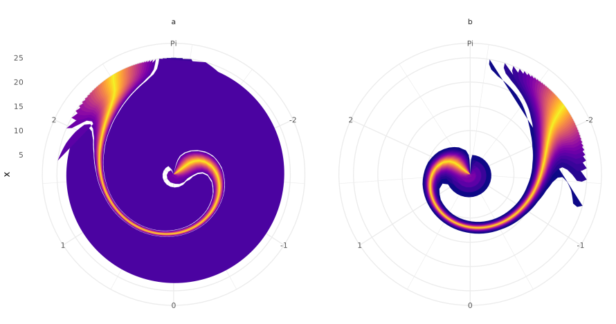

```{r setup, include=FALSE}
knitr::opts_chunk$set(echo = TRUE)
```

```{css}
.static-code {
  background-color: white;
  border: 1px solid lightgray;
}
.simulated {
  background-color: #EEF8FB;
  border: 1px solid #287C94;
}
```

```{r}
library(pcvr)
library(brms) # for rvon_mises
library(ggplot2)
library(patchwork) # for easy ggplot manipulation/combination
```

# What are directional statistics?

Directional (or circular/spherical) statistics is a subset of statistics which focuses on directions
and rotations. The reason directional statistics are separated from general statistics is that normally
we think about numbers being on a line such that the mean of 4 and 356 would be 180,
but if they are degrees in a circle then the mean would be at 0 (360) degrees.

Most distributions that we talk about in statistics are defined on a line. The Beta distribution is
defined on the interval [0,1], the normal can exist on a line in [-Inf, Inf], gamma on [0, Inf], etc.
Directional statistics allows us to wrap those distributions around a circle but that can sometimes add
difficulty to interpretation or extra error prone steps. Currently, pcvr does not support "wrapping"
distributions in this way and instead uses to Von-Mises distribution to handle circular data.

The Von-Mises distribution is a mathematically tractable circular distribution that can range from the
circular uniform to roughly the circular normal depending on the precision parameter $\kappa$, with the
uniform corresponding to $\kappa = 0$.

# Why are they in `pcvr`?

This is relevant to pcvr mainly for the color use case. `PlantCV` returns some single and multi value
traits that are circular, hue_circular_mean/median and hue_frequencies. Luckily for simplified plant
phenotyping, the Hue circle has red at 0/360 degrees (0/$2\pi$ in radians) and much of the time we will
not have to worry about the circular nature of the data since values are confined to the more green part
of the hue circle. Still, for cases where color does wrap around the circle it may be important to your
research to take that into account. Those special cases are where the Von-Mises distribution can help
you.

# `conjugate`

The simplest way to use the Von-Mises distribution in `pcvr` is through the `conjugate` function, where
"vonmises" and "vonmises2" are valid methods. As with other conjugate methods these are implemented for
single or multi value traits, but unlike other methods these are only necessarily supported in comparing
to other samples from the same distribution. If more distributions become tenable to add as circular
or wrapped functions then this may be revisted.

## "vonmises" method

The "vonmises" method uses the fact that the conjugate prior for the direction parameter ($\mu$) is
itself a Von-Mises distribution. Utilizing this conjugacy requires that we assume a known $\kappa$ for
the complete distribution so that updating the $\mu$ parameter is straightforward. Conceptually it may
be helpful to consider this similarly to the "T" method for comparing the means of guassians.

Priors for this method should specify a list containing "mu", "kappa", "boundary", "known_kappa",
and "n" elements. In that prior "mu" is the direction of the circular distribution,
"kappa" is the precision of the mean,
"boundary" is a vector including the two values that are the where the circular data "wraps"
around the circle,
"known_kappa" is the fixed value of precision for the total distribution,
and "n" is the number of prior observations.
If the prior is not specified then the default is
`list(mu = 0, kappa = 1, boundary = c(-pi, pi), known_kappa = 1, n = 1)`. As per other methods for the
conjugate function, the "posterior" part of the output is of the same form as the prior.

### Example

First we'll simulate some multi value data

```{r}
mv_gauss <- mvSim(
  dists = list(
    rnorm = list(mean = 50, sd = 10),
    rnorm = list(mean = 60, sd = 12)
    ),
  n_samples = c(30, 40)
  )
```

Next we'll run `conjugate` specifying that our data is on a circle defined over [0, 180] with an
expected direction around 45 (90 degrees on the full [0,360] or $\pi/2$ radians) and low precision.

```{r}
vm_ex1 <- conjugate(
  s1 = mv_gauss[1:30, -1],
  s2 = mv_gauss[31:70, -1],
  method = "vonmises",
  priors = list(mu = 45, kappa = 1, boundary = c(0, 180), known_kappa = 1, n = 1),
  plot = TRUE, rope_range = c(-5, 5), rope_ci = 0.89,
  cred.int.level = 0.89, hypothesis = "equal"
)
```

The summary shows normal `conjugate` output, here showing a posterior probability of ~91% that our
samples have equal means (remember the difference in our simulated data is now on a circle).

```{r}
vm_ex1$summary
```

Displaying plots of these data can be slower than for other conjugate methods due to the density of
the support. To explain, the Von-Mises distribution is defined in on the unit circle [$-\pi$, $\pi$]
so in order to have support that works to project that data into whatever space the boundary in the
prior specifies the support has to be very dense.

Note also that our rope_range is specified in the boundary units space, which is not necessarily
the unit circle.

```{r}
vm_ex1$plot
```

We get very similar results using roughly analogous single value traits.

```{r}
vm_ex1.1 <- conjugate(
  s1 = rnorm(30, 50, 10),
  s2 = rnorm(40, 60, 12),
  method = "vonmises",
  priors = list(mu = 0, kappa = 1, known_kappa = 1, boundary = c(0,180), n = 1),
  plot = FALSE, rope_range = c(-0.1, 0.1), rope_ci = 0.89,
  cred.int.level = 0.89, hypothesis = "equal"
)
vm_ex1.1$posterior
```

Single value traits work in the same way. Note that if we omit parts of the prior then they will be
filled in with the default prior values.

```{r}
set.seed(42)
vm_ex2 <- conjugate(
  s1 = brms::rvon_mises(100, -3.1, 2),
  s2 = brms::rvon_mises(100, 3.1, 2),
  method = "vonmises",
  priors = list(mu = 0, kappa = 1, known_kappa = 2),
  plot = TRUE, rope_range = c(-0.1, 0.1), rope_ci = 0.89,
  cred.int.level = 0.89, hypothesis = "equal"
)
```

We check our summary and see around 75% chance that these are equal 

```{r}
vm_ex2$summary
vm_ex2$posterior
```

Here our plot is much faster to make since the support is a roughly a thirtieth the size of the previous
example.

```{r}
vm_ex2$plot
```

Sometimes it may be helpful to use polar coordinates to consider this data, although limitations in
plotting area style geometries in the polar coordinates can be frustrating.

```{r}
p <- vm_ex2$plot
p[[1]] <- p[[1]] +
  ggplot2::coord_polar()+
  ggplot2::scale_y_continuous(limits = c(-pi, pi))
p
```


## "vonmises2" method

The "vonmises2" method updates $\mu$ and $\kappa$ of the complete Von-Mises distribution. This is done
by first taking a weighted average of the prior $\kappa$ and the MLE of $\kappa$ based on the sample
data then updating $\mu$ as above.

Priors for this method should specify "mu", "kappa", "boundary", and "n". Where "mu" is still mean
direction, "kappa" is the precision, and boundary/n are as above.

### Example

Using the same test data as above we can run the "vonmises2" method.

```{r}
vm2_ex1 <- conjugate(
  s1 = mv_gauss[1:30, -1],
  s2 = mv_gauss[31:70, -1],
  method = "vonmises2",
  priors = list(mu = 45, kappa = 1, boundary = c(0, 180), n = 1),
  plot = TRUE, rope_range = c(-5, 5), rope_ci = 0.89,
  cred.int.level = 0.89, hypothesis = "equal"
)
```

```{r}
vm2_ex1$plot
```

```{r}
vm2_ex1$posterior
```

```{r}
set.seed(42)
vm2_ex2 <- conjugate(
  s1 = brms::rvon_mises(100, -3.1, 2),
  s2 = brms::rvon_mises(100, 3.1, 2),
  method = "vonmises2",
  priors = list(mu = 0, kappa = 1),
  plot = TRUE, rope_range = c(-0.1, 0.1), rope_ci = 0.89,
  cred.int.level = 0.89, hypothesis = "equal"
)
```

```{r}
vm2_ex2$plot
```

```{r}
vm2_ex2$posterior
```


# `growthSS and brms`

The "von_mises" family is an option in `brms::brm()` and can be used via `growthSS` by specifying it in
the model using the form `model = "von_mises: linear"`. While this will let you specify a Von-Mises
model it does not necessarily mean the model will be as ready to go as the default student_t models
or gaussian or count models. The Von-Mises family can be more difficult to fit, particularly with
non-linear models. Von-Mises mixture models (which may be useful for modeling color changes due to
disease or abiotic stress that affects only a part of the plant at a time) are very difficult to fit
but can be at least hypothetically very useful.

## Example of specifying a circular model in `growthSS`

Here we set up a model with `growthSS` only for example purposes

```{r}
nReps <- 25
time <- 1:20
muTrend1 <- -2 + (0.25*time)
muTrend2 <- -1 + (0.2*time)
kappaTrend1 <- (0.5 * time)
kappaTrend2 <- (0.3 * time)
set.seed(123)
vm2 <- do.call(rbind, lapply(1:nReps, function(rep){
    do.call(rbind, lapply(time, function(ti){
      v1 <- brms::rvon_mises(1, muTrend1[ti], kappaTrend1[ti])
      v2 <- brms::rvon_mises(1, muTrend2[ti], kappaTrend2[ti])
      data.frame(y = c(v1, v2), x = ti, group = c("a", "b"), rep = rep )
  }))
}))

ss <- growthSS(model = "von_mises: int_linear", form = y ~ x|rep/group, sigma = "int", df = vm2,
               start = NULL, type = "brms")
ss$prior # default priors
ss$formula # formula specifies kappa based on sigma argument
```

## Example using `brms` directly

### Single Timepoint Model

```{r}
set.seed(123)
n=1000
vm1 <- data.frame(x = c(brms::rvon_mises(n, 1.5, 3), brms::rvon_mises(n, 3, 2)),
                  y = rep(c("a", "b"), each=n))

basePlot <- ggplot(vm1, aes(x=x, fill=y))+
  geom_histogram(binwidth=0.1, alpha = 0.75, position="identity")+
  labs(fill="Group")+
  guides(fill=guide_legend(override.aes = list(alpha=1)))+
  scale_fill_viridis_d()+
  theme_minimal()+
  theme(legend.position = "bottom")

basePlot +
  coord_polar()+
  scale_x_continuous(breaks = c(-2, -1, 0,1,2,3.1415), labels = c(-2, -1, 0, 1, 2, "Pi"))
basePlot + scale_x_continuous(breaks = c(-round(pi,2), -1.5, 0, 1.5, round(pi,2)))

prior1 <- set_prior("student_t(3,0,2.5)", coef = "ya")+
  set_prior("student_t(3,0,2.5)", coef = "yb")+
  set_prior("normal(5.0, 0.8)", coef = "ya", dpar = "kappa")+
  set_prior("normal(5.0, 0.8)", coef = "yb", dpar="kappa")

fit1 <- brm(bf(x ~ 0+y, kappa ~ 0+y),
            family = von_mises,
            prior = prior1,
            data = vm1,
            iter = 1000, cores = 2, chains = 2, backend = "cmdstanr", silent=0, init=0,
            control = list(adapt_delta = 0.999, max_treedepth = 20) )
fit1

x <- brmsfamily("von_mises")
pars <- colMeans(as.data.frame(fit))
mus <- pars[grepl("b_y", names(pars))]
x$linkinv(mus) # inverse half tangent function
# should be around 1.5, 3
kappas <- pars[grepl("kappa", names(pars))]
exp(kappas) # kappa is log linked
# should be around 3, 2
pred_draws <- as.data.frame(predict(fit1, newdata = data.frame(y = c("a", 'b')), summary=FALSE))
preds <- data.frame(draw = c(pred_draws[,1],pred_draws[,2]),
                    y = rep(c("a", "b"), each=nrow(pred_draws)))
predPlot <- ggplot(preds, aes(x=draw, fill=y))+
  geom_histogram(binwidth=0.1, alpha = 0.75, position="identity")+
  labs(fill="Group", y = "Predicted Draws")+
  guides(fill=guide_legend(override.aes = list(alpha=1)))+
  scale_fill_viridis_d()+
  theme_minimal()+
  theme(legend.position = "bottom")
predPlot + scale_x_continuous(breaks = c(-round(pi,2), -1.5, 0, 1.5, round(pi,2)))
predPlot +
  coord_polar()+
  scale_x_continuous(breaks = c(-2, -1, 0,1,2,3.1415), labels = c(-2, -1, 0, 1, 2, "Pi"))
```

### Longitudinal Model

```{r}
nReps <- 25
time <- 1:20
muTrend1 <- -2 + (0.25*time)
muTrend2 <- -1 + (0.2*time)
kappaTrend1 <- (0.5 * time)
kappaTrend2 <- (0.3 * time)
set.seed(123)
vm2 <- do.call(rbind, lapply(1:nReps, function(rep){
    do.call(rbind, lapply(time, function(ti){
      v1 <- rvon_mises(1, muTrend1[ti], kappaTrend1[ti])
      v2 <- rvon_mises(1, muTrend2[ti], kappaTrend2[ti])
      data.frame(y = c(v1, v2), x = ti, group = c("a", "b"), rep = rep )
  }))
}))

ggplot(vm2, aes(x=x, y = y, color=group, group = interaction(group, rep)))+
  geom_line()+
  labs(y="Y (Von Mises)")+
  theme_minimal()

ggplot(vm2, aes(y=x, x = y, color=group, group = interaction(group, rep), alpha = x))+
  geom_line()+
  labs(y="Time", x = "Von Mises")+
  theme_minimal()+
  guides(alpha="none")+
  coord_polar()+
  scale_x_continuous(breaks = c(-2, -1, 0, 1, 2, 3.1415),
                     limits = c(-pi, pi),
                     labels = c(-2, -1, 0, 1, 2, "Pi"))

prior2 <- set_prior("normal(5,0.8)", nlpar = "K")+
  set_prior("student_t(3, 0, 2.5)", nlpar = "I")+
  set_prior("student_t(3, 0, 2.5)", nlpar = "M")

fit2 <- brm(bf(y ~ I + M*x,
               nlf(kappa ~ K*x),
               I + M ~ 0 + group,
               K ~ 0 + group,
               autocor = ~arma(x|rep:group, 1,1),
               nl=TRUE),
            family = von_mises,
            prior = prior2,
            data = vm2,
            iter = 2000, cores = 4, chains = 4, backend = "cmdstanr", silent=0, init=0,
            control = list(adapt_delta = 0.999, max_treedepth = 20) )
fit2
pars <- colMeans(as.data.frame(fit2))
pars[grepl("^b_", names(pars))]

outline <- data.frame(group = rep(c("a", "b"), each=20),
                      x = rep(1:20, 2))
probs <-seq(0.01, 0.99, 0.02)
preds <- cbind(outline, predict(fit2, newdata = outline, probs = probs))

pal <- viridis::plasma(n = length(probs))
p2 <- ggplot(preds, aes(y = x))+
  facet_wrap(~group)+
  lapply(seq(1,49, 2), function(lower){
    geom_ribbon(aes(xmin = .data[[paste0("Q", lower)]], xmax = .data[[paste0("Q", 100-lower)]]), 
                fill = pal[lower])
  })+
  theme_minimal()+
  coord_polar()+
  scale_x_continuous(breaks = c(-2, -1, 0, 1, 2, 3.1415),
                     limits = c(-pi, pi),
                     labels = c(-2, -1, 0, 1, 2, "Pi"))
```

These models can be difficult to fit but they may be useful for your situation in which case the
stan forums and `pcvr` github issues are reasonable places to get help.




