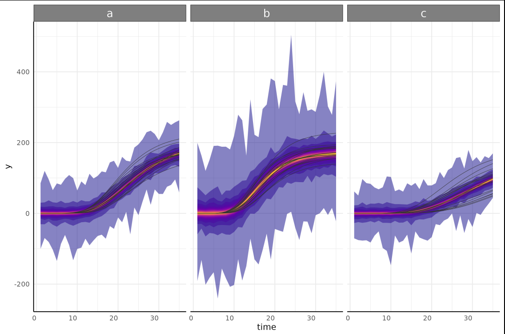
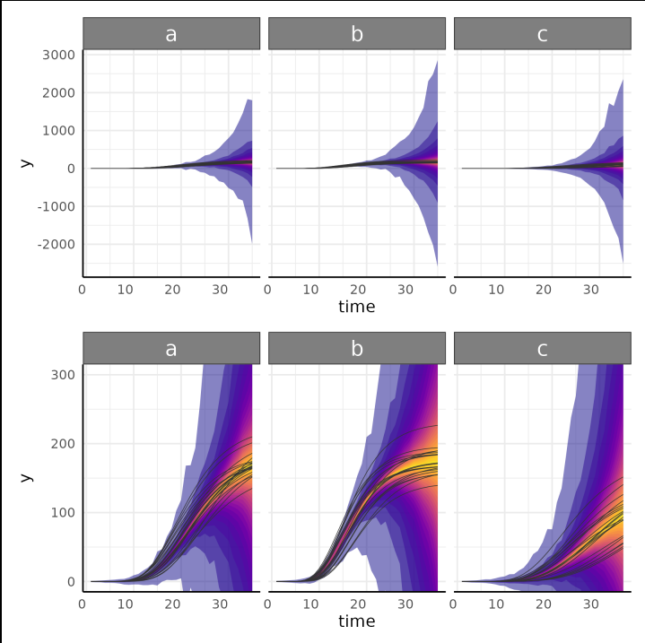
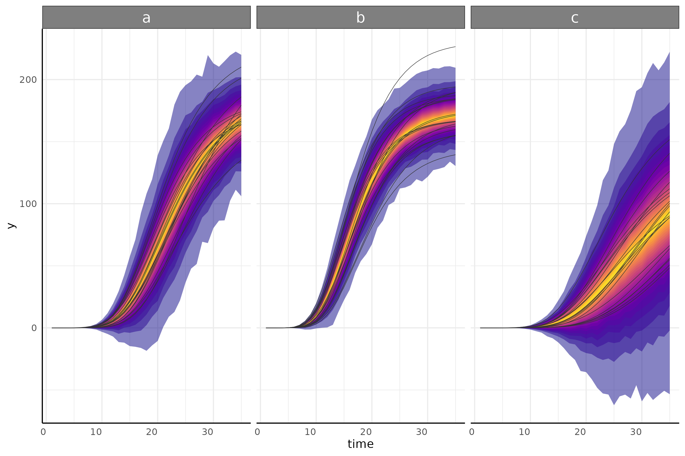
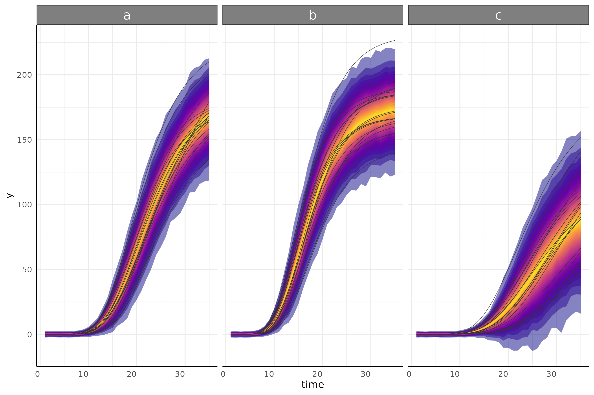
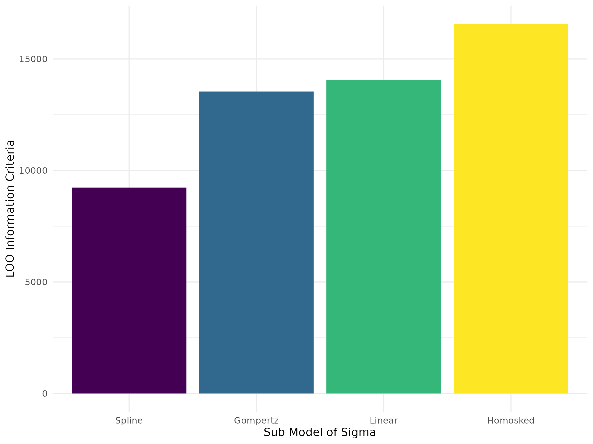
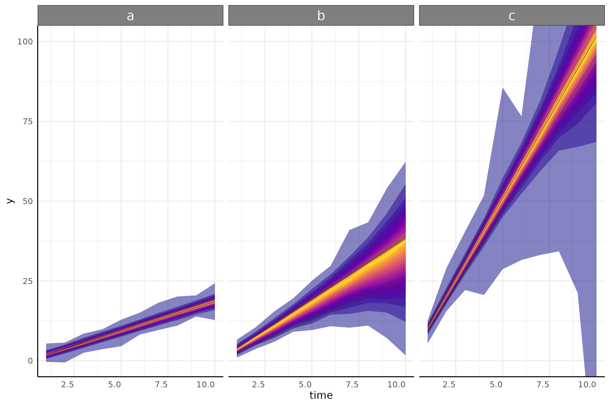

```{r setup, include=FALSE}
knitr::opts_chunk$set(echo = TRUE, eval=FALSE)#, tidy.opts=list(width.cutoff=60),tidy=TRUE
```

```{r, message = FALSE}
library(pcvr) 
library(data.table) # for fread
library(ggplot2)
library(patchwork) # for easy ggplot manipulation/combination
library(brms)
```


## Why Longitudinal Modeling?

Longitudinal modeling allows users to take full advantage of accurate and non-destructive data collection possible through high throughput image based phenotyping. Using longitudinal data accurately requires some understanding of the statistical challenges associated with it. Statistical complications including changes in variance (heteroskedasticity), non-linearity, and autocorrelation (plant's day to day self similarity) present potential problems in analyses. To address this kind of data several functions are provided to make fitting appropriate growth models more straightforward.

## Installation for Advanced Models

The `brms` package is not automatically imported by `pcvr`, so before fitting `brms` models we need to load that package. For details on installing [`brms`](https://github.com/paul-buerkner/brms) and either [`rstan`](https://mc-stan.org/rstan/) or [`cmdstanr`](https://mc-stan.org/cmdstanr/) (with `cmdstanr` being recommended), see the linked documentation. Note that if you install `pcvr` from github with `dependencies=T` then `cmdstanr` and `brms` will be installed.

Once `cmdstanr` is installed we also need to set the cmdstan path and link cmdstan to R, which is all done easily by `cmdstanr`. For example, packages can be installed and prepped using this code.

```{r, eval = FALSE}
if(!"cmdstanr" %in% installed.packages()){
  install.packages("cmdstanr", repos = c("https://mc-stan.org/r-packages/", getOption("repos")))
}
if(!"brms" %in% installed.packages()){
  install.packages("brms")
}
library(brms)
library(cmdstanr)
cmdstanr::install_cmdstan()
```


## Available Growth Models

Based on [literature](https://doi.org/10.1111/j.2041-210X.2011.00155.x) and experience there are six common plant growth models. Those main six growth models are supported in `pcvr` across each of four available backend functions (`nls`, `nlrq`, `nlme`, and `brms`). The `mgcv` backend can also be used to fit generalized additive models (GAMS) to any of these growth curves as well. In addition to these six main models GAMs, double logistic, and double gompertz models are supported across the four available parameter based backends. The parameterizations of these models are explained below.


### Logistic

The logistic function here is implemented as a 3 parameter sigmoidal growth curve: $A / (1 + e^{(B-x)/C} )$

In this model A is the asymptote, B is the inflection point, and C is the growth rate. 

### Gompertz

The gompertz function here is also a 3 parameter sigmoidal growth curve: $A * e^{(-B * e^{(-C*x)})}$

In this model A is the asymptote, B is the inflection point, and C is the growth rate. 

The gompertz formula is more complex than the logistic formula, which tends to make the model slightly harder to fit in terms of time and computation. The benefit to that extra effort is that the gompertz curve is more flexible than the logistic curve and does not have to stop growing at the same rate as it initially started growing. In the author's experience gompertz growth models have provided the best fit to sigmoidal data, but sometimes the speed and familiarity of the logistic function may be compelling.

### Monomolecular

The monomolecular function here is a 2 parameter asymptotic growth curve: $A-A * e^{(-B * x)}$

Once again, A is the asymptote but now B is the growth rate.

This model has often fit well for height or width phenotypes, but you should make model choices based on your data/expectations.

### Exponential

The exponential function here is a 2 parameter non-asymptotic growth curve bearing strong similarity to the monomolecular formula: $A * e^{(B * x)}$

Here A is a scale parameter and B is the growth rate.

Most plants do not grow indefinitely, although many may grow exponentially through the course of an experiment (think of the first half of a logistic or gompertz curve). In those cases you may wish to use an exponential model or if you are using the `brms` backend then you may wish to rely on some prior information about an asymptote that would eventually be achieved to use a sigmoidal model. 

### Power Law

The power law function here is a 2 parameter non-asymptotic growth curve: $A * x^B$

Here A is a scale parameter and B is the growth rate. The formula becomes linear when B is 1, shows slowing growth over time when 0 < B < 1 and shows growth speed increasing over time (the exponential) when B > 1.

These models can allow for slowing growth over time but without the expectation that growth ever truly stops. 

### Linear

The linear function here is simply: $A * x$

Here A is the growth rate and the intercept is assumed to be 0.

### Double Logistic

The double logistic function here is just two combined logistic functions: $A / (1+e^{((B-x)/C)}) + ((A2-A) /(1+e^{((B2-x)/C2)}))$

Here the parameters have the same interpretation as those in the logistic curve, but for the first and second component separately.

This is intended for use with recover experiments, not for any data with very minor hiccups in the overall trend. Additionally, with the `brms` backend the segmented models allow for a more flexible implementation as `logistic+logistic`, although in that implementation the values for A and B are not relative.

### Double Gompertz

The double logistic function here is just two combined gompertz functions: $A * e^{(-B * e^{(-C*x)})} + ((A2-A) * e^{(-B2 * e^{(-C2*(x-B))})})$

Here the parameters have the same interpretation as those in the gompertz curve, but for the first and second component separately.

All the same points as with the double logistic curve apply here as well.

### GAM

Finally, all backends can fit GAMs. These are unparameterized functions that use a series of splines to fit a variety of trends.

In general these are less useful since they do not give directly interpretable parameters, but their flexibility can be valuable if your data does not fit some more standard model well.

### Simulating data

Data from any parameterized model can be simulated using `growthSim`. Through this vignette we will use data created in this way to show modeling options.

```{r}
simdf<-growthSim("logistic", n=20, t=25, params = list("A"=c(200,160), "B"=c(13, 11), "C"=c(3, 3.5)))
l<-ggplot(simdf,aes(time, y, group=interaction(group,id)))+
  geom_line(aes(color=group))+labs(title="Logistic")+theme_minimal()+theme(legend.position="none")

simdf<-growthSim("gompertz", n=20, t=25, params = list("A"=c(200,160), "B"=c(13, 11), "C"=c(0.2, 0.25)))
g<-ggplot(simdf,aes(time, y, group=interaction(group,id)))+
  geom_line(aes(color=group))+labs(title="Gompertz")+theme_minimal()+theme(legend.position="none")

simdf<-growthSim("monomolecular", n=20, t=25, params = list("A"=c(200,160), "B"=c(0.08, 0.1)))
m<-ggplot(simdf,aes(time, y, group=interaction(group,id)))+
  geom_line(aes(color=group))+labs(title="Monomolecular")+theme_minimal()+theme(legend.position="none")

simdf<-growthSim("exponential", n=20, t=25, params = list("A"=c(15, 20), "B"=c(0.095, 0.095)))
e<-ggplot(simdf,aes(time, y, group=interaction(group,id)))+
  geom_line(aes(color=group))+labs(title="Exponential")+theme_minimal()+theme(legend.position="none")

simdf<-growthSim("linear", n=20, t=25, params = list("A"=c(1.1, 0.95)))
ln<-ggplot(simdf,aes(time, y, group=interaction(group,id)))+
  geom_line(aes(color=group))+labs(title="Linear")+theme_minimal()+theme(legend.position="none")

simdf<-growthSim("power law", n=20, t=25, params = list("A"=c(16, 11), "B"=c(0.75, 0.7)))
pl<-ggplot(simdf,aes(time, y, group=interaction(group,id)))+ geom_line(aes(color=group))+
  labs(title="Power Law")+theme_minimal()+theme(legend.position="none")

patch<-(l+g+m)/(e+ln+pl)
patch
```

## Available Model Backends

As previously mentioned there are five backends supported in `pcvr`. Here we will go over those backends in more detail. These backends are selected using one of nls, nlrq, nlme, mgcv, or brms which correspond to the functions shown in this table.

| "nls"        | "nlrq"           | "nlme"       | "mgcv"      | "brms"       |
|--------------|------------------|--------------|-------------|--------------|
| `stats::nls` | `quantreg::nlrq` | `nlme::nlme` | `mgcv::gam` | `brms::brms` |

### `nls`

The `nls` backend is the simplest option. These models account for non-linearity using any of the aforementioned model types and fit very quickly but do not have ways to take autocorrelation or heteroskedasticity into account.

### `nlrq`

The `nlrq` backend fits non-linear quantile models to specified quantiles of the data. These models account for non-linearity and account for heteroskedasticity in a non-parametric quantile based way (fitting 2.5% and 97.5% models will provide something like a 95% confidence interval that changes width across time as the data does).

### `nlme`

The `nlme` backend fits non-linear mixed effect models. These models account for non-linearity, autocorrelation, and to have options to model the heteroskedasticity.

### `mgcv`

The `mgcv` backend only fits GAMs, which do account for non-linearity but do not account for heteroskedasticity and autocorrelation and do not return interpretable parameters. 

### `brms`

The `brms` backend fits hierarchical Bayesian models that account for non-linearity, autocorrelation and heteroskedasticity. These models are more flexible than any of the other options and are the focus of the [Advanced Growth Modeling Tutorial](https://github.com/danforthcenter/pcvr/tree/main/tutorials/pcvrTutorial_advancedGrowthModeling).

## Making models in `pcvr`

At a high level the relevant functions in `pcvr` are `growthSS`, `fitGrowth`, `growthPlot`, and `testGrowth`. 

- `growthSS` specifies self starting growth models and returns a list that is used by `fitGrowth`

- `fitGrowth` fits a growth model specified by `growthSS` and returns a model or a list of model options.

- `growthPlot` visualizes the model fit. This is particularly helpful with `brms` models to check their heteroskedastic sub models.

- `testGrowth` tests model parameters against nested versions of the same models to allow for straightforward hypothesis testing on frequentist (non-`brms`) models. For `brms` models the `brms::hypothesis` function should be used.


### Using `growthSS`

`growthSS` is the first `pcvr` helper function for setting up longitudinal models. `growthSS` will return a list of elements used to fit a longitudinal model including a formula, starting values (or priors for `brms` values), data to use, and several elements used internally in other functions.

`growthSS` takes five arguments which specify the model to use, a simplified formula specifying the columns of your data to use, a sigma option, the data to use, and starting values/priors. The model and data to use are relatively straightforward, compare a plot of your data against the general shapes of the model parameterizations shown above to pick a model type and pass your dataframe to the `df` argument. The remaining arguments are explained below.

#### `growthSS(..., form, ...)`

The `form` argument of `growthSS` needs to specify the outcome variable, the time variable, an identifier for individuals, and the grouping structure. These are passed as a formula object, using similar syntax to `lme4` and `brms`, such as `outcome ~ time|individual_id/group_id`. Verbally this would be read as "outcome modeled by time accounting for correlation between individual_id's with fixed effects specified per each group_id". Note that this formula will not have to change for different growth models, this is only to specify the structure of your data. This simplification requires each of these parts of the formula must be a single column in your dataframe.

For model backends that do not account for autocorrelation the individual will not be used and can be omitted leaving `outcome ~ time|group_id`, but there is no harm in including the `individual_id` component.

#### `growthSS(..., sigma, ...)`

The `sigma` argument controls the sub model on variance. This is only used with `nlme` and `brms` backends which support different options.

In `nlme` models this can be "int", "power", or "exp" which correspond to using `nlme::varIdent` (constant variance within groups), `nlme::varPower` (variance changing by a power function), `nlme::varExp` (variance changing by an exponential function).

In `brms` models this can be specified in the same way as the general growth model. There is also an "int" model type which fits a 0 slope intercept only model. While "int" can be used in any `brms` model the option is meant to be used specifying a homoskedastic sub model, or a period of noise before the main growth trend begins (in terms of growth or variance).

At a high level we can think about any of these models as fitting a curve to these lines.

```{r}
set.seed(345)
gomp<-growthSim("gompertz", n=20, t=35, params = list("A"=c(200,180, 160), "B"=c(20,22, 18), "C"=c(0.15, 0.2, 0.1)))


sigma_df <- aggregate(y ~ group+time, data = gomp, FUN = sd)

ggplot(sigma_df, aes(x=time, y=y, group=group))+
  geom_line(color = "gray60")+
  pcv_theme()+
  labs(y="SD of y", title = "Gompertz Sigma")
```

Several options are shown here, ignoring grouping here since the data is already aggregated. 


```{r, message = FALSE}
draw_gomp_sigma <- function(x){ 23*exp(-21*exp(-0.22*x)) }
ggplot(sigma_df, aes(x=time, y=y))+
  geom_line(aes(group=group), color = "gray60")+
  geom_hline(aes(yintercept = 12, color="Homoskedastic"), linetype=5, key_glyph = draw_key_path)+
  geom_abline(aes(slope = 0.8, intercept=0,color="Linear"), linetype=5, key_glyph = draw_key_path)+
  geom_smooth(method="gam", aes(color = "Spline"), linetype=5, se=F, key_glyph = draw_key_path)+
  geom_function(fun = draw_gomp_sigma, aes(color="Gompertz"), linetype=5)+
  scale_color_viridis_d(option="plasma", begin = 0.1, end = 0.9)+
  guides(color=guide_legend(override.aes = list(linewidth=1, linetype=1)))+
  pcv_theme()+
  theme(legend.position="bottom")+
  labs(y="SD of y", title = "Gompertz Sigma", color = "")
```

"int" will specify a homoskedastic model, that is one with constant variance over time per each group. While this is the default for almost every kind of statistical modeling it is an unrealistic assumption in this setting where we often follow growth from small seedlings to potentially fully grown plants. Even if we start with larger plants the homoskedastic assumption almost never holds in longitudinal modeling. We can fit an example model and see the issue with the homoskedastic assumption through the model's credible intervals, which are far too wide at the beginning of the experiment and even include some negative values for plant area.

```{r}
ss <- growthSS(model = "gompertz", form = y~time|id/group, sigma = "int",
               df = gomp, start = list("A"=130, "B"=15, "C"=0.25))
```

```{r, eval=FALSE}
fit_h <- fitGrowth(ss, iter=1000, cores=4, chains=4, silent=0)

brmPlot(fit_h, form = ss$pcvrForm, df=ss$df)
```




We can relax this assumption and model sigma separately from the main growth trend. To show an example of the options in `pcvr`, here we repeat the example from above using a linear submodel. Note that here we add some extra controls to the model fitting algorithm to help the model fit well with the added complexity at the cost of being slower.

```{r}
ss <- growthSS(model = "gompertz", form = y~time|id/group, sigma = "linear",
               df = gomp, start = list("A"=130, "B"=15, "C"=0.25))
```

```{r, eval=FALSE}
fit_l <- fitGrowth(ss, iter=1000, cores=4, chains=4, silent=0, control = list(adapt_delta = 0.999, max_treedepth = 20))

p1<-brmPlot(fit_l, form = ss$pcvrForm, df=ss$df)
p2<-p1+coord_cartesian(ylim = c(0,300))
p <- p1/p2
p
```



This model is also a poor fit, but it has a different problem. It accurately models the low variability at the beginning of the experiment, but the linear model is not flexible enough to adapt to the changes in variance even in this simulated data.

We can also use spline sub models. The spline model does a very good job of fitting the data due to the natural flexibility of polynomial functions. Again this added accuracy comes at the cost of taking longer for the model to fit. Here we can specify "gam" or "spline" for backwards compatibility.


```{r}
ss <- growthSS(model = "gompertz", form = y~time|id/group, sigma = "spline",
               df = gomp, start = list("A"=130, "B"=15, "C"=0.25))
```

```{r, eval=FALSE}
fit_s <- fitGrowth(ss, iter=2000, cores=4, chains=4, silent=0, control = list(adapt_delta = 0.999, max_treedepth = 20))

brmPlot(fit_s, form = ss$pcvrForm, df=ss$df)
```


Here we try applying a gompertz function to the variance submodel. While this is much less flexible than splines it tends to describe the variance of a sigmoid growth model quite well and allows for easier hypothesis testing between groups. A fringe benefit can also be the predictability of the gompertz formula in extrapolating future data. Splines can have unexpected behavior when trying to predict timepoints outside of your initial data, but the gompertz formula is more predictable. Additionally, since the spline sub model will fit many basis functions this will generally be **significantly** faster since it only needs to find 3 parameters to complete the sub model, and each can have a mildly informative prior. As a single reference point, the model below fit in about 6 minutes while the spline model above took slightly over an hour to fit. These example models have three groups and the model with a gompertz sub model contains 21 total parameters while the spline sub model version contains 43 total parameters.

When setting priors for the gompertz sub-model it is generally reasonable to expect a similar growth rate and inflection point as in the main model (assuming the main model is gompertz as well).

```{r}
ss <- growthSS(model = "gompertz", form = y~time|id/group, sigma = "gompertz",
               df = gomp, start = list("A"=130, "B"=15, "C"=0.25, "subA"=15, "subB"=15, "subC"=0.25),
               type="brms")
```

```{r, eval=FALSE}
fit_g <- fitGrowth(ss, iter=2000, cores=4, chains=4, silent=0, control = list(adapt_delta = 0.999, max_treedepth = 20))

brmPlot(fit_g, form = ss$pcvrForm, df=ss$df)
```



A few other options are shown here as further examples. There are as many ways to model variance as there are to model growth using the `brms` backend, but other options are more limited.

```{r, message = FALSE}
draw_gomp_sigma <- function(x){ 23*exp(-21*exp(-0.22*x)) }
draw_logistic_sigma <- function(x){ 20 / (1 + exp( (15-x)/2) ) }
draw_logistic_exp <- function(x){ 2.5 * exp(0.08 * x) }
draw_logistic_quad <- function(x){ (0.3 * x) + (0.02*x^2) }

ggplot(sigma_df, aes(x=time, y=y))+
  geom_line(aes(group=group), color = "gray60", linetype=5)+
  geom_hline(aes(yintercept = 12, color="Homoskedastic"), linetype=1)+
  geom_abline(aes(slope = 0.8, intercept=0,color="Linear"), linetype=1, key_glyph = draw_key_path)+
  geom_smooth(method="gam", aes(color = "Spline"), linetype=1, se=F, key_glyph = draw_key_path)+
  geom_function(fun = draw_gomp_sigma, aes(color="Gompertz"), linetype=1)+
  geom_function(fun = draw_logistic_sigma, aes(color="Logistic"), linetype=1)+
  geom_function(fun = draw_logistic_exp, aes(color="Exponential"), linetype=1)+
  geom_function(fun = draw_logistic_quad, aes(color="Quadratic"), linetype=1)+
  scale_color_viridis_d(option="plasma", begin = 0.1, end = 0.9)+
  guides(color=guide_legend(override.aes = list(linewidth=1, linetype=1)))+
  pcv_theme()+
  theme(legend.position="bottom")+
  labs(y="SD of y", title = "Gompertz Sigma", color = "")
```

When considering several sub models (or growth models) we can compare models using Leave-One-Out Information Criterion (LOO IC).

```{r, eval = FALSE}
loo_spline <- add_criterion(fit_s, "loo")
loo_homo <- add_criterion(fit_h, "loo")
loo_linear <- add_criterion(fit_l, "loo")
loo_gomp <- add_criterion(fit_g, "loo")

h<-loo_homo$criteria$loo$estimates[3,1]
s<-loo_spline$criteria$loo$estimates[3,1]
l<-loo_linear$criteria$loo$estimates[3,1]
g<-loo_gomp$criteria$loo$estimates[3,1]

loodf<-data.frame(loo = c(h,s,l,g), model = c("Homosked", "Spline", "Linear", "Gompertz"))
loodf$model <- factor(loodf$model, levels=unique(loodf$model[order(loodf$loo)]), ordered=TRUE)

ggplot(loodf,
       aes(x=model,y=loo,fill=model))+
  geom_col()+
  scale_fill_viridis_d()+
  labs(y = "LOO Information Criteria", x = "Sub Model of Sigma")+
  theme_minimal()+
  theme(legend.position = "none")
```

{h!}

The spline sub-model tends to have the best LOO IC, but comparing credible intervals while taking speed and interpretability into account may change which model is the best option for your situation. For this particular data the gompertz submodel does seem to perform very well despite the LOO IC difference from using splines.

#### `growthSS(..., start, ...)`

One of the main difficulties in non-linear modeling is getting the models to fit without convergence errors. Using `growthSS` the six main model options (and GAMs, although in a different way) are self-starting and do not require starting values. For the double sigmoid options starting values are required though.

Additionally, using the `brms` backend this argument is used to specify prior distributions. Setting appropriate prior distributions is an important part and often criticized part of Bayesian statistics. Prior distributions are often talked about in the language of "prior beliefs", which can be somewhat misleading. Instead it can be helpful to think of prior distributions as hard-headed prior evidence.

In a broad sense, priors can be "strong" or "weak". 

##### Strong Priors

A strong prior is generally thought of as a prior with low variance. Almost all of the probability is in a tight space and the observed data will have a very hard time shifting the distribution meaningfully. Here is an example of a strong prior hurting a model. This example is clearly dramatic, but less absurd strong priors will still impact your results.

```{r, eval = FALSE}
set.seed(345)
ln <- growthSim("linear", n=5, t=10, params = list("A"=c(2, 3, 10)))

strongPrior <- prior(student_t(3,0,5), dpar="sigma", class="b") +
  prior(gamma(2,0.1), class="nu", lb=0.001)+
  prior(normal(10, .05),nlpar = "A", lb = 0)

ss <- growthSS(model = "linear", form = y~time|id/group, sigma = "homo",
               df = ln, priors = strongPrior)

fit <- fitGrowth(ss, iter=1000, cores=2, chains=2, silent=0)

brmPlot(fit, form = ss$pcvrForm, df=ss$df)+
 coord_cartesian(ylim = c(0,100))
```

{h!}

Setting a prior as narrow as `N(10, 0.05)` intuitively does feel too strong, as though we are so sure already that we can't expect to learn much more, but another way that a prior can be too strong is in providing too much unrealistic information. Specifically the flat prior can also be thought of as too strong given that it will weigh all numbers equally, which is almost never a reasonable assumption. In our growth model examples there should be no probability given to negative growth rates when plants start from seed. Even if the flat prior is constricted to be positive there is no parameterization where a parameter value in the thousands or millions makes sense as being biologically plausible.

Finally, when setting priors separately for groups you should consider the evidence toward your eventual hypotheses contained in those priors. If the mean effect size of some hypothesis of interest is far away from 0 based solely on your prior distributions then they are probably too strong.

Above all, remember to focus on evidence instead of hopes and beliefs. By default `pcvr` will make biologically plausible and individually weak priors for each parameter in your growth model using `growthSS` and check that the prior evidence of common hypotheses is not too strong, but it will not stop you from going forward with strong priors if you specify them.

##### Weak Prior

Generally we aim for "weak" or "mildly informative" priors. The goal with these is to constrict our sampler to possible values so that it moves faster and to introduce evidence driven domain expertise. 

```{r, eval = FALSE}
weakPrior <- prior(student_t(3,0,5), dpar="sigma", class="b") +
  prior(gamma(2,0.1), class="nu", lb=0.001)+
  prior(lognormal(log(10), 0.25), nlpar = "A", lb = 0)

ss <- growthSS(model = "linear", form = y~time|id/group, sigma = "homo",
               df = ln, priors = weakPrior)

fit <- fitGrowth(ss, iter=1000, cores=2, chains=2, silent=0)

brmPlot(fit, form = ss$pcvrForm, df=ss$df)+
 coord_cartesian(ylim = c(0,100))
```

{h!}

As you can see the weak priors moved to meet our data and now we have usable posterior distributions. The variance is large but that is natural with 5 reps per condition when looking at 99% credible intervals.

##### Priors in `growthSS`

In `growthSS` priors can be specified as a `brmsprior` object (in which case it is used as is, like in the strong/weak examples above), a named list (names representing parameters), or a numeric vector, where values will be used to generate lognormal priors with a long right tail. Lognormal priors with long right tails are used because the values for our growth curves are strictly positive and the lognormal distribution is easily interpreted. The tail is a product of the variance, which is assumed to be 0.25 for simplicity and to ensure priors are wide. This means that only a location parameter needs to be provided. If a list is used then each element of the list can be length 1 in which case each group will use the same prior or it can be a vector of the same length as `unique(data$group)` where `group` is your grouping variable from the `form` argument to `growthSS`. If a vector is used then a warning will be printed to check that the assumed order of groups is correct. The `growthSim` function can be useful in thinking about what a reasonable prior distribution might be, although priors should not be picked by trying to get a great fit by eye to your collected data.

We can check the priors made by `growthSS` with the `plotPrior` function.

```{r}
priors = list("A" = 130, "B" = 10, "C" = 0.2)
priorPlots<-plotPrior(priors)
priorPlots[[1]]/priorPlots[[2]]/priorPlots[[3]]
```

Looking at the prior distributions this way is useful, but the parameter values can be a degree removed from what we are really wanting to check. To help with picking reasonable priors based on the growth curves they'd represent the `plotPrior` function can also simulate growth curves by making draws from the specified prior distributions. Here is an example of using `plotPrior` in this way to pick between possible sets of prior distributions for a gompertz model. For asymptotic distributions the prior on "A" is added to the y margin. For distributions with an inflection point the prior on "B" is shown in the x margin. Arbitrary numbers of priors can be compared in this manner, but more than two or three can be cluttered so an iterative process is recommended if you are learning about your growth model.

```{r}
twoPriors = list("A" = c(100, 130), "B" = c(6, 12), "C" = c(0.5, 0.25))
plotPrior(twoPriors, "gompertz",n=100)[[1]]
```

#### `growthSS(..., tau, ...)`

For `nlrq` models the "tau" argument determines which quantiles are fit. By default this uses the median (0.5), but can be any quantile or vector of quantiles between 0 and 1.

### Using `fitGrowth`

The output from `growthSS` is passed to `fitGrowth` which fits the growth model using the specified backend.

Here we fit a model using each backend to simulated data.

```{r}
simdf<-growthSim("gompertz", n=20, t=25, params = list("A"=c(200,160), "B"=c(13, 11), "C"=c(0.2, 0.25)))
```

```{r}
nls_ss <- growthSS(model="logistic", form =  y~time|id/group,
                   df=simdf, type = "nls")
```

```{r}
nlrq_ss <- growthSS(model="logistic", form =  y~time|id/group,
                    df=simdf, type = "nlrq",
                    tau = seq(0.01, 0.99, 0.04))
```

```{r}
nlme_ss <- growthSS(model="logistic", form =  y~time|id/group,
                    df=simdf, sigma = "power", type = "nlme")
```

```{r}
mgcv_ss <- growthSS(model="gam", form =  y~time|id/group,
                   df=simdf, type = "mgcv")
```

```{r, eval=FALSE}
brms_ss<-growthSS(model="gompertz", form =  area_cm2~DAS|barcode/group,
             sigma="spline", df=simdf,
             priors = list("A" = 130, "B" = 10, "C" = 0.5))
```

Now we have all the essential model components in the `..._ss` objects. Since we specified a gompertz model we have three parameters, the asymptote (`A`), the inflection point (`B`), and the growth rate (`C`). In the `brms` option our sub model uses a GAM and does not add more parameters.

Before trying to fit the model it is generally a good idea to check one last plot of the data and make sure you have everything defined correctly.

```{r}
ggplot(simdf, aes(time, y, group=interaction(group,id)))+
 geom_line(aes(color=group))
```

This looks okay, there are no strange jumps in the data or glaring problems, the group and id variables seem to uniquely identify lines so the models should fit well.

Now we use `fitGrowth` to fit our models. Additional arguments can be passed to fitGrowth (see `?fitGrowth` for details), but here we only use those to specify details for the `brms` model and to run the `nlrq` model in parallel.

```{r, warning=FALSE, message=FALSE}
nls_fit <- fitGrowth(nls_ss)
nlrq_fit <- fitGrowth(nlrq_ss, cores = 4)
nlme_fit <- fitGrowth(nlme_ss)
mgcv_fit <- fitGrowth(mgcv_ss)
```

```{r, eval=FALSE}
brms_fit <- fitGrowth(brms_ss, iter = 1000, cores = 1, chains = 1, 
               control = list(adapt_delta = 0.999, max_treedepth = 20))
```


#### Check Model Fit

We can check the model fits using `growthPlot`.

```{r}
growthPlot(nls_fit, form = nls_ss$pcvrForm, df=nls_ss$df)
growthPlot(nlrq_fit, form = nlrq_ss$pcvrForm, df=nlrq_ss$df)
growthPlot(nlme_fit, form = nlme_ss$pcvrForm, df=nlme_ss$df, boot=3)
growthPlot(mgcv_fit, form = mgcv_ss$pcvrForm, df=mgcv_ss$df)
```

```{r, eval=FALSE}
growthPlot(brms_fit, form = brms_ss$pcvrForm, df=brms_ss$df)
```


{h!}

### `testGrowth`


#### `brms::hypothesis`

We can write arbitrarily complex hypotheses about our models and test the posterior probability using `brms::hypothesis`. Here we test if the ratio of Asymptotes for unfertilized plants from B73 over MM is more than 10 percent higher than that ratio in halfway fertilized plants. It would be out of scope to go over all the potentially interesting hypotheses since those will depend on your experimental design and questions, but hopefully this communicates the flexibility in using these models once they are fit.

```{r, echo=TRUE, eval=FALSE}
(hyp<-brms::hypothesis(fit, "(A_group0.B73 / A_group0.MM) > 1.1 * (A_group50.B73 / A_group50.MM)"))
```

```{r, echo=FALSE, eval=TRUE}
# dput(hyp)
structure(list(Hypothesis = "((A_group0.B73/A_group0.MM))-(1.1*(A_group50.B73/A_group50.MM)) > 0", 
    Estimate = 0.241209320218704, Est.Error = 0.322485870935505, 
    CI.Lower = -0.287499674054895, CI.Upper = 0.749743868569684, 
    Evid.Ratio = 3.72813238770686, Post.Prob = 0.7885, Star = ""), row.names = c(NA, 
-1L), class = "data.frame")
```

### Threshold Models


## Comparing Models Over Time

As a final note on `brms`, there is a possiblity of making interesting early stopping rules in a Bayesian framework. Currently this does not have an obvious Bellwether implementation but it should be noted as a benefit of the method. If you have models fit to subsets of your data then the `distPlot` function will show changes in the posterior distribution for some or all of your parameters over time or over another subset variable. Here the growth trend plots are also a legend for the time of each posterior distribution.

```{r, eval=FALSE}
print(load(url("https://raw.githubusercontent.com/joshqsumner/pcvrTestData/main/brmsFits.rdata")))
from3to25<-list(fit_3, fit_5, fit_7, fit_9, fit_11, fit_13, fit_15, fit_17, fit_19, fit_21, fit_23, fit_25)

distributionPlot(fits = from3to25, form = y~time|id/group, params=c("A", "B", "C"), d=simdf)
```


{h!}

## Other Resources

The supported models in `pcvr` are meant to lower the barrier to entry for complex models using `brms` and `Stan`. While there are lots of options using these growth models there are many many more options using `brms` directly and still more is possible programming directly in `Stan`. If you take an interest in developing more and more nuanced models then please see the [`brms` documentation](https://paul-buerkner.github.io/brms/), [`Stan` documentation](https://mc-stan.org/users/documentation/), or [stan forums](https://discourse.mc-stan.org/). For models that you think may have broader appeal for high throughput plant phenotyping please raise an issue on [github](https://github.com/danforthcenter/pcvr) and help the DDPSC data science team understand what the desired model is/where existing options fall short for your needs.


