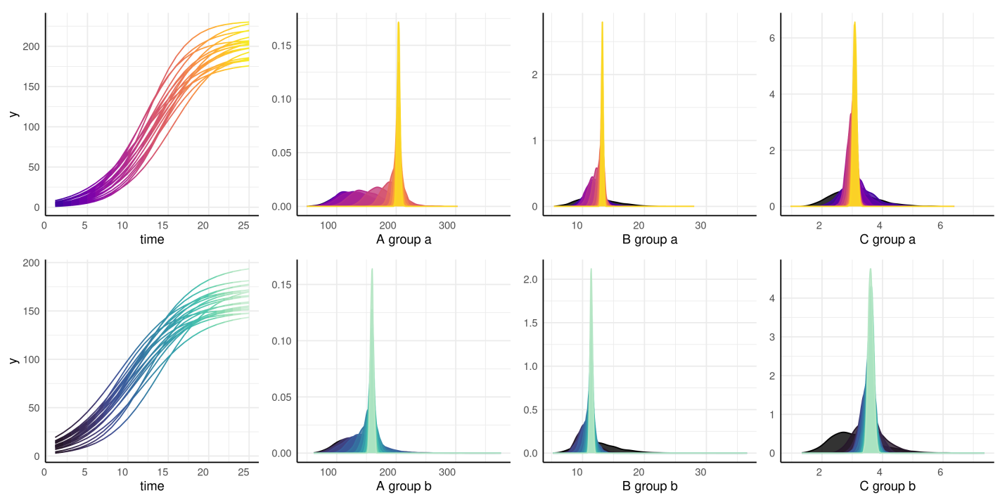

```{r setup, include=FALSE}
knitr::opts_chunk$set(echo = TRUE, tidy.opts=list(width.cutoff=60),tidy=TRUE)
```

```{r, message = FALSE}
devtools::load_all("~/Desktop/stargate/fahlgren_lab/pcvr/")
#library(pcvr) # devtools::load_all()
library(data.table) # for fread
library(ggplot2)
library(patchwork) # for easy ggplot manipulation/combination
library(brms)
```


## Why Longitudinal Modeling?

Longitudinal modeling allows users to take full advantage of accurate and non-destructive data collection possible through high throughput image based phenotyping. Using longitudinal data accurately requires some understanding of the statistical challenges associated with it. Statistical complications including changes in variance (heteroskedasticity), non-linearity, and autocorrelation (plant's day to day self similarity) present potential problems in analyses. To address these we recommend using hierarchical models. Often non-linear models present challenges in testing hypotheses but this concern, among others, can be solved by using a Bayesian framework. `pcvr` attempts to lower the barrier to entry for building these models with helper functions for use with `brms`.

## Setup

The `brms` package is not automatically imported by `pcvr`, so before fitting models we would need to load that package. For details on installing [`brms`](https://github.com/paul-buerkner/brms) and either [`rstan`](https://mc-stan.org/rstan/) or [`cmdstanr`](https://mc-stan.org/cmdstanr/) (with `cmdstanr` being recommended), see those packages linked documentation. Note that if you install `pcvr` from github with `dependencies=T` then `cmdstanr` and `brms` will be installed.

Once `cmdstanr` is installed we also need to set the cmdstan path and link cmdstan to R, which is all done easily by `cmdstanr`:

```{r, eval = FALSE}
library(cmdstanr)
cmdstanr::install_cmdstan()
```


## Read In Bellwether Data

For this tutorial we will use a mix of simulated data and Bellwether data. The Bellwether data is from an experiment using four maize genotypes in three levels of NPK fertilizer. Data from that experiment is available on github and can be read into R using `read.pcv`. The simulated data will be generated as needed. For details on the reading/metadata functions used here please see the main bellwether vignette.

```{r}
sv<-read.pcv(paste0("https://media.githubusercontent.com/media/",
                    "joshqsumner/pcvrTestData/main/smallPhenotyperRun.csv"), 
             mode="wide", singleValueOnly = T, reader="fread")

key<-read.csv(paste0("https://raw.githubusercontent.com/joshqsumner/",
                     "pcvrTestData/main/smallPhenotyperRun_key.csv"))

sv<-merge(sv, key, by="barcode")
```

Now we add integer time columns using `bw.time`.

```{r}
sv<-bw.time(sv, plantingDelay = 0, phenotype="area.pixels", cutoff=10, timeCol="timestamp", group=c("barcode", "rotation"), plot=FALSE)
```

Before combining angled pictures of the same plant per a given time.

```{r}
phenotypes <- c('area.pixels', 'convex_hull_area.pixels', 'convex_hull_vertices', 'ellipse_angle.degrees', 'ellipse_eccentricity', 'ellipse_major_axis.pixels', 'ellipse_minor_axis.pixels', 'height.pixels', 'hue_circular_mean.degrees', 'hue_circular_std.degrees', 'hue_median.degrees', 'longest_path.pixels', 'perimeter.pixels', 'solidity', 'width.pixels')
phenoForm<-paste0("cbind(", paste0(phenotypes, collapse=", "), ")")
groupForm<-"DAS+barcode+genotype+fertilizer"
form<-as.formula(paste0(phenoForm, "~", groupForm))
sv_ag_withOutliers<-aggregate(form, data=sv, mean, na.rm=TRUE)
```

And finally removing outliers with `bw.outliers` and converting area to be in $\text{cm}^2$ instead of pixels.

```{r}
sv_ag<-bw.outliers(df = sv_ag_withOutliers, phenotype="area.pixels", group = c("DAS", "genotype", "fertilizer"), plotgroup = c("barcode"), plot=FALSE)
pixels_per_cmsq <- 42.5^2 
sv_ag$area_cm2<-sv_ag$area.pixels / pixels_per_cmsq
sv_ag$group<-interaction(sv_ag$fertilizer, sv_ag$genotype)
```

## Growth Model Parameterizations

Based on [literature](https://doi.org/10.1111/j.2041-210X.2011.00155.x) and experience there are 6 common growth models that `pcvr` supports. Those are shown here using the `growthSim` function, with two groups simulated for each dataset to show some of the flexibility in the distributions.

```{r,  class.source="simulated", class.output="simulated"}
simdf<-growthSim("logistic", n=20, t=25, params = list("A"=c(200,160), "B"=c(13, 11), "C"=c(3, 3.5)))
l<-ggplot(simdf,aes(time, y, group=interaction(group,id)))+
  geom_line(aes(color=group))+labs(title="Logistic")+theme_minimal()+theme(legend.position="none")

simdf<-growthSim("gompertz", n=20, t=25, params = list("A"=c(200,160), "B"=c(13, 11), "C"=c(0.2, 0.25)))
g<-ggplot(simdf,aes(time, y, group=interaction(group,id)))+
  geom_line(aes(color=group))+labs(title="Gompertz")+theme_minimal()+theme(legend.position="none")

simdf<-growthSim("monomolecular", n=20, t=25, params = list("A"=c(200,160), "B"=c(0.08, 0.1)))
m<-ggplot(simdf,aes(time, y, group=interaction(group,id)))+
  geom_line(aes(color=group))+labs(title="Monomolecular")+theme_minimal()+theme(legend.position="none")

simdf<-growthSim("exponential", n=20, t=25, params = list("A"=c(15, 20), "B"=c(0.095, 0.095)))
e<-ggplot(simdf,aes(time, y, group=interaction(group,id)))+
  geom_line(aes(color=group))+labs(title="Exponential")+theme_minimal()+theme(legend.position="none")

simdf<-growthSim("linear", n=20, t=25, params = list("A"=c(1.1, 0.95)))
ln<-ggplot(simdf,aes(time, y, group=interaction(group,id)))+
  geom_line(aes(color=group))+labs(title="Linear")+theme_minimal()+theme(legend.position="none")

simdf<-growthSim("power law", n=20, t=25, params = list("A"=c(16, 11), "B"=c(0.75, 0.7)))
pl<-ggplot(simdf,aes(time, y, group=interaction(group,id)))+ geom_line(aes(color=group))+
  labs(title="Power Law")+theme_minimal()+theme(legend.position="none")

patch<-(l+g+m)/(e+ln+pl)
patch
```

Typically at least one of these models will be a good fit to your data.
Of these options the Gompertz model tends to be the most flexible and best suited to sigmoidal data ("S" shaped). The logistic function can be slightly faster to fit, but at the cost of having less flexibility between the initial speed of growth and the speed approaching the asymptote.

Another consideration when fitting one of these growth models is whether or not more time in the experiment would have led to a very different type of model due to known biological constraints. As an example, here is a plot of the growth data collected on the Bellwether.

```{r}
ggplot(sv_ag, aes(x=DAS, y=area_cm2, group=barcode, color=group))+
  geom_line()+
  theme_minimal()+
  labs(y=expression("Area"~"(cm"^2~")"),
       color="Fertilizer\nand Genotype")
```

Normally in Bellwether data we see larger areas sooner, but for this experiment the plants were germinated on the Bellwether system. Typically Maize would have been planted up to a week before being loaded onto the Bellwether system, meaning we would see the plants growth inflect (slow down) and possibly hit asymptotic size based on soil constraints. We know that maize in small pots will not continue exponential growth for long, so here we may opt to use a gompertz model with the caveat that we will not have a very well informed asymptote parameters. Regardless, we expect that our data would look more like this if allowed to grow for longer. We cannot use these assumptions to interpolate data, but we can use them to set well educated bounds on what is possible for our maize plants in a growth model.

```{r}
set.seed(345)
gomp<-growthSim("gompertz", n=20, t=35, params = list("A"=c(200,180, 160), "B"=c(20,22, 18), "C"=c(0.15, 0.2, 0.1)))

ggplot(sv_ag)+
  geom_line(data= gomp, aes(x=time, y=y, group = interaction(group,id)), color="gray60", linetype=5, linewidth=0.25)+
  geom_line(aes(x=DAS, y=area_cm2, group=barcode, color=group))+
  theme_minimal()+
  labs(y=expression("Area"~"(cm"^2~")"),
       color="Fertilizer\nand Genotype")
```

## Using `growthSS`

`growthSS` is the first `pcvr` helper function for setting up `brms` models. `growthSS` will return a `brmsformula` object, a `brmsprior` object (if priors are specified), an initialization function, a (potentially modified) dataframe for use in fitting the model, the model family (currently this is always student, see [this paper](https://doi.org/10.1037/a0029146) for details), and the `pcvr` formula for use with downstream model visualization functions.

`growthSS` takes five arguments which specify the model to use (of the 6 options above), the columns of your data to use (in a simplified formula), a submodel type, the data to use, and the prior distributions to use. The model and data to use are relatively straightforward, compare a plot of your data against the general shapes of the model parameterizations shown above to pick a model type and pass your dataframe to the `df` argument. The remaining arguments will be explained below.

### `growthSS(..., form, ...)`

The `form` argument of `growthSS` needs to specify the outcome variable, the time variable, an identifier for individuals, and the grouping structure. These are passed as a formula object, using similar syntax to `lme4` and `brms`, such as `outcome ~ time|individual_id/group_id`. Verbally this would be read as "outcome modeled by time accounting for correlation between individual_id's with fixed effects specified per each group_id". Note that this formula will not have to change for different growth models, this is only to specify the structure of your data. Because of that simplification each of these parts of the formula must be a single column in your dataframe. In our example Bellwether data we combine the `genotype` and `fertilizer` columns using `interaction()` into a new column called `group`.

### `growthSS(..., sigma, ...)`

The `sigma` argument controls the sub model of heteroskedasticity. Currently three options are given: "homo", "linear", and "spline".

At a high level we can think about these models as fitting a curve to these lines.

```{r}
set.seed(345)
gomp<-growthSim("gompertz", n=20, t=35, params = list("A"=c(200,180, 160), "B"=c(20,22, 18), "C"=c(0.15, 0.2, 0.1)))


sigma_df <- aggregate(formula = y ~ group+time, data = gomp, FUN = sd)

ggplot(sigma_df, aes(x=time, y=y, group=group))+
  geom_line(color = "gray60")+
  pcv_theme()+
  labs(y="SD of y", title = "Gompertz Sigma")
```

The three options implemented in `pcvr` are roughly represented by these curves, ignoring grouping here since the data is already aggregated. 


```{r, message = FALSE}
draw_gomp_sigma <- function(x){ 23*exp(-21*exp(-0.22*x)) }
ggplot(sigma_df, aes(x=time, y=y))+
  geom_line(aes(group=group), color = "gray60")+
  geom_hline(aes(yintercept = 12, color="Homoskedastic"), linetype=5, key_glyph = draw_key_path)+
  geom_abline(aes(slope = 0.8, intercept=0,color="Linear"), linetype=5, key_glyph = draw_key_path)+
  geom_smooth(method="gam", aes(color = "Spline"), linetype=5, se=F, key_glyph = draw_key_path)+
  geom_function(fun = draw_gomp_sigma, aes(color="Gompertz"), linetype=5)+
  scale_color_viridis_d(option="plasma", begin = 0.1, end = 0.9)+
  guides(color=guide_legend(override.aes = list(linewidth=1, linetype=1)))+
  pcv_theme()+
  theme(legend.position="bottom")+
  labs(y="SD of y", title = "Gompertz Sigma", color = "")
```

"homo" will specify a homoskedastic model, that is one with constant variance over time per each group. While this is the default for almost every kind of statistical modeling it is an unrealistic assumption in this setting where we often follow growth from uniformly small seedlings to potentially fully grown plants. We can fit an example model and see the issue with the homoskedastic assumption shown in the model's credible intervals, which are far too wide at the beginning of the experiment and even include some negative values for plant area.

```{r}
ss <- growthSS(model = "gompertz", form = y~time|id/group, sigma = "homo",
               df = gomp, priors = list("A"=130, "B"=15, "C"=0.25))
```

```{r, eval=FALSE}
fit_h <- fitGrowth(ss, iter=1000, cores=4, chains=4, silent=0)

brmPlot(fit_h, form = ss$pcvrForm, df=ss$df)
```


We can relax this assumption and model sigma separately from the main growth trend. To show an example of the options in `pcvr`, here we repeat the example from above using a linear submodel. Note that here we add some extra controls to the model fitting algorithm to help the model fit well with the added complexity at the cost of being slower.

```{r}
ss <- growthSS(model = "gompertz", form = y~time|id/group, sigma = "linear",
               df = gomp, priors = list("A"=130, "B"=15, "C"=0.25))
```

```{r, eval=FALSE}
fit_l <- fitGrowth(ss, iter=1000, cores=4, chains=4, silent=0, control = list(adapt_delta = 0.999, max_treedepth = 20))

p1<-brmPlot(fit_l, form = ss$pcvrForm, df=ss$df)
p2<-p1+coord_cartesian(ylim = c(0,300))
p <- p1/p2
p
```


This model is also a poor fit, but it has a different problem. It accurately models the low variability at the beginning of the experiment, but the linear model is not flexible enough to adapt to the changes in variance even in this simulated data.

We can also use spline sub models. The spline model does a very good job of fitting the data due to the natural flexibility of polynomial functions. Again this added accuracy comes at the cost of taking longer for the model to fit.


```{r}
ss <- growthSS(model = "gompertz", form = y~time|id/group, sigma = "spline",
               df = gomp, priors = list("A"=130, "B"=15, "C"=0.25))
```

```{r, eval=FALSE}
fit_s <- fitGrowth(ss, iter=2000, cores=4, chains=4, silent=0, control = list(adapt_delta = 0.999, max_treedepth = 20))

brmPlot(fit_s, form = ss$pcvrForm, df=ss$df)
```


Finally, we can specify a sigmoid function to model sigma. In `growthSS` the sigmoid option is a gompertz formula, same as the main growth function. While this is much less flexible than splines it tends to describe the variance of a sigmoid growth model quite well and allows for easier hypothesis testing between groups. Additionally, since the spline sub model will fit many basis functions this will generally be **significantly** faster since it only needs to find 3 parameters to complete the sub model, and each can have a mildly informative prior. As a single reference point, the model below fit in about 6 minutes while the spline model above took slightly over an hour to fit. These example models have three groups and the model with a gompertz sub model contains 21 total parameters while the spline sub model version contains 43 total parameters.

When setting priors for the gompertz sub-model it is generally reasonable to expect a similar growth rate and inflection point as in the main model (assuming the main model is gompertz as well).

```{r}
ss <- growthSS(model = "gompertz", form = y~time|id/group, sigma = "gompertz",
               df = gomp, priors = list("A"=130, "B"=15, "C"=0.25, "subA"=15, "subB"=15, "subC"=0.25))
```

```{r, eval=FALSE}
fit_g <- fitGrowth(ss, iter=2000, cores=4, chains=4, silent=0, control = list(adapt_delta = 0.999, max_treedepth = 20))

brmPlot(fit_g, form = ss$pcvrForm, df=ss$df)
```


Revisiting our sigma plots you might have realized that there are at least as many possibilities for how to parameterize submodels as there are for the growth models themselves. A few other options are shown here as further examples.

```{r, message = FALSE}
draw_gomp_sigma <- function(x){ 23*exp(-21*exp(-0.22*x)) }
draw_logistic_sigma <- function(x){ 20 / (1 + exp( (15-x)/2) ) }
draw_logistic_exp <- function(x){ 2.5 * exp(0.08 * x) }
draw_logistic_quad <- function(x){ (0.3 * x) + (0.02*x^2) }

ggplot(sigma_df, aes(x=time, y=y))+
  geom_line(aes(group=group), color = "gray60", linetype=5)+
  geom_hline(aes(yintercept = 12, color="Homoskedastic"), linetype=1)+
  geom_abline(aes(slope = 0.8, intercept=0,color="Linear"), linetype=1, key_glyph = draw_key_path)+
  geom_smooth(method="gam", aes(color = "Spline"), linetype=1, se=F, key_glyph = draw_key_path)+
  geom_function(fun = draw_gomp_sigma, aes(color="Gompertz"), linetype=1)+
  geom_function(fun = draw_logistic_sigma, aes(color="Logistic"), linetype=1)+
  geom_function(fun = draw_logistic_exp, aes(color="Exponential"), linetype=1)+
  geom_function(fun = draw_logistic_quad, aes(color="Quadratic"), linetype=1)+
  scale_color_viridis_d(option="plasma", begin = 0.1, end = 0.9)+
  guides(color=guide_legend(override.aes = list(linewidth=1, linetype=1)))+
  pcv_theme()+
  theme(legend.position="bottom")+
  labs(y="SD of y", title = "Gompertz Sigma", color = "")
```

For this data there are several reasonable looking curves. In some cases you might decide to fit a model using a different sub model than those offered in `pcvr`. To give an example of how you can do that here is a manual version of the same model with a gompertz sub model available from `growthSS` that we used above. 

```{r, eval = FALSE}
prior1 <- prior(gamma(2,0.1), class="nu", lb=0.001)+
  prior(lognormal(log(130), .25),nlpar = "A", lb = 0) +
  prior(lognormal(log(12), .25), nlpar = "B", lb = 0) + 
  prior(lognormal(log(1.2), .25), nlpar = "C", lb = 0)+
  prior(lognormal(log(25), .25),nlpar = "subA", lb = 0) +
  prior(lognormal(log(20), .25), nlpar = "subB", lb = 0) + 
  prior(lognormal(log(1.2), .25), nlpar = "subC", lb = 0)

form_b <- bf(y ~ A*exp(-B*exp(-C*time)), 
           nlf(sigma ~ subA*exp(-subB*exp(-subC*time))),
           A+B+C+AA+BB+CC ~ 0+group, 
           autocor = ~arma(~time|sample:group,1,1),
           nl = TRUE ) 

fit_g2 <- brm(form_b, family = student, prior = prior1, data = gomp,
             iter = 1000, cores = 4, chains = 4, backend = "cmdstanr", silent = 0,
             control = list(adapt_delta = 0.999,max_treedepth = 20),
             init = 0 ) # chain initialization at 0 for simplicity
brmPlot(fit_g2, form = y~time|id/group, df = gomp)
```


We can compare models using Leave-One-Out Information Criterion (LOO IC).

```{r, eval = FALSE}
loo_spline <- add_criterion(fit_s, "loo")
loo_homo <- add_criterion(fit_h, "loo")
loo_linear <- add_criterion(fit_l, "loo")
loo_gomp <- add_criterion(fit_g, "loo")

h<-loo_homo$criteria$loo$estimates[3,1]
s<-loo_spline$criteria$loo$estimates[3,1]
l<-loo_linear$criteria$loo$estimates[3,1]
g<-loo_gomp$criteria$loo$estimates[3,1]

loodf<-data.frame(loo = c(h,s,l,g), model = c("Homosked", "Spline", "Linear", "Gompertz"))
loodf$model <- factor(loodf$model, levels=unique(loodf$model[order(loodf$loo)]), ordered=TRUE)

ggplot(loodf,
       aes(x=model,y=loo,fill=model))+
  geom_col()+
  scale_fill_viridis_d()+
  labs(y = "LOO Information Criteria", x = "Sub Model of Sigma")+
  theme_minimal()+
  theme(legend.position = "none")
```

{h!}

The spline sub-model tends to have the best LOO IC, but comparing credible intervals while taking speed and interpretability into account may change which model is the best option for your situation. For this particular data the gompertz submodel does seem to perform very well despite the LOO IC difference from using splines.

#### A note on GAMs

The spline submodels are an easy, if computationally heavy, way to skip complex parameterizations in submodels so it is natural to consider using them in place of the main growth formula as well. A linear model where the linear terms are expressed as smooths (splines) is a General Additive Model (GAM). GAMs are possible in `brms` but have several drawbacks for our common purposes. First, GAMs do not have the easily interpreted parameters that the aforementioned growth models use, so testing hypotheses and interpreting model output can be more difficult. Second, the GAM still has to deal with heteroskedasticity and that will either require a second set of splines or a parameterized submodel. It would be a very strange scenario where you are confident in parameterizing the variance but unable to parameterize the overall trend, so we would be forced to use two sets of splines and slow down the models even more while eliminating the easy model interpretation which makes Bayesian methods so attractive. In short these models are **strongly discouraged** for common plantCV applications.

```{r, eval = FALSE}
fit_gam <- brm( bf(y ~ s(time, by = group),
     sigma ~ s(time, by=group),
     autocor = ~arma(~time|sample:group,1,1)),
  data = gomp, family = student,
  iter = 1000, 
  chains = 2, cores = 2,
  control = list(adapt_delta = 0.99, max_treedepth=20) )

```


### `growthSS(..., priors, ...)`

Setting appropriate prior distributions is an important part and often criticized part of Bayesian statistics. Prior distributions are often talked about in the language of "prior beliefs", which can be somewhat misleading. Instead it can be helpful to think of prior distributions as hard-headed prior evidence.

In a broad sense, priors can be "strong" or "weak". 

#### Strong Priors

A strong prior is generally thought of as a prior with low variance. Almost all of the probability is in a tight space and the observed data will have a very hard time shifting the distribution meaningfully. Here is an example of a strong prior hurting a model. This example is clearly dramatic, but less absurd strong priors will still impact your results.

```{r, eval = FALSE}
set.seed(345)
ln <- growthSim("linear", n=5, t=10, params = list("A"=c(2, 3, 10)))

strongPrior <- prior(student_t(3,0,5), dpar="sigma", class="b") +
  prior(gamma(2,0.1), class="nu", lb=0.001)+
  prior(normal(10, .05),nlpar = "A", lb = 0)

ss <- growthSS(model = "linear", form = y~time|id/group, sigma = "homo",
               df = ln, priors = strongPrior)

fit <- fitGrowth(ss, iter=1000, cores=2, chains=2, silent=0)

brmPlot(fit, form = ss$pcvrForm, df=ss$df)+
 coord_cartesian(ylim = c(0,100))
```

{h!}

Setting a prior as narrow as `N(10, 0.05)` intuitively does feel too strong, as though we are so sure already that we can't expect to learn much more, but another way that a prior can be too strong is in providing too much unrealistic information. Specifically the flat prior can also be thought of as too strong given that it will weigh all numbers equally, which is almost never a reasonable assumption. In our growth model examples there should be no probability given to negative growth rates when plants start from seed. Even if the flat prior is constricted to be positive there is no parameterization where a parameter value in the thousands or millions makes sense as being biologically plausible.

Finally, when setting priors separately for groups you should consider the evidence toward your eventual hypotheses contained in those priors. If the mean effect size of some hypothesis of interest is far away from 0 based solely on your prior distributions then they are probably too strong.

Above all, remember to focus on evidence instead of hopes and beliefs. By default `pcvr` will make biologically plausible and individually weak priors for each parameter in your growth model using `growthSS` and check that the prior evidence of common hypotheses is not too strong, but it will not stop you from going forward with strong priors if you specify them.

#### Weak Prior

Generally we aim for "weak" or "mildly informative" priors. The goal with these is to constrict our sampler to possible values so that it moves faster and to introduce evidence driven domain expertise. 

```{r, eval = FALSE}
weakPrior <- prior(student_t(3,0,5), dpar="sigma", class="b") +
  prior(gamma(2,0.1), class="nu", lb=0.001)+
  prior(lognormal(log(10), 0.25), nlpar = "A", lb = 0)

ss <- growthSS(model = "linear", form = y~time|id/group, sigma = "homo",
               df = ln, priors = weakPrior)

fit <- fitGrowth(ss, iter=1000, cores=2, chains=2, silent=0)

brmPlot(fit, form = ss$pcvrForm, df=ss$df)+
 coord_cartesian(ylim = c(0,100))
```

{h!}

As you can see the weak priors moved to meet our data and now we have usable posterior distributions. The variance is large but that is natural with 5 reps per condition when looking at 99% credible intervals.

#### Priors in `growthSS`

In `growthSS` priors can be specified as a `brmsprior` object (in which case it is used as is, like in the strong/weak examples above), a named list (names representing parameters), or a numeric vector, where values will be used to generate lognormal priors with a long right tail. Lognormal priors with long right tails are used because the values for our growth curves are strictly positive and the lognormal distribution is easily interpreted. The tail is a product of the variance, which is assumed to be 0.25 for simplicity and to ensure priors are wide. This means that only a location parameter needs to be provided. If a list is used then each element of the list can be length 1 in which case each group will use the same prior or it can be a vector of the same length as `unique(data$group)` where `group` is your grouping variable from the `form` argument to `growthSS`. If a vector is used then a warning will be printed to check that the assumed order of groups is correct. The `growthSim` function can be useful in thinking about what a reasonable prior distribution might be, although priors should not be picked by trying to get a great fit by eye to your collected data.

We can check the priors made by `growthSS` with the `plotPrior` function.

```{r}
priors = list("A" = 130, "B" = 10, "C" = 0.2)
priorPlots<-plotPrior(priors)
priorPlots[[1]]/priorPlots[[2]]/priorPlots[[3]]
```

Looking at the prior distributions this way is useful, but the parameter values can be a degree removed from what we are really wanting to check. To help with picking reasonable priors based on the growth curves they'd represent the `plotPrior` function can also simulate growth curves by making draws from the specified prior distributions. Here is an example of using `plotPrior` in this way to pick between possible sets of prior distributions for a gompertz model. For asymptotic distributions the prior on "A" is added to the y margin. For distributions with an inflection point the prior on "B" is shown in the x margin. Arbitrary numbers of priors can be compared in this manner, but more than two or three can be cluttered so an iterative process is recommended if you are learning about your growth model.

```{r}
twoPriors = list("A" = c(100, 130), "B" = c(6, 12), "C" = c(0.5, 0.25))
plotPrior(twoPriors, "gompertz",n=100)[[1]]
```

## Using `fitGrowth`

The output from `growthSS` can be passed to `fitGrowth` which calls `brms::brm` and to fit the growth model.

Here our priors are informed by a general understanding of what we expect to see for a plant on the bellwether system.

```{r, eval=FALSE}
ss<-growthSS(model="gompertz", form =  area_cm2~DAS|barcode/group, sigma="spline", df=sv_ag,
             priors = list("A" = 130, "B" = 10, "C" = 0.5))
```

Now we have most of our model components in the `ss` object. Since we specified a gompertz model we have three parameters, the asymptote (`A`), the inflection point (`B`), and the growth rate (`C`). For other model options see `?pcvr::growthSim` for details on the parameters.

Before trying to fit the model it is generally a good idea to check one last plot of the data and make sure you have everything defined correctly.

```{r}
ggplot(sv_ag, aes(x=DAS, y=area_cm2, group=barcode, color=group))+
  geom_line()+theme_minimal()+
  labs(y=expression("Area"~"(cm"^2~")"),
       color="Genotype\nand Soil")
```

This looks okay, there are no strange jumps in the data or glaring problems.


### Running Models

The `fitGrowth` function is a wrapper around `brms::brm` which automatically uses the output from `growthSS`. Any additional arguments to `brms::brm` can still be specified, a few examples of which are shown here. 

```{r, class.source="static-code", eval=FALSE}
fit <- fitGrowth(ss, iter = 1000, cores = 2, chains = 2, backend = "cmdstanr",
               control = list(adapt_delta = 0.999, max_treedepth = 20)) # options to increase performance
```

```{r}
data(bw_vignette_fit)
fit<-bw_vignette_fit
```


### Check Model Fit

We can visualize credible intervals from a `brms` model and compare that to our growth trendlines to get an intuitive understanding of how well the model fit. Note that since this vignette does not load brms these are only a picture of the output from `brmPlot` and `brmViolin`. The code is present to run this locally if you have brms installed and choose to.

```{r, eval=FALSE}
brmPlot(fit, form = area_cm2~DAS|barcode/group, df = ss$df)+ 
  labs(y=expression("Area"~"(cm"^2~")"))
```

{h!}

In this case our model has 12 groups (3 soil conditions in each of 4 genotypes), so we might want to pull out only a few groups to look at. 

```{r, eval=FALSE}
brmPlot(fit, form = area_cm2~DAS|barcode/group, df = ss$df, groups = c("0.B73", "50.B73", "100.B73"))+
  labs(y=expression("Area"~"(cm"^2~")"))
```

{h!}

## Test Hypotheses

Now we probably have some ideas about what we want to test in our data. The `brms::hypothesis` function offers incredible flexibility to test all kinds of hypotheses. For some comparisons `pcvr` has a helper function called `brmViolin` to visualize posterior distributions and the posterior probability of some hypotheses associated with them.

```{r, eval=FALSE}
brmViolin(model = fit, params = NULL,
          hyp="num/denom>1.05", compareX = c("0.B73", "50.B73", "100.B73"), againstY = "0.B73",
          group_sep = "[.]", groups_into = c("soil", "genotype"), x="soil", facet="genotype",
          returnData=FALSE)
```

{h!}

This shows that we have a posterior probability greater than 99 percent of an asymptotic size at least 5 percent higher with the 100 type soil when compared against the 0 type soil. Note that this data does not have any plants that reached asymptotic size, so the model uses the incomplete data to estimate where an asymptote would be. In a normal experiment the plants would be more mature but here the asymptote parameter is artificially inflated for the 100 soil treatment group due to their slower growth rate. 

There are a lot of options for how to use this function and even more ways to use `brms::hypothesis`.

### `brms::hypothesis`

We can write arbitrarily complex hypotheses about our models and test the posterior probability using `brms::hypothesis`. Here we test if the ratio of Asymptotes for unfertilized plants from B73 over MM is more than 10 percent higher than that ratio in halfway fertilized plants. It would be out of scope to go over all the potentially interesting hypotheses since those will depend on your experimental design and questions, but hopefully this communicates the flexibility in using these models once they are fit.

```{r}
brms::hypothesis(fit, "(A_group0.B73 / A_group0.MM) > 1.1 * (A_group50.B73 / A_group50.MM)")
```


## Comparing Models Over Time

As a final note on `brms`, there is a possiblity of making interesting early stopping rules in a Bayesian framework. Currently this does not have an obvious Bellwether implementation but it should be noted as a benefit of the method. If you have models fit to subsets of your data then the `distPlot` function will show changes in the posterior distribution for some or all of your parameters over time or over another subset variable. Here the growth trend plots are also a legend for the time of each posterior distribution.

```{r, eval=FALSE}
print(load(url("https://raw.githubusercontent.com/joshqsumner/pcvrTestData/main/brmsFits.rdata")))
from3to25<-list(fit_3, fit_5, fit_7, fit_9, fit_11, fit_13, fit_15, fit_17, fit_19, fit_21, fit_23, fit_25)

distributionPlot(fits = from3to25, form = y~time|id/group, params=c("A", "B", "C"), d=simdf)
```


{h!}

## Recovery Experiments

Previously we looked at the 6 standard growth models supported by `growthSS` and `growthSim`.

```{r, echo=F}
patch
```

There are two additional growth models supported by `growthSS` and `growthSim` for use with specialized situations where growth is interrupted for some reason, such as with a stress treatment and a recovery period. It is strongly recommended that you familiarize with double sigmoid curves by using `growthSim` before using these model formulae.

```{r}
simdf<-growthSim("double logistic", n=20, t=70,
                 params = list("A"=c(70,50), "B"=c(20, 15), "C"=c(3, 3),
                               "A2"=c(160,210), "B2"=c(45, 45), "C2"=c(4,4)))

ggplot(simdf,aes(time, y, group=interaction(group,id)))+
 geom_line(aes(color=group))+labs(title="Double Logistic")+
  pcv_theme()
```


```{r}
simdf<-growthSim("double gompertz", n=20, t=70,
                 params = list("A"=c(70,50), "B"=c(8, 8), "C"=c(0.2, 0.2),
                               "A2"=c(160,210), "B2"=c(35, 40), "C2"=c(0.1, 0.1)))

ggplot(simdf,aes(time, y, group=interaction(group,id)))+
 geom_line(aes(color=group))+labs(title="Double Gompertz")+
  pcv_theme()
```

To fit these models we take the same approach of using `growthSS` and `fitGrowth`.

```{r,eval=FALSE}
ss <- growthSS("double gompertz", y ~ time|id/group, sigma = "homo", df = simdf,
               priors = list('A' = 100, 'B' = 12, 'C' = 0.25,
                             'A2' = 200, 'B2' = 30, 'C2' = 0.1))

fit <- fitGrowth(ss, 1000, cores = 4, chains=4, silent=0)

brmPlot(fit, form = ss$pcvrForm, df = simdf) # 200 seconds
```

{h!}

```{r, eval = FALSE}
ss <- growthSS("double gompertz", y ~ time|id/group, sigma = "gompertz", df = simdf,
               priors = list('A' = 100, 'B' = 12, 'C' = 0.25,
                             'A2' = 200, 'B2' = 30, 'C2' = 0.1,
                             'subA' = 200, 'subB' = 30, 'subC' = 0.1))

fit <- fitGrowth(ss, 1000, cores = 4, chains=4, silent=0)

brmPlot(fit, form = ss$pcvrForm, df = simdf) # 440 seconds
```

{h!}

```{r, eval = FALSE}
ss <- growthSS("double gompertz", y ~ time|id/group, sigma = "spline", df = simdf,
               priors = list('A' = 100, 'B' = 12, 'C' = 0.25,
                             'A2' = 200, 'B2' = 30, 'C2' = 0.1))

fit <- fitGrowth(ss, 1000, cores = 4, chains=4, silent=0)

brmPlot(fit, form = ss$pcvrForm, df = simdf) # 1280 seconds
```

{h!}


## Other Resources

The supported models in `pcvr` are meant to lower the barrier to entry for complex models using `brms` and `Stan`. While there are lots of options using these growth models there are many many more options using `brms` directly and still more is possible programming directly in `Stan`. If you take an interest in developing more and more nuanced models then please see the [`brms` documentation](https://paul-buerkner.github.io/brms/), [`Stan` documentation](https://mc-stan.org/users/documentation/), or [stan forums](https://discourse.mc-stan.org/). For models that you think may have broader appeal for high throughput plant phenotyping please raise an issue on [github](https://github.com/danforthcenter/pcvr) and help the DDPSC data science team understand what the desired model is/where existing options fall short for your needs.


